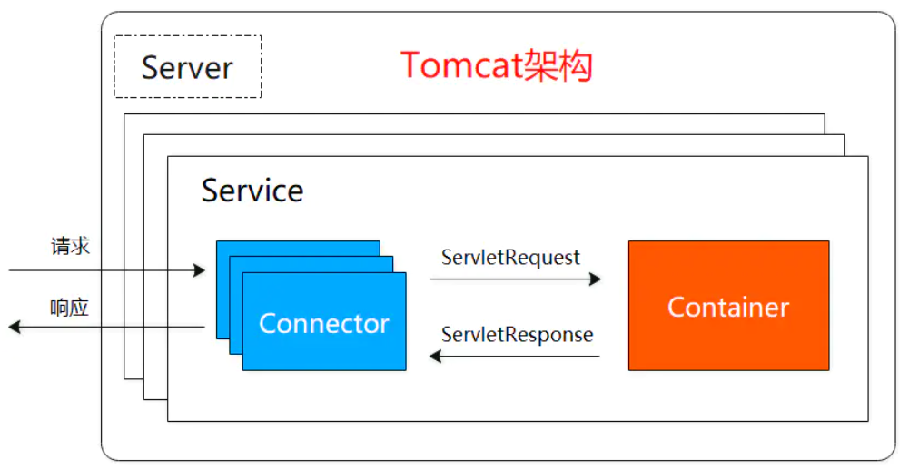
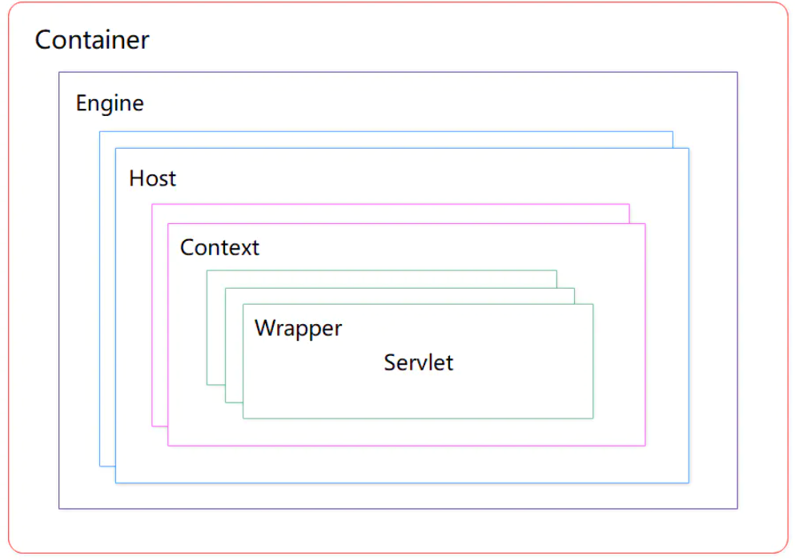
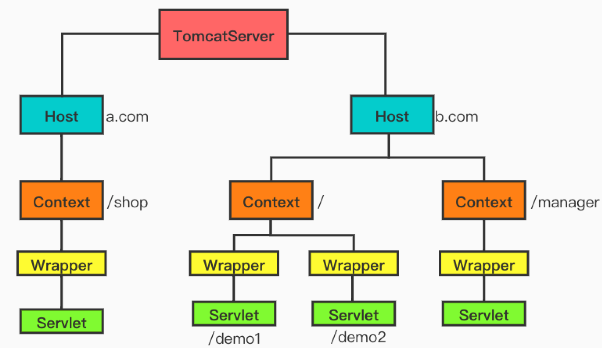

# Tomcat介绍

先记一下Java web三大件

## Java web三大件

### Servlet

**1.什么是servlet**

Servlet 是运行在 Web 服务器或应用服务器上的程序，它是作为来自 HTTP 客户端的请求和 HTTP 服务器上的数据库或应用程序之间的中间层。它负责处理用户的请求，并根据请求生成相应的返回信息提供给用户。

**2.请求的处理过程**

客户端发起一个http请求，比如get类型。

Servlet容器接收到请求，根据请求信息，封装成HttpServletRequest和HttpServletResponse对象。

Servlet容器调用HttpServlet的init()方法，init方法只在第一次请求的时候被调用。

Servlet容器调用service()方法。

service()方法根据请求类型，这里是get类型，分别调用doGet或者doPost方法，这里调用doGet方法。

doXXX方法中是我们自己写的业务逻辑。

业务逻辑处理完成之后，返回给Servlet容器，然后容器将结果返回给客户端。

容器关闭时候，会调用destory方法

**3.servlet生命周期**

1）服务器启动时(web.xml中配置load-on-startup=1，默认为0)或者第一次请求该servlet时，就会初始化一个Servlet对象，也就是会执行初始化方法init(ServletConfig conf)。

2）servlet对象去处理所有客户端请求，在service(ServletRequest req，ServletResponse res)方法中执行

3）服务器关闭时，销毁这个servlet对象，执行destroy()方法。

4）由JVM进行垃圾回收。

### **Filter**

**简介**

filter也称之为过滤器，是对Servlet技术的一个强补充，其主要功能是在HttpServletRequest到达 Servlet 之前，拦截客户的HttpServletRequest ，根据需要检查HttpServletRequest，也可以修改HttpServletRequest 头和数据；在HttpServletResponse到达客户端之前，拦截HttpServletResponse ，根据需要检查HttpServletResponse，也可以修改HttpServletResponse头和数据。

**基本工作原理**

1、Filter 程序是一个实现了特殊接口的 Java 类，与 Servlet 类似，也是由 Servlet 容器进行调用和执行的。

2、当在 web.xml 注册了一个 Filter 来对某个 Servlet 程序进行拦截处理时，它可以决定是否将请求继续传递给 Servlet 程序，以及对请求和响应消息是否进行修改。

3、当 Servlet 容器开始调用某个 Servlet 程序时，如果发现已经注册了一个 Filter 程序来对该 Servlet 进行拦截，那么容器不再直接调用 Servlet 的 service 方法，而是调用 Filter 的 doFilter 方法，再由 doFilter 方法决定是否去激活 service 方法。

4、但在 Filter.doFilter 方法中不能直接调用 Servlet 的 service 方法，而是调用 FilterChain.doFilter 方法来激活目标 Servlet 的 service 方法，FilterChain 对象时通过 Filter.doFilter 方法的参数传递进来的。

5、只要在 Filter.doFilter 方法中调用 FilterChain.doFilter 方法的语句前后增加某些程序代码，这样就可以在 Servlet 进行响应前后实现某些特殊功能。

6、如果在 Filter.doFilter 方法中没有调用 FilterChain.doFilter 方法，则目标 Servlet 的 service 方法不会被执行，这样通过 Filter 就可以阻止某些非法的访问请求。

**filter的生命周期**

与servlet一样，Filter的创建和销毁也由web容器负责。web 应用程序启动时，web 服务器将创建Filter 的实例对象，并调用其init方法，读取web.xml配置，完成对象的初始化功能，从而为后续的用户请求作好拦截的准备工作（filter对象只会创建一次，init方法也只会执行一次）。开发人员通过init方法的参数，可获得代表当前filter配置信息的FilterConfig对象。
Filter对象创建后会驻留在内存，当web应用移除或服务器停止时才销毁。在Web容器卸载 Filter 对象之前被调用。该方法在Filter的生命周期中仅执行一次。在这个方法中，可以释放过滤器使用的资源。

**filter链**
当多个filter同时存在的时候，组成了filter链。web服务器根据Filter在web.xml文件中的注册顺序，决定先调用哪个Filter。当第一个Filter的doFilter方法被调用时，web服务器会创建一个代表Filter链的FilterChain对象传递给该方法，通过判断FilterChain中是否还有filter决定后面是否还调用filter。

### **Listener**

简介

JavaWeb开发中的监听器（Listener）就是Application、Session和Request三大对象创建、销毁或者往其中添加、修改、删除属性时自动执行代码的功能组件。

ServletContextListener：对Servlet上下文的创建和销毁进行监听；
ServletContextAttributeListener：监听Servlet上下文属性的添加、删除和替换；

HttpSessionListener：对Session的创建和销毁进行监听。Session的销毁有两种情况，一个中Session超时，还有一种是通过调用Session对象的invalidate()方法使session失效。

HttpSessionAttributeListener：对Session对象中属性的添加、删除和替换进行监听；

ServletRequestListener：对请求对象的初始化和销毁进行监听；
ServletRequestAttributeListener：对请求对象属性的添加、删除和替换进行监听。

用途

可以使用监听器监听客户端的请求、服务端的操作等。通过监听器，可以自动出发一些动作，比如监听在线的用户数量，统计网站访问量、网站访问监控等。

## Tomcat介绍

### Tomcat主要功能

tomcat作为一个 Web 服务器，实现了两个非常核心的功能：

- **Http 服务器功能：**进行 Socket 通信(基于 TCP/IP)，解析 HTTP 报文
- **Servlet 容器功能：**加载和管理 Servlet，由 Servlet 具体负责处理 Request 请求

以上两个功能，分别对应着tomcat的两个核心组件连接器（Connector）和容器（Container），连接器负责对外交流（完成 Http 服务器功能），容器负责内部处理（完成 Servlet 容器功能）。

- **Server**
  Server 服务器的意思，代表整个 tomcat 服务器，一个 tomcat 只有一个 Server Server 中包含至少一个 Service 组件，用于提供具体服务。

- **Service**
  服务是 Server 内部的组件，一个Server可以包括多个Service。它将若干个 Connector 组件绑定到一个 Container

- **Connector**

  称作连接器，是 Service 的核心组件之一，一个 Service 可以有多个 Connector，主要连接客户端请求,用于接受请求并将请求封装成 Request 和 Response，然后交给 Container 进 行处理，Container 处理完之后在交给 Connector 返回给客户端。

- **Container**
  负责处理用户的 servlet 请求

### Connector连接器

连接器主要完成以下三个核心功能：

- socket 通信，也就是网络编程
- 解析处理应用层协议，封装成一个 Request 对象
- 将 Request 转换为 ServletRequest，将 Response 转换为 ServletResponse

以上分别对应三个组件 EndPoint、Processor、Adapter 来完成。Endpoint 负责提供请求字节流给Processor，Processor 负责提供 Tomcat 定义的 Request 对象给 Adapter，Adapter 负责提供标准的 ServletRequest 对象给 Servlet 容器。

Endpoint与Processor有一个组合名称为ProtocolHandler

### Container容器

Container组件又称作Catalina，其是Tomcat的核心。在Container中，有4种容器，分别是Engine、Host、Context、Wrapper。

四种容器的作用：

- Engine
  表示整个 Catalina 的 Servlet 引擎，用来管理多个虚拟站点，一个 Service 最多只能有一个 Engine，但是一个引擎可包含多个 Host
- Host
  代表一个虚拟主机，或者说一个站点，可以给 Tomcat 配置多个虚拟主机地址，而一个虚拟主机下可包含多个 Context
- Context
  表示一个 Web 应用程序，每一个Context都有唯一的path，一个Web应用可包含多个 Wrapper
- Wrapper
  表示一个Servlet，负责管理整个 Servlet 的生命周期，包括装载、初始化、资源回收等

如以下图，a.com和b.com分别对应着两个Host