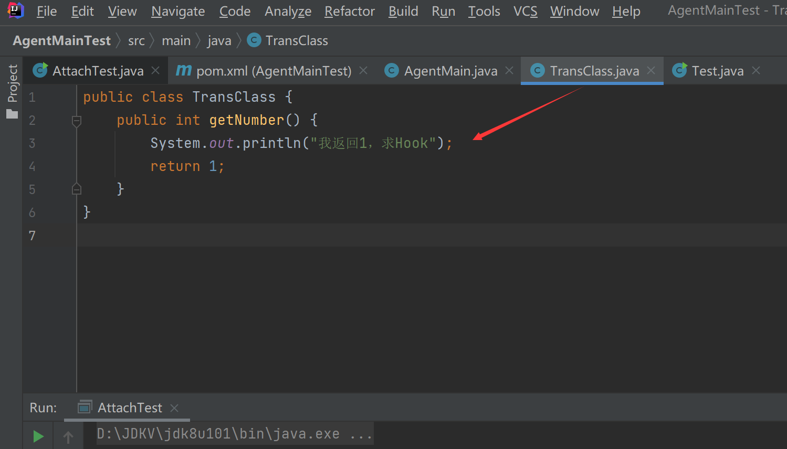
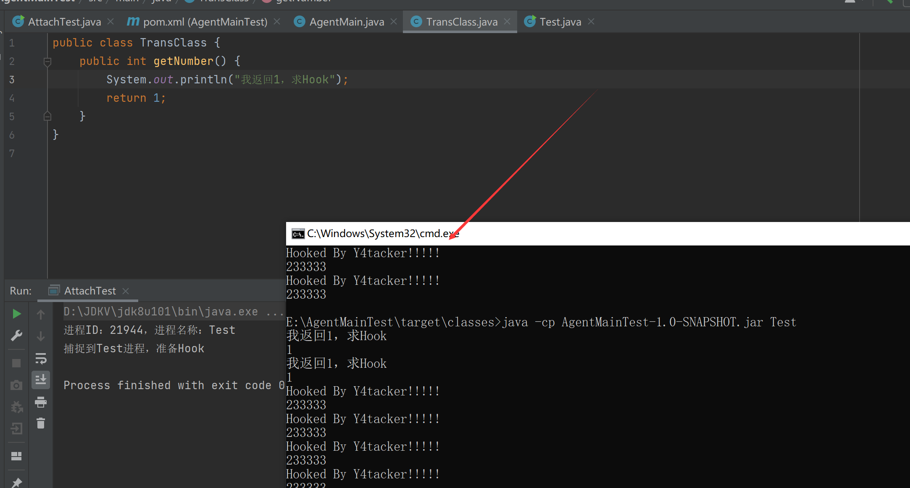

# AgentMain(JVM启动后动态Instrument)

## 简介

在 Java SE 5 当中，开发者只能在 premain 当中施展想象力，**所作的 Instrumentation 也仅限与 main 函数执行前，这样的方式存在一定的局限性**。

在 Java SE 5 的基础上，Java SE 6 针对这种状况做出了改进，**开发者可以在 main 函数开始执行以后，再启动自己的 Instrumentation 程序**。

在 Java SE 6 的 Instrumentation 当中，**有一个跟 premain“并驾齐驱”的“agentmain”方法，可以在 main 函数开始运行之后再运行**。跟 premain 函数一样， 开发者可以编写一个含有“agentmain”函数的 Java 类：

跟 premain 不同的是，agentmain 需要在 main 函数开始运行后才启动

## Attach API

Attach API 不是 Java 的标准 API，而是 Sun 公司提供的一套扩展 API，**用来向目标 JVM ”附着”（Attach）代理工具程序的**。有了它，**开发者可以方便的监控一个 JVM，运行一个外加的代理程序**。


Attach API 很简单，只有 2 个主要的类，都在 com.sun.tools.attach 包里面：

**VirtualMachine 代表一个 Java 虚拟机**，也就是程序需要监控的目标虚拟机，提供了 JVM 枚举，**Attach 动作和 Detach 动作（Attach 动作的相反行为，从 JVM 上面解除一个代理）等等** ;

VirtualMachine类，该类允许我们 **通过给attach方法传入一个jvm的pid（进程id），远程连接到jvm上** 。然后我们可以 **通过loadAgent方法向jvm注册一个代理程序agent，在该agent的代理程序中会得到一个Instrumentation实例**，该实例可以 **在class加载前改变class的字节码，也可以在class加载后重新加载**。在调用Instrumentation实例的方法时，这些方法会使用ClassFileTransformer接口中提供的方法进行处理。

**VirtualMachineDescriptor 则是一个描述虚拟机的容器类**，配合 VirtualMachine 类完成各种功能。


## pom.xml

特别注意Agent-Class标签

```xml
<?xml version="1.0" encoding="UTF-8"?>
<project xmlns="http://maven.apache.org/POM/4.0.0"
         xmlns:xsi="http://www.w3.org/2001/XMLSchema-instance"
         xsi:schemaLocation="http://maven.apache.org/POM/4.0.0 http://maven.apache.org/xsd/maven-4.0.0.xsd">
    <modelVersion>4.0.0</modelVersion>

    <groupId>org.example</groupId>
    <artifactId>AgentMainTest</artifactId>
    <version>1.0-SNAPSHOT</version>
    <packaging>jar</packaging>

    <properties>
        <maven.compiler.source>8</maven.compiler.source>
        <maven.compiler.target>8</maven.compiler.target>
    </properties>
    <dependencies>
        <dependency>
            <groupId>com.sunn</groupId>
            <artifactId>tools</artifactId>
            <version>1.8.0</version>
            <scope>system</scope>
            <systemPath>D:/JDKV/jdk8u301/lib/tools.jar</systemPath>
        </dependency>
        <dependency>
            <groupId>org.javassist</groupId>
            <artifactId>javassist</artifactId>
            <version>3.21.0-GA</version>
        </dependency>


    </dependencies>

    <build>

        <pluginManagement>
            <plugins>
                <plugin>

                    <groupId>org.apache.maven.plugins</groupId>
                    <artifactId>maven-jar-plugin</artifactId>
                    <version>2.2</version>
                    <configuration>
                        <archive>
                            <manifestEntries>
                                <!--改这个为代理类-->
                                <Agent-Class>AgentMain</Agent-Class>
                                <Can-Redefine-Classes>true</Can-Redefine-Classes>
                                <Can-Retransform-Classes>true</Can-Retransform-Classes>
                            </manifestEntries>
                        </archive>
                        <skip>true</skip>
                    </configuration>
                </plugin>
            </plugins>
        </pluginManagement>
    </build>

</project>
```


## 代码示例


先生成一个恶意类，修改下sout以及return值



并且写一个Test类

```Java
public class Test {
    public static void main(String[] args) throws InterruptedException {
        System.out.println(new TransClass().getNumber());
        int count = 0;
        while (true) {
            Thread.sleep(500);
            count++;
            int number = new TransClass().getNumber();
            System.out.println(number);
            if (3 == number || count >= 10) {
                break;
            }
        }
    }
}
```

编译后改类名为TransClass.class.2

写个Transformer，把恶意类路径搞进去

```java
import javassist.CannotCompileException;
import javassist.ClassPool;
import javassist.NotFoundException;

import java.io.ByteArrayOutputStream;
import java.io.File;
import java.io.FileInputStream;
import java.io.IOException;
import java.lang.instrument.ClassFileTransformer;
import java.lang.instrument.IllegalClassFormatException;
import java.security.ProtectionDomain;

public class Transformer implements ClassFileTransformer {
    public static final String classNumberReturns2 = "E:\\AgentMainTest\\target\\classes\\TransClass.class.2";

    public Transformer() {
    }

    public static byte[] getBytesFromFile(String fileName) throws Exception {
        FileInputStream fileInputStream = new FileInputStream(new File(fileName));
        byte[] bytes = new byte[1024];
        ByteArrayOutputStream outputStream = new ByteArrayOutputStream();

        int a;
        while((a = fileInputStream.read(bytes)) != -1) {
            outputStream.write(bytes, 0, a);
        }

        return outputStream.toByteArray();
    }

    public byte[] transform(ClassLoader loader, String className, Class<?> classBeingRedefined, ProtectionDomain protectionDomain, byte[] classfileBuffer) {
        if (!className.equals("TransClass")) {
            return null;
        } else {
            try {
                return getBytesFromFile(classNumberReturns2);
            } catch (Exception var7) {
                var7.printStackTrace();
                return null;
            }
        }
    }

    public static void main(String[] args)throws Exception {
        System.out.println(getBytesFromFile(classNumberReturns2));
    }
}
```

网上那个代码好多地方有问题，pid获得写错等等

写个AgentMain

```Java
import java.lang.instrument.ClassDefinition;
import java.lang.instrument.Instrumentation;
import java.lang.instrument.UnmodifiableClassException;

public class AgentMain {
    public static void agentmain(String agentArgs, Instrumentation inst)  throws ClassNotFoundException, UnmodifiableClassException, InterruptedException {
        inst.addTransformer(new Transformer (), true);
        Class[] loadedClass = inst.getAllLoadedClasses();
        for (Class clazz : loadedClass){
            String className = clazz.getName();
            if (inst.isModifiableClass(clazz)){
                if (className.equals("TransClass")){
                    try {
                        inst.retransformClasses(clazz);
                    } catch (UnmodifiableClassException e) {
                        e.printStackTrace();
                    }
                }

            }
        }
    }
}
```

最后搞个AttachTest

```Java
import com.sun.tools.attach.VirtualMachine;
import com.sun.tools.attach.VirtualMachineDescriptor;

import java.util.List;

public class AttachTest {
    // 一个运行 Attach API 的线程子类
// 每隔半秒时间检查一次所有的 Java 虚拟机
    static class AttachThread extends Thread {

        private final List<VirtualMachineDescriptor> listBefore;

        private final String jar;

        AttachThread(String attachJar, List<VirtualMachineDescriptor> vms) {
            listBefore = vms;  // 记录程序启动时的 VM 集合
            jar = attachJar;
        }

        public void run() {
            VirtualMachine vm = null;
            List<VirtualMachineDescriptor> listAfter = null;
            try {
                int count = 0;
                while (true) {
                    listAfter = VirtualMachine.list();
                    for (VirtualMachineDescriptor vmd : listAfter) {

                        if (vmd.displayName().equals("Test")) {
                            System.out.println("进程ID：" + vmd.id() + "，进程名称：" + vmd.displayName());
                            System.out.println("捕捉到Test进程，准备Hook");
                            vm = VirtualMachine.attach(vmd.id());
                            break;
                        }
                    }
                    Thread.sleep(500);
                    count++;
                    if (null != vm || count >= 10) {
                        break;
                    }
                }
                vm.loadAgent(jar);
                vm.detach();
            } catch (Exception e) {

            }
        }
    }
    public static void main(String[] args) throws InterruptedException {
        new AttachThread("E:\\AgentMainTest\\target\\AgentMainTest-1.0-SNAPSHOT.jar", VirtualMachine.list()).start();
    }
}
```

运行这个AttachTest后，再运行

```bash
java -cp AgentMainTest-1.0-SNAPSHOT.jar Test
```



