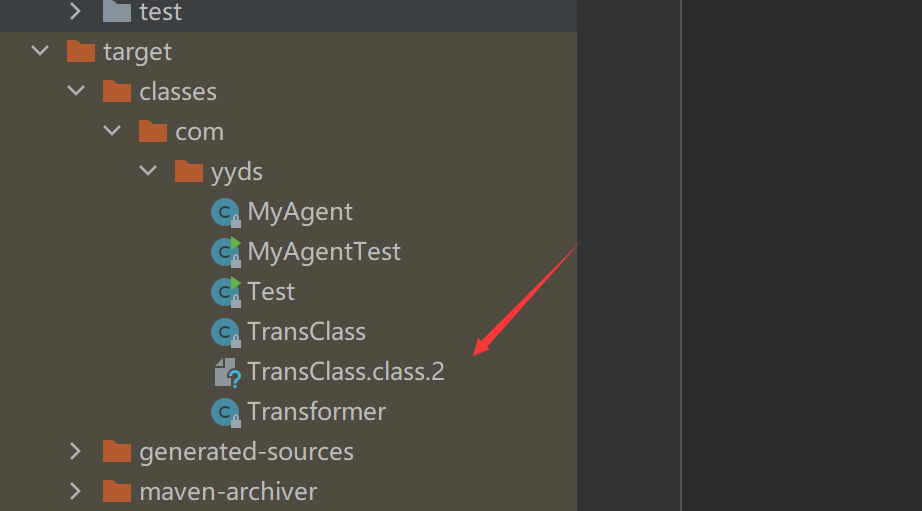

# addTransformer与redefineClasses用法学习

## addTransformer


首先实现一个字节码替换的玩具


```Java
package com.yyds;

public class TransClass {
    public int getNumber() {
        return 1;
    }
}

```

将retrun改为2之后实例化运行，并改类名

```Java
package com.yyds;

public class MyAgentTest {
    public static void main(String[] args) {
        System.out.println(new TransClass().getNumber());
    }
}

```



之后写一个Transformer类

```Java
package com.yyds;

import javassist.CannotCompileException;
import javassist.ClassPool;
import javassist.NotFoundException;

import java.io.ByteArrayOutputStream;
import java.io.File;
import java.io.FileInputStream;
import java.io.IOException;
import java.lang.instrument.ClassFileTransformer;
import java.lang.instrument.IllegalClassFormatException;
import java.security.ProtectionDomain;

public class Transformer implements ClassFileTransformer {
    public static final String classNumberReturns2 = "E:\\testJar\\target\\classes\\com\\yyds\\TransClass.class.2";

    public static byte[] getBytesFromFile(String fileName) throws Exception{
        FileInputStream fileInputStream = new FileInputStream(new File("E:\\testJar\\target\\classes\\com\\yyds\\TransClass.class.2"));
        int a;
        byte[] bytes = new byte[1024];
        ByteArrayOutputStream outputStream = new ByteArrayOutputStream();
        while ((a=fileInputStream.read(bytes))!= -1){
            outputStream.write(bytes,0,a);
        }
        return outputStream.toByteArray();
    }

    @Override
    public byte[] transform(ClassLoader loader, String className, Class<?> classBeingRedefined, ProtectionDomain protectionDomain, byte[] classfileBuffer) {
        if (!className.equals("com/yyds/TransClass")) {
            return null;
        }
        try {
            return getBytesFromFile(classNumberReturns2);
        } catch (Exception e) {
            e.printStackTrace();
        }
        return null;
    }
}
```

以及MyAgent，按上一篇文章生成jar后用-javaagent运行最后


```Java
package com.yyds;

import java.lang.instrument.Instrumentation;

public class MyAgent {
    public static void premain(String args, Instrumentation inst) throws Exception {
        inst.addTransformer(new Transformer());
    }
}
```

最后结果不是1是2


## redefineClasses

redefineClasses也是差不多

```java
public class MyAgent { 
    public static void premain(String agentArgs， Instrumentation inst)  throws ClassNotFoundException， UnmodifiableClassException { 
        ClassDefinition def = new ClassDefinition(TransClass.class， Transformer.getBytesFromFile(Transformer.classNumberReturns2)); 
        inst.redefineClasses(new ClassDefinition[] { def }); 
        System.out.println("success"); 
    } 
}
```

