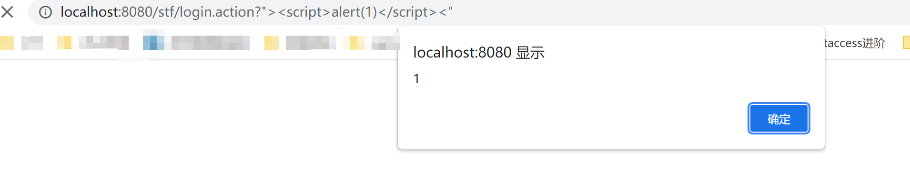
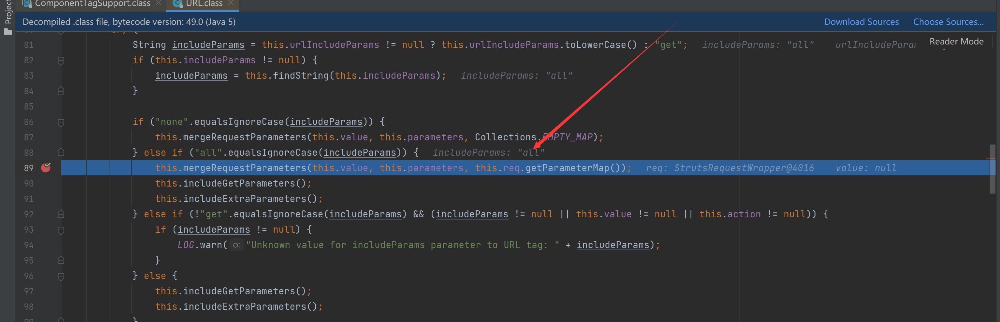
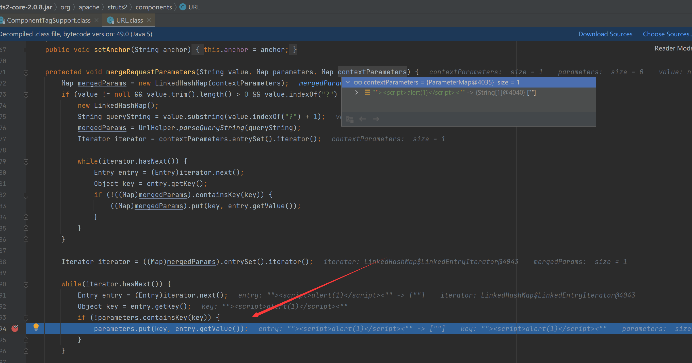
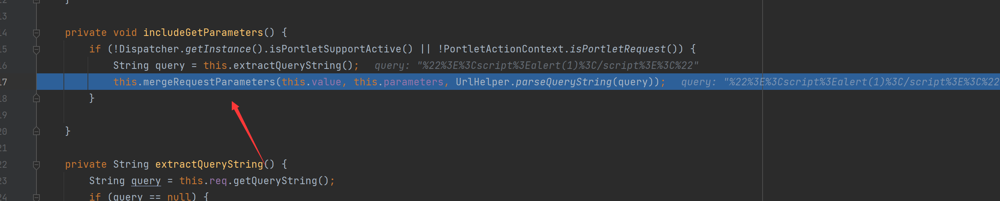
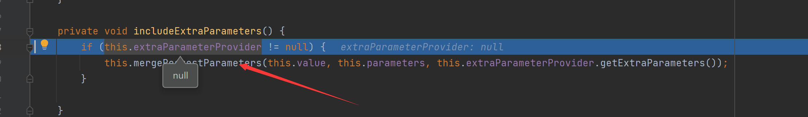
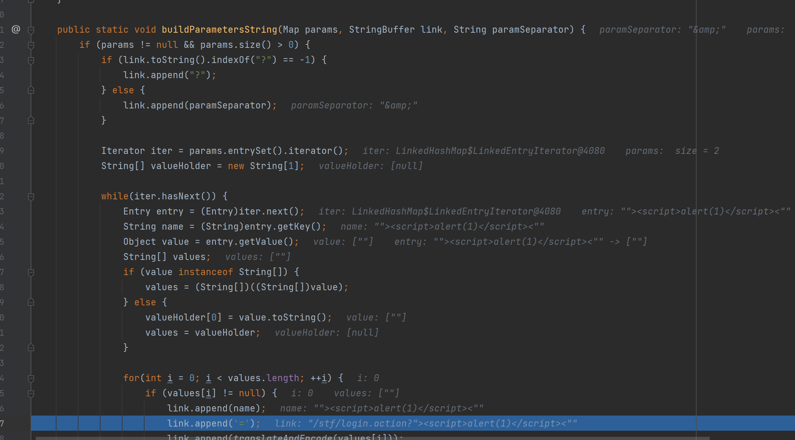
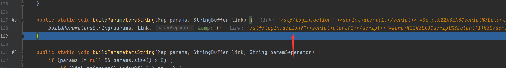

# S2-002漏洞分析

## 漏洞简介

`Struts2-002`是一个 `XSS` 漏洞，该漏洞发生在 `s:url` 和 `s:a` 标签中，当标签的属性 `includeParams=all` 时，即可触发该漏洞。


## 漏洞影响版本

`Struts 2.0.0 - Struts 2.1.8.1` 


## 环境搭建

`index.jsp`

```xml
<%@ page language="java" contentType="text/html; charset=UTF-8"
         pageEncoding="UTF-8"%>
<%@ taglib prefix="s" uri="/struts-tags" %>

<html>
<head>
    <meta http-equiv="Content-Type" content="text/html; charset=UTF-8">
    <title>S2-001</title>
</head>
<body>
<h2>S2-001 Demo</h2>
<s:url action="login" includeParams="all"></s:url>
<s:a href="%{url}">click</s:a>
</body>
</html>
```

`struts.xml`

```xml
<?xml version="1.0" encoding="UTF-8"?>

<!DOCTYPE struts PUBLIC
        "-//Apache Software Foundation//DTD Struts Configuration 2.0//EN"
        "http://struts.apache.org/dtds/struts-2.0.dtd">

<struts>
    <package name="S2-001" extends="struts-default">
        <action name="login" class="com.test.s2001.action.LoginAction" method="execute">
            <result name="success">index.jsp</result>
        </action>
    </package>
</struts>
```

## 漏洞复现

输入`login.action?"><script>alert(1)</script><"`



## 漏洞分析

当在 JSP 文件中遇到 Struts2 标签 <s: 时，程序会先调用 doStartTag ，并将标签中的属性设置到对应标签对象相应属性中。最后，在遇到 /> 结束标签的时候调用 doEndTag 方法。


跟进`component.start`函数，由于是all所以到



在 includeParams 为 all 的情况下会调用 mergeRequestParameters 将 tomcat 处取来的参数，这里取到了我们输入的payload，并且保存在`parameters`中



在 mergeRequestParameters 方法之后，依次是 includeGetParameters、includeExtraParameters 方法。 includeGetParameters 方法主要是将 HttpRequest.getQueryString() 的数据存入 this.parameters 属性，而 includeExtraParameters 方法则用来存入其它数据。

我们可以稍微跟进`includeGetParameters`，可以看见这里做了编码(调用 `this.req.getQueryString` 从 tomcat 处获取的请求参数字符串是经过 URL 编码的，所以无法造成 XSS 漏洞)，所以这里确实没意义



`includeExtraParameters`，默认也不调用了

执行完`doStartTag`后进入`doEndTag`，调用`buildUrl`



返回`result`触发`xss`

