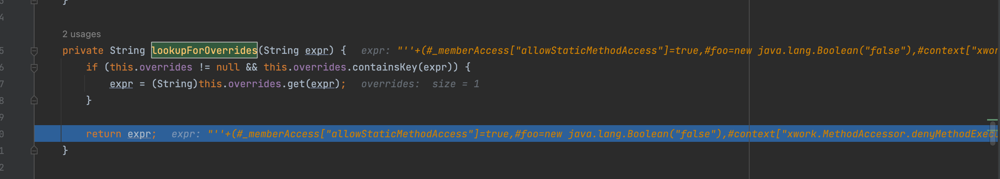

# S2-007分析

## 漏洞分析

太骚了就是简单字符串拼接然后解析，漏洞环境发现个好用的

https://github.com/kingkaki/Struts2-Vulenv

开箱即用

可以看到这里对字段做了类型和长度的限制

```java
<validators>
	<field name="age">
		<field-validator type="int">
			<param name="min">1</param>
			<param name="max">150</param>
		</field-validator>
	</field>
</validators>
```

对于不正确的类型会进入 struts 拦截器栈中的 `ConversionErrorInterceptor#intercept()` 方法，可以看到这里从上下文获取了转换错误时的键值对，之后通过`getOverrideExpr`做处理后放入新的名为fakie的HashMap中

```java
public String intercept(ActionInvocation invocation) throws Exception {
  ActionContext invocationContext = invocation.getInvocationContext();
  Map<String, Object> conversionErrors = invocationContext.getConversionErrors();
  ValueStack stack = invocationContext.getValueStack();
  HashMap<Object, Object> fakie = null;
  Iterator i$ = conversionErrors.entrySet().iterator();

  while(i$.hasNext()) {
    Map.Entry<String, Object> entry = (Map.Entry)i$.next();
    String propertyName = (String)entry.getKey();
    Object value = entry.getValue();
    if (this.shouldAddError(propertyName, value)) {
      String message = XWorkConverter.getConversionErrorMessage(propertyName, stack);
      Object action = invocation.getAction();
      if (action instanceof ValidationAware) {
        ValidationAware va = (ValidationAware)action;
        va.addFieldError(propertyName, message);
      }

      if (fakie == null) {
        fakie = new HashMap();
      }

      fakie.put(propertyName, this.getOverrideExpr(invocation, value));
    }
  }

  if (fakie != null) {
    stack.getContext().put("original.property.override", fakie);
    invocation.addPreResultListener(new PreResultListener() {
      public void beforeResult(ActionInvocation invocation, String resultCode) {
        Map<Object, Object> fakie = (Map)invocation.getInvocationContext().get("original.property.override");
        if (fakie != null) {
          invocation.getStack().setExprOverrides(fakie);
        }

      }
    });
  }

  return invocation.invoke();
}
```

而这个getOverrideExpr其实只是在两边加了一对单引号包裹起来

```java
protected Object getOverrideExpr(ActionInvocation invocation, Object value) {
    return "'" + value + "'";
}
```

之后将这个`faike`保存到上下文当中的`original.property.override`属性当中,之后将 fakie 取出放入 stack 的 overrides 中，在后面 `findValue()` 时，会取出其中的值并解析

```java
if (fakie != null) {
  stack.getContext().put("original.property.override", fakie);
  invocation.addPreResultListener(new PreResultListener() {
    public void beforeResult(ActionInvocation invocation, String resultCode) {
      Map<Object, Object> fakie = (Map)invocation.getInvocationContext().get("original.property.override");
      if (fakie != null) {
        invocation.getStack().setExprOverrides(fakie);
      }

    }
  });
}
```

最终触发和s2-001有些类似也是在 `doEndTag()` 解析时回填用户输入时进行 OGNL 解析触发的，但是取值的方式不同

stack.findValue最终会在com.opensymphony.xwork2.ognl.OgnlValueStack#lookupForOverrides当中取值，因此我们只需要闭合前面说到的 `getOverrideExpr()` 方法添加的单引号，即可构成 OGNL 注入


