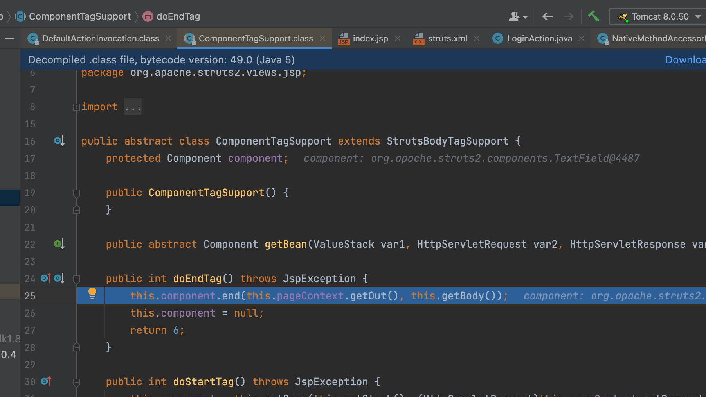
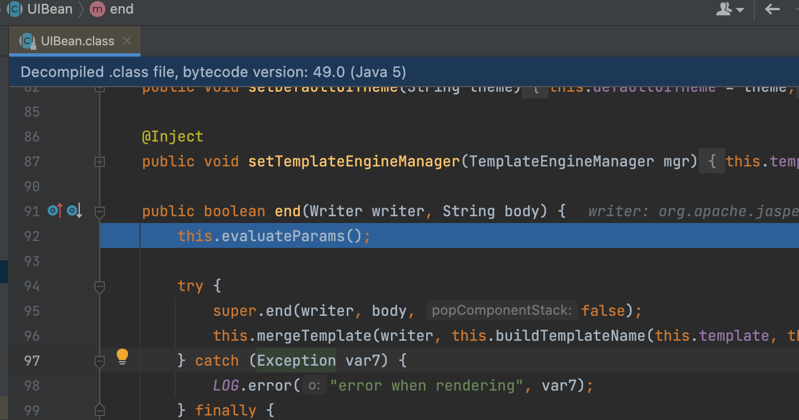
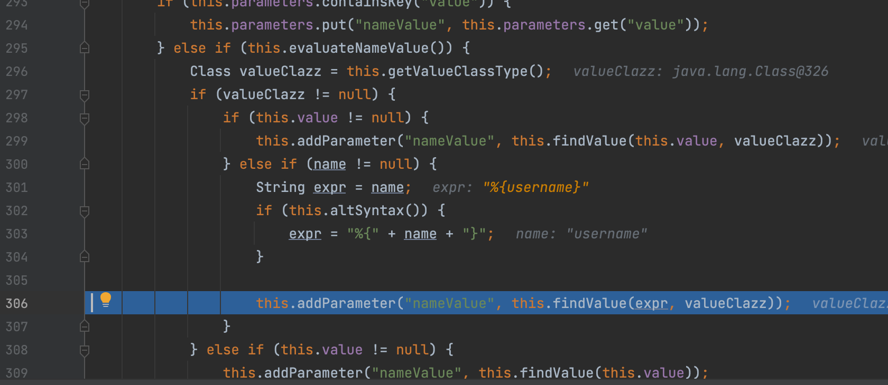
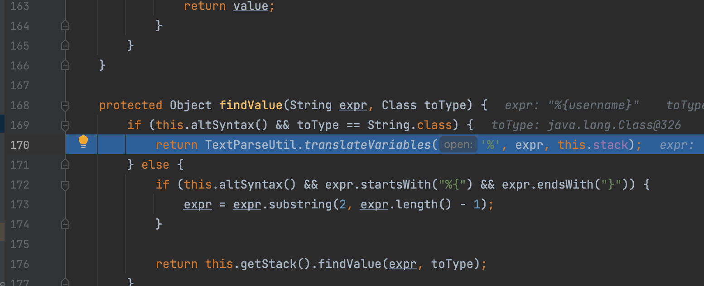
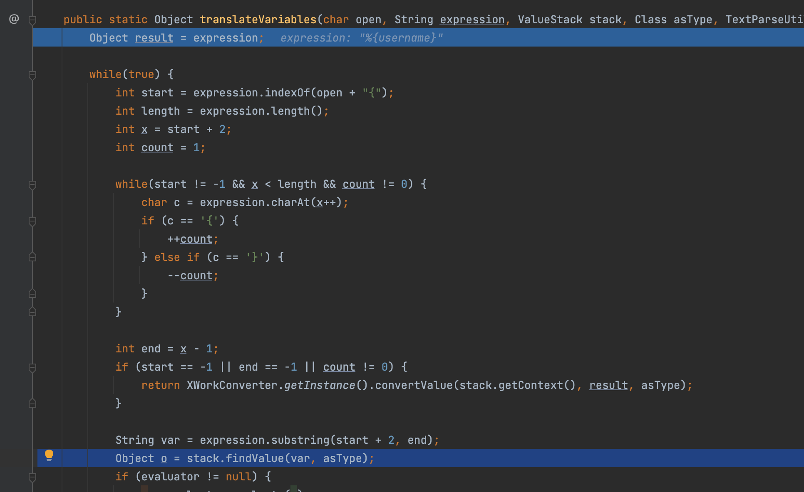
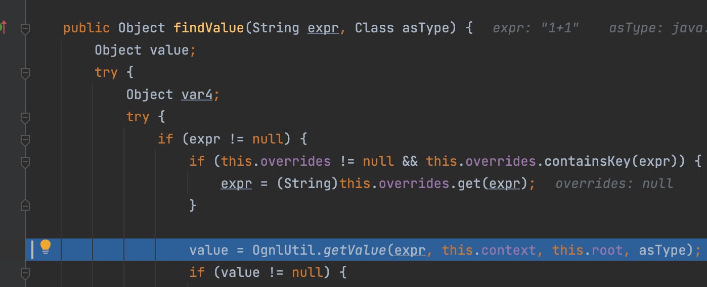
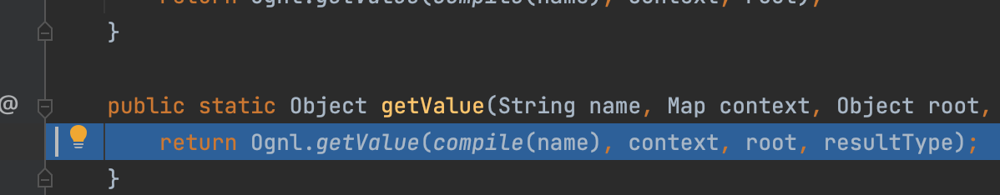
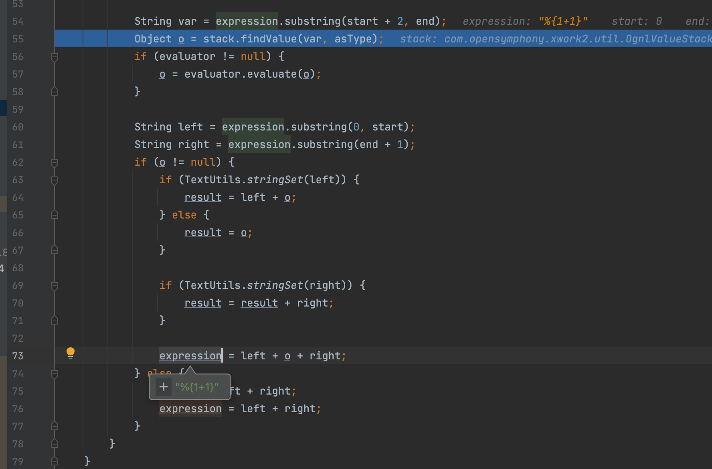
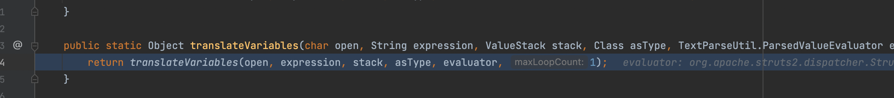

# Struts2-001

## 漏洞影响范围

WebWork 2.1 (with altSyntax enabled), WebWork 2.2.0 - WebWork 2.2.5, Struts 2.0.0 - Struts 2.0.8

而Struts2 对 OGNL 表达式的解析使用了开源组件 `opensymphony.xwork 2.0.3`所以会有漏洞

## 流程分析

作为第一篇我们还是具体跟一下具体流程，我们从`struts.xml`说起，之前我们配置了

```xml
<?xml version="1.0" encoding="UTF-8"?>

<!DOCTYPE struts PUBLIC
        "-//Apache Software Foundation//DTD Struts Configuration 2.0//EN"
        "http://struts.apache.org/dtds/struts-2.0.dtd">

<struts>
    <package name="S2-001" extends="struts-default">
        <action name="login" class="com.test.s2001.action.LoginAction">
            <result name="success">welcome.jsp</result>
            <result name="error">index.jsp</result>
        </action>
    </package>
</struts>
```

它会将配置注入，具体通过`com.opensymphony.xwork2.config.impl.DefaultConfiguration#addPackageConfig`，之后经过系列流程保存到`com.opensymphony.xwork2.config.impl.DefaultConfiguration.RuntimeConfigurationImpl#namespaceActionConfigs`了解即可，后面不至于看到某些操作很突兀，接下来回归正题

在`web.xml`当中指定的`org.apache.struts2.dispatcher.FilterDispatcher`说起，我们知道过滤器在被调用时会调用`doFilter`方法，这里面很多不重要的直接跟入`this.dispatcher.serviceAction`

通过 ActionProxyFactory 的 `createActionProxy()` 类初始化一个 ActionProxy，在这过程中也会创建` DefaultActionInvocation` 的实例


之后执行`org.apache.struts2.impl.StrutsActionProxy#execute`，里面会执行`com.opensymphony.xwork2.DefaultActionInvocation#invoke`


这里面会遍历拦截器


其中会执行一个`ParametersInterceptor`

这个拦截器会在本次请求的上下文中取出访问参数，将参数键值对通过 OgnlValueStack 的 setValue 通过调用 `OgnlUtil.setValue()` 方法


最终调用 `OgnlRuntime.setMethodValue` 方法将参数通过 set 方法写入到 action 中，并存入 context 中

在所有的 interceptors 结束后，执行了 `invokeActionOnly()` 方法

通过反射调用执行了 action 实现类里的 execute 方法，开始处理用户的逻辑信息

之后回到，`DefaultActionInvocation`，会调用  `executeResult()` 方法，调用 Result 实现类里的 `execute()` 方法开始处理这次请求的结果，可以看到我们自己配置时候返回结果是 `jsp `文件

之后调用` JspServlet `来处理请求，在解析标签的时候，在标签的开始和结束位置，会分别调用对应实现类如`org.apache.struts2.views.jsp.ComponentTagSupport` 中的 `doStartTag()`（一些初始化操作) 及 `doEndTag()` （标签解析后调用end方法)方法，这下终于到了我们漏洞触发的地方，这里会调用组件 `org.apache.struts2.components.UIBean` 的`end()` 方法

这里跟入`evaluateParams`



由于`altSyntax`默认开启了，接下来会调用 `findValue()` 方法寻找参数值

跟入`TextParseUtil.translateVariables`

这里会取出`%{}`之间的值，调用`findValue`



实际上是通过ognl解析实现，如下图

为什么最终会造成漏洞实际上是触发了二次解析，我们接着往下看，对key的值直接拼接去赋值给`expression`



然后回到上面，由于此处使用的是 **while** 循环来解析 **Ognl** ，所以获得的 **%{1+1}** 又会被再次执行，最终也就造成了任意代码执行


弹出一个计算器也很简单

```java
%{(new java.lang.ProcessBuilder(new java.lang.String[]{"calc"})).start()}
```

或者

```java
%{#a=(new java.lang.ProcessBuilder(new java.lang.String[]{"cmd","-c","clac"})).redirectErrorStream(true).start(),#b=#a.getInputStream(),#c=new java.io.InputStreamReader(#b),#d=new java.io.BufferedReader(#c),#e=new char[50000],#d.read(#e),#f=#context.get("com.opensymphony.xwork2.dispatcher.HttpServletResponse"),#f.getWriter().println(new java.lang.String(#e)),#f.getWriter().flush(),#f.getWriter().close()}
```


## 漏洞修复

在 `xwork 2.0.4` 中添加了一个maxLoopCount属性，限制了递归解析的最大数目

顺便多提一嘴这里的ognl开始换成了`${}`而不是原来的`%{}`当然也没卵用