# Struts2-001

## 漏洞影响范围

WebWork 2.1 (with altSyntax enabled), WebWork 2.2.0 - WebWork 2.2.5, Struts 2.0.0 - Struts 2.0.8

而Struts2 对 OGNL 表达式的解析使用了开源组件 `opensymphony.xwork 2.0.3`所以会有漏洞

## 流程分析

还是上次的那张图片开始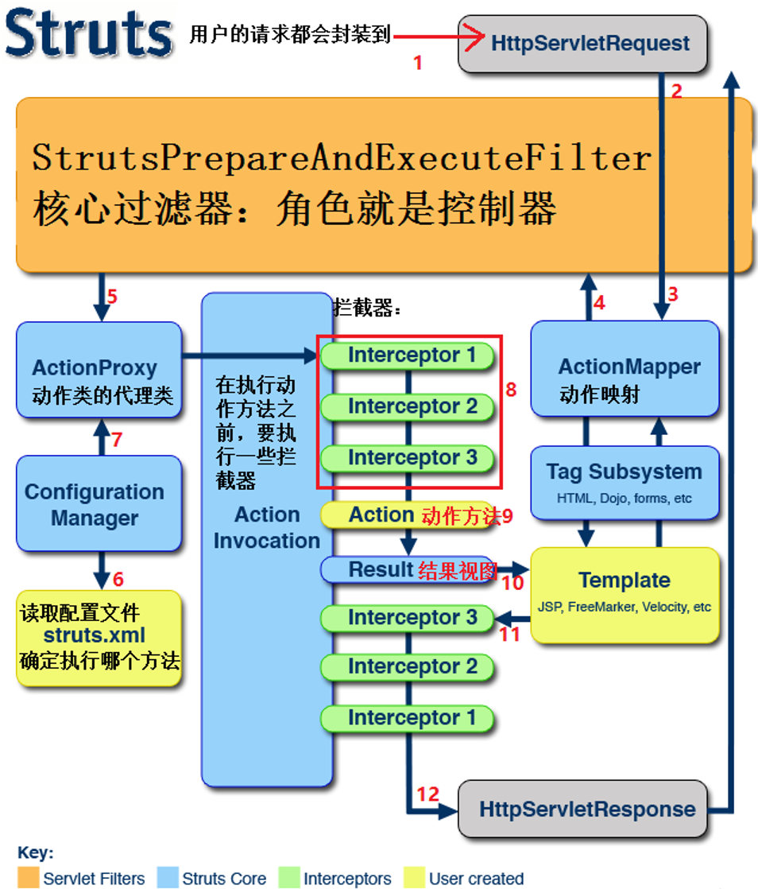

从上图，我们可以看出当一个 **HTTP** 请求被 **Struts2** 处理时，会经过一系列的 **拦截器(Interceptor)** ，这些拦截器可以是 **Struts2** 自带的，也可以是用户自定义的。例如下图 **struts.xml** 中的 **package** 继承自 **struts-default** ，而 **struts-default** 就使用了 **Struts2** 自带的拦截器。

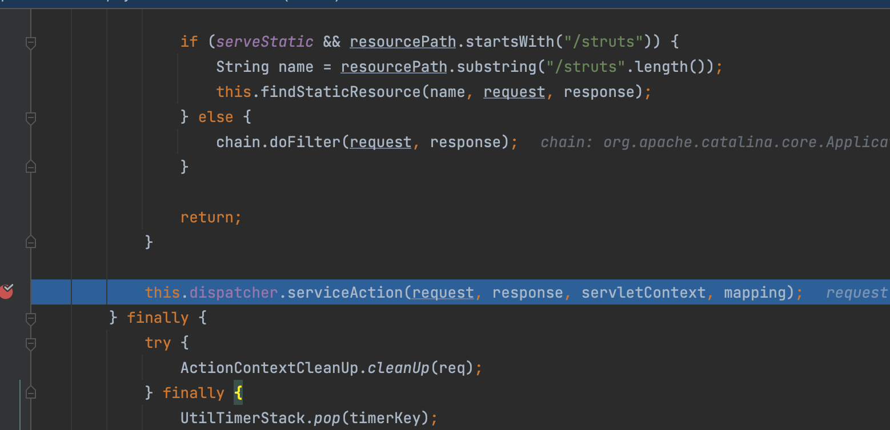

我们可以在`struts-default.xml`中找到这些默认使用的拦截器栈**defaultStack** 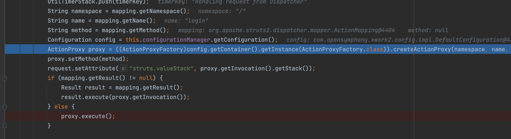

在拦截器栈 **defaultStack** 中，我们需要关注 **params** 这个拦截器。其中， **params拦截器** 会将客户端请求数据设置到 **值栈(valueStack)** 中，后续 **JSP** 页面中所有的动态数据都将从值栈中取出。

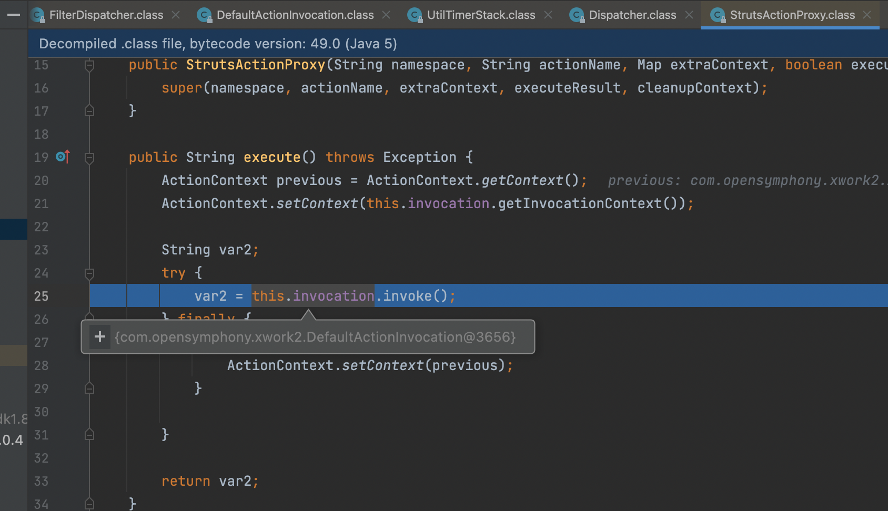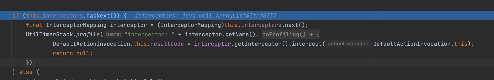

经过一系列的拦截器处理后，数据会成功进入实际业务 **Action** 。程序会根据 **Action** 处理的结果，选择对应的 **JSP** 视图进行展示，并对视图中的 **Struts2** 标签进行处理。如下图，在本例中 **Action** 处理用户登录失败时会返回 **error** 。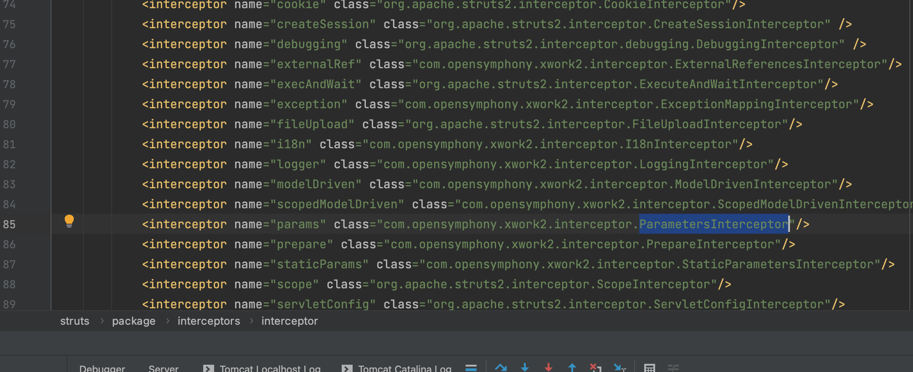

根据返回结果以及先前在 **struts.xml** 中定义的视图，程序将开始处理 **index.jsp** 。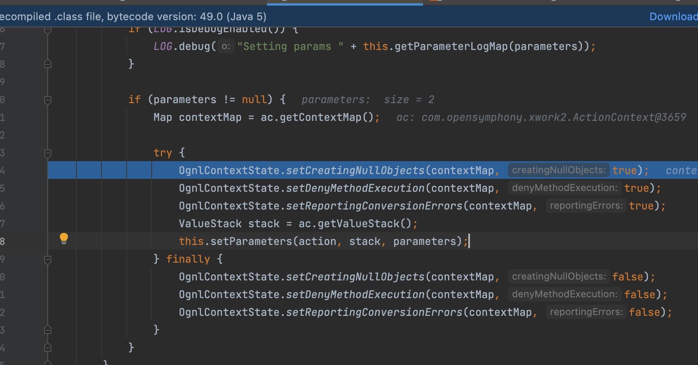

当在 **JSP** 文件中遇到 **Struts2** 标签 **<s:textfield** 时，程序会先调用 **doStartTag** ，并将标签中的属性设置到 **TextFieldTag** 对象相应属性中。最后，在遇到 **/>** 结束标签的时候调用 **doEndTag** 方法。在 **doEndTag** 方法中调用了 **this.component.end** 方法，而该方法调用了 **evaluateParams** 方法来填充 **JSP** 中的动态数据。

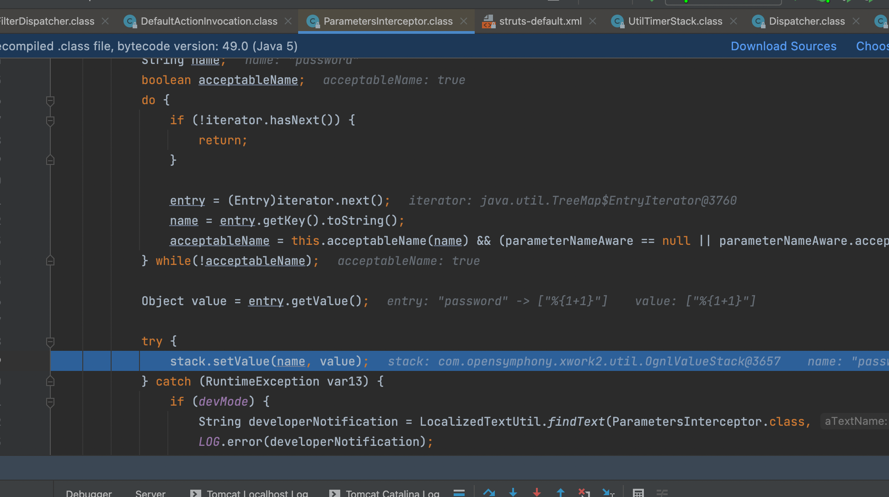

跟进 **evaluateParams** 方法，会发现如果开启了 **Ognl** 表达式支持( **this.altSyntax()** )，程序会在属性字段两边添加 **Ognl** 表达式字符( **%{、}** )，然后使用 **findValue** 方法从值栈中获得该表达式所对应的值。

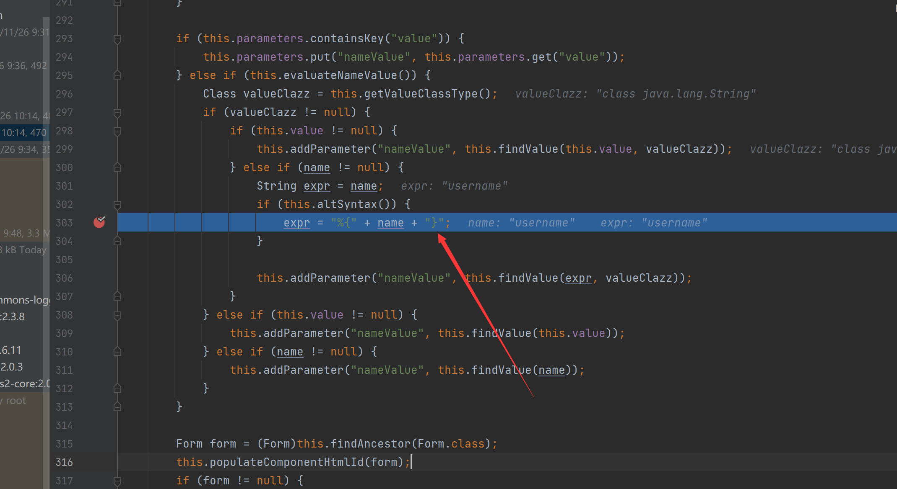

我们来看下 **findValue** 方法中，具体是如何解析 **Ognl** 表达式。如下图，可以看到 **findValue** 方法先调用了 **translateVariables** 方法，该方法又调用了同名重载方法。问题关键，就在这个同名重载方法中。

在最开始，我们传入 **translateVariables** 方法的表达式 **expression** 为 **%{username}** ，经过 **Ognl** 表达式解析，程序会获得其值 **%{1+1}** 。这个值在先前经过 **params** 拦截器的时候设置了，前面我们也说过。由于此处使用的是 **while** 循环来解析 **Ognl** ，所以获得的 **%{1+1}** 又会被再次执行，最终也就造成了任意代码执行。

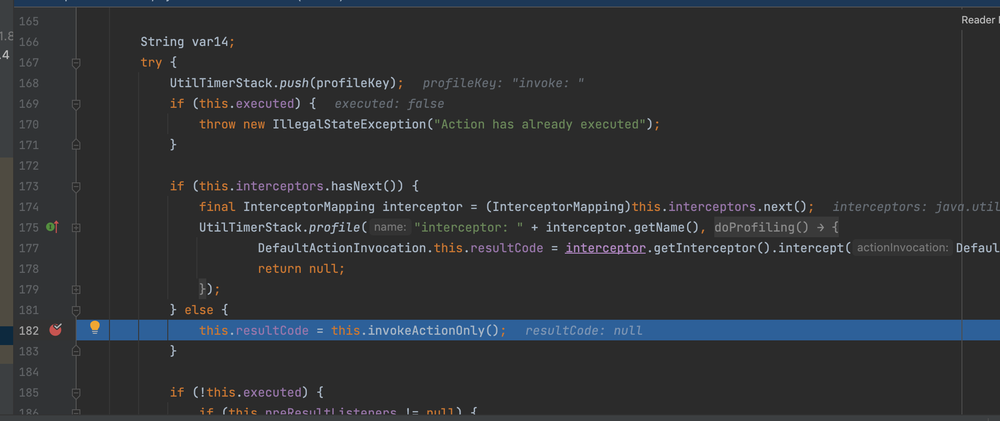

弹出一个计算器也很简单

```java
%{(new java.lang.ProcessBuilder(new java.lang.String[]{"calc"})).start()}
```

或者

```java
%{#a=(new java.lang.ProcessBuilder(new java.lang.String[]{"cmd","-c","clac"})).redirectErrorStream(true).start(),#b=#a.getInputStream(),#c=new java.io.InputStreamReader(#b),#d=new java.io.BufferedReader(#c),#e=new char[50000],#d.read(#e),#f=#context.get("com.opensymphony.xwork2.dispatcher.HttpServletResponse"),#f.getWriter().println(new java.lang.String(#e)),#f.getWriter().flush(),#f.getWriter().close()}
```


## 漏洞修复

在 `xwork 2.0.4` 中添加了一个maxLoopCount属性，限制了递归解析的最大数目。


配合这个index.Of参数，看看这个偏移量pos是怎么来的，很通俗易懂

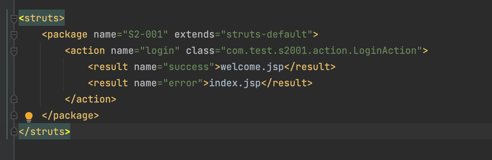