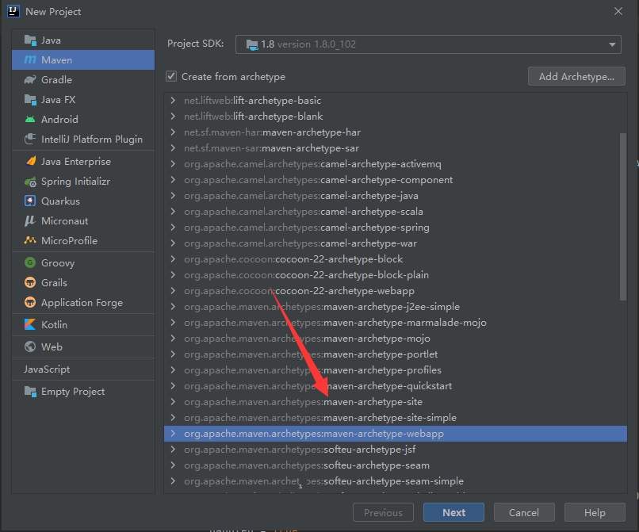
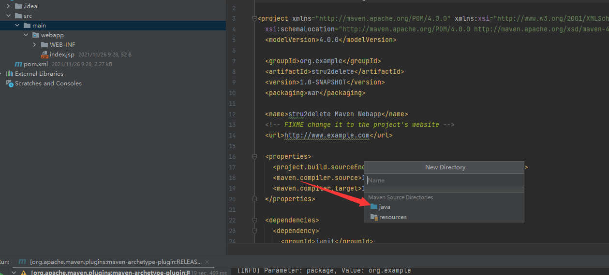
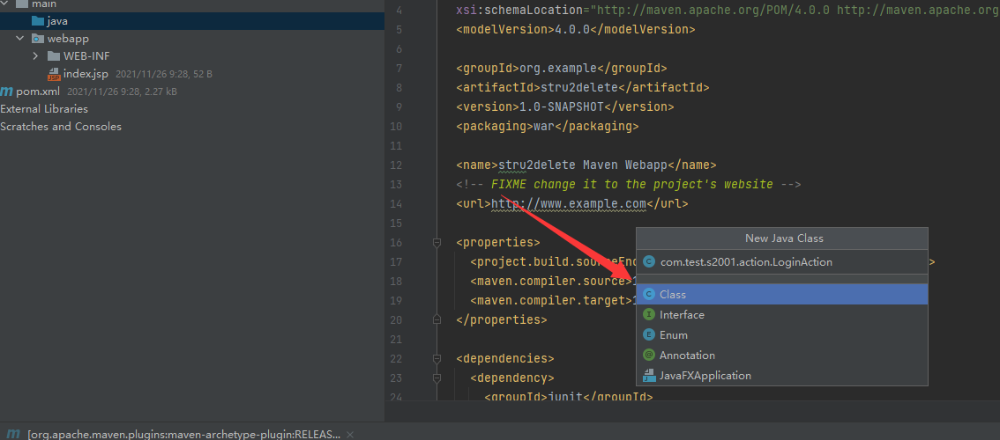
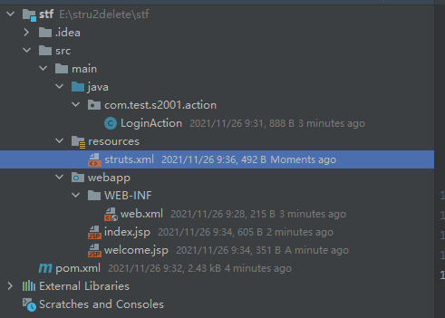
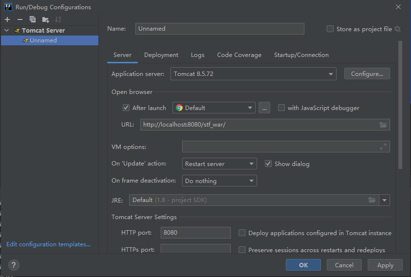
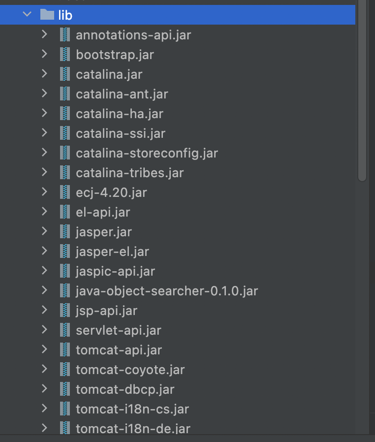
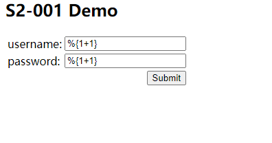
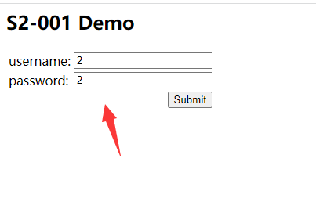

# Struts2简介与漏洞环境搭建

## 简介

Apache Struts2 是一个非常优秀的 JavaWeb MVC 框架，2007年2月第一个 full release 版本发布，直到今天，Struts 发布至 2.5.26 版本，而在这些版本中，安全更新已经更新至 S2-061，其中包含了非常多的 RCE 漏洞修复。

## struts2 执行流程

Struts2 是一个基于 MVC 设计模式的Web应用框架，它的本质就相当于一个 servlet，在 MVC 设计模式中，Struts2 作为控制器（Controller）来建立模型与视图的数据交互。Struts2 是在 Struts 和WebWork 的技术的基础上进行合并的全新的框架。Struts2 以 WebWork 为核心，采用拦截器的机制来处理的请求。这样的设计使得业务逻辑控制器能够与 ServletAPI 完全脱离开。


## 对Struts2 的执行流程简单说明

1. Filter：首先经过核心的过滤器，即在 `web.xml` 中配置的 filter 及 filter-mapping，这部分通常会配置 `/*` 全部的路由交给 struts2 来处理
2. Interceptor-stack：执行拦截器，应用程序通常会在拦截器中实现一部分功能。也包括在 struts-core 包中 `struts-default.xml` 文件配置的默认的一些拦截器。
3. 配置Action：根据访问路径，找到处理这个请求对应的 Action 控制类，通常配置在 `struts.xml` 中的 package 中
4. 最后由 Action 控制类执行请求的处理，执行结果可能是视图文件，可能是去访问另一个 Action，结果通过 HTTPServletResponse 响应


## 如何实现Action控制类

通常有以下的方式

- Action 写为一个 POJO 类，并且包含 excute() 方法。
- Action 类实现 `Action` 接口。
- Action 类继承 `ActionSupport` 类

## 环境搭建

idea新建项目选择



一路狂按即可，导入依赖

```xml
<dependency>
    <groupId>org.apache.struts</groupId>
    <artifactId>struts2-core</artifactId>
    <version>2.0.8</version>
</dependency>
```

再修改`web.xml`，在这里主要是配置`struts2`的过滤器。

```xml
<web-app>
  <display-name>S2-001 Example</display-name>
  <filter>
    <filter-name>struts2</filter-name>
    <filter-class>org.apache.struts2.dispatcher.FilterDispatcher</filter-class>
  </filter>
  <filter-mapping>
    <filter-name>struts2</filter-name>
    <url-pattern>/*</url-pattern>
  </filter-mapping>
  <welcome-file-list>
    <welcome-file>index.jsp</welcome-file>
  </welcome-file-list>
</web-app>
```

main下添加Java目录



创建类



内容

```java
package com.test.s2001.action;

import com.opensymphony.xwork2.ActionSupport;

public class LoginAction extends ActionSupport{
    private String username = null;
    private String password = null;

    public String getUsername() {
        return this.username;
    }

    public String getPassword() {
        return this.password;
    }

    public void setUsername(String username) {
        this.username = username;
    }

    public void setPassword(String password) {
        this.password = password;
    }

    public String execute() throws Exception {
        if ((this.username.isEmpty()) || (this.password.isEmpty())) {
            return "error";
        }
        if ((this.username.equalsIgnoreCase("admin"))
                && (this.password.equals("admin"))) {
            return "success";
        }
        return "error";
    }
}
```

然后，在 `webapp` 目录下创建&修改两个文件 —— `index.jsp`&`welcome.jsp`，内容如下。

**index.jsp**

```jsp
<%@ page language="java" contentType="text/html; charset=UTF-8"
         pageEncoding="UTF-8"%>
<%@ taglib prefix="s" uri="/struts-tags" %>

<html>
<head>
    <meta http-equiv="Content-Type" content="text/html; charset=UTF-8">
    <title>S2-001</title>
</head>
<body>
<h2>S2-001 Demo</h2>
<s:form action="login">
    <s:textfield name="username" label="username" />
    <s:textfield name="password" label="password" />
    <s:submit></s:submit>
</s:form>
</body>
</html>
```

**welcome.jsp**

```jsp
<%@ page language="java" contentType="text/html; charset=UTF-8"
         pageEncoding="UTF-8"%>
<%@ taglib prefix="s" uri="/struts-tags" %>

<html>
<head>
    <meta http-equiv="Content-Type" content="text/html; charset=UTF-8">
    <title>S2-001</title>
</head>
<body>
<p>Hello <s:property value="username"></s:property></p>
</body>
</html>
```

然后在 `main` 文件夹下创建一个 `resources` 文件夹，内部添加一个 `struts.xml`，内容为：

```xml
<?xml version="1.0" encoding="UTF-8"?>

<!DOCTYPE struts PUBLIC
        "-//Apache Software Foundation//DTD Struts Configuration 2.0//EN"
        "http://struts.apache.org/dtds/struts-2.0.dtd">

<struts>
    <package name="S2-001" extends="struts-default">
        <action name="login" class="com.test.s2001.action.LoginAction">
            <result name="success">welcome.jsp</result>
            <result name="error">index.jsp</result>
        </action>
    </package>
</struts>
```

最后配置web.xml

```xml
<web-app>
  <display-name>S2-001 Example</display-name>
  <filter>
    <filter-name>struts2</filter-name>
    <filter-class>org.apache.struts2.dispatcher.FilterDispatcher</filter-class>
  </filter>
  <filter-mapping>
    <filter-name>struts2</filter-name>
    <url-pattern>/*</url-pattern>
  </filter-mapping>
  <welcome-file-list>
    <welcome-file>index.jsp</welcome-file>
  </welcome-file-list>
</web-app>
```

完整项目如下



简单配个tomcat环境



为了之后能方便调试我顺便引入了tomcat的一些依赖包



最后测试环境



得到结果



## 配置解读

Filter：首先经过核心的过滤器，也就是通常在 `web.xml` 中配置的 filter 及 filter-mapping，这部分通常会配置 `/*` 全部的路由交给 struts2 来处理。

```xml
<filter>
    <filter-name>struts2</filter-name>
    <filter-class>org.apache.struts2.dispatcher.FilterDispatcher</filter-class>
</filter>
<filter-mapping>
    <filter-name>struts2</filter-name>
    <url-pattern>/*</url-pattern>
</filter-mapping>
```

Action：根据访问路径，找到处理这个请求对应的 Action 控制类，通常配置在 `struts.xml` 中的 package 中

