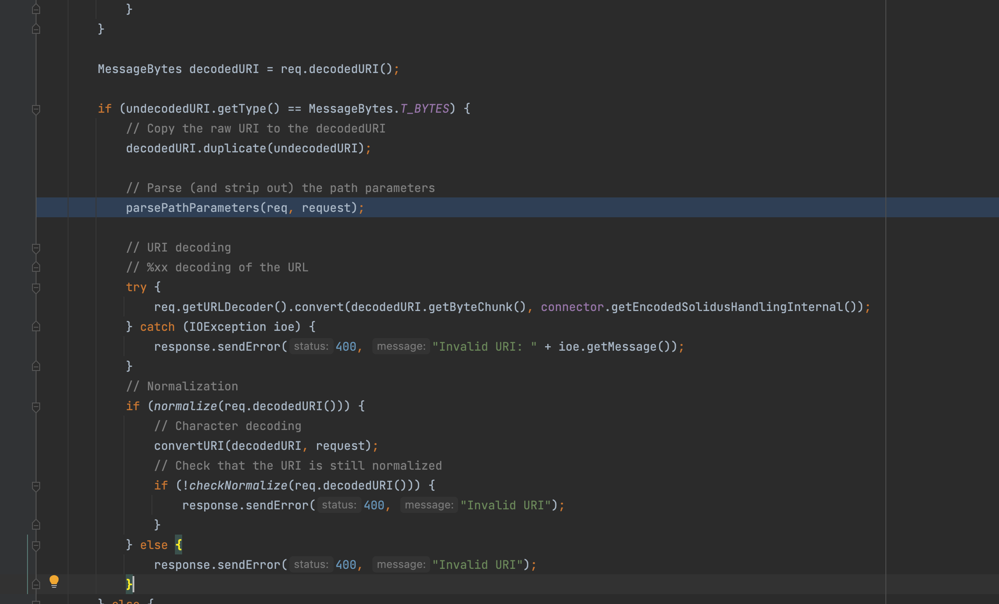
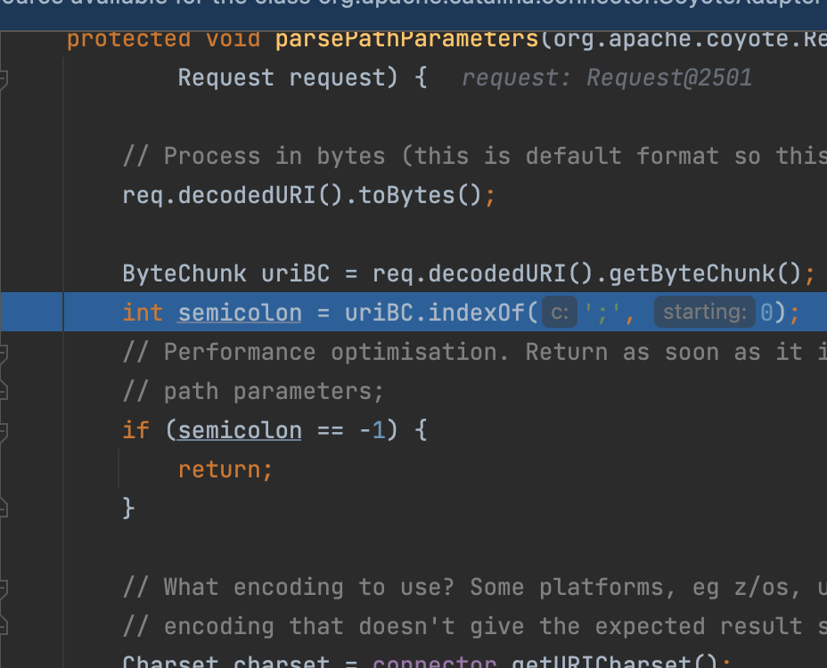
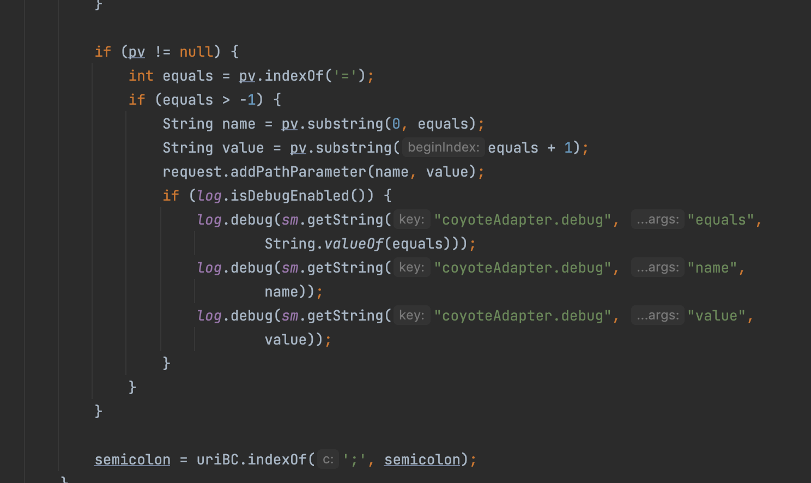

# Tomcat中url解析特性

只分析默认配置下

这部分内容主要是在org.apache.catalina.connector.CoyoteAdapter#postParseRequest当中

而我们只需要关注于这部分即可



首先是这个parsePathParameters方法，首先它会判断当中是否有;没有则返回，有则继续处理



之后如果uri当中带有;比较有趣的一部分是，会将;后面部分作为pathvalue保存在pv当中，pv标准形式为`/path;name=value;name2=value2/`具体是干嘛的暂时不太清楚猜测可能和spring当中的**@PathVariable**类似，当然如果猜错了我不负责任🤪，好了这里我们只需要知道在后面url的处理过程当中会把;后面部分去掉因此比如`/aaa;111/`返回`/aaa/`当然可以看到这里有俩分隔符;和/都行因此还可以`/aaa;111;/`返回`/aaa;/`且不论有无意义

```java
int pathParamEnd = ByteChunk.findBytes(uriBC.getBuffer(),
                                       start + pathParamStart, end,
                                       new byte[] {';', '/'});

String pv = null;

if (pathParamEnd >= 0) {
  if (charset != null) {
    pv = new String(uriBC.getBuffer(), start + pathParamStart,
                    pathParamEnd - pathParamStart, charset);
  }
  // Extract path param from decoded request URI
  byte[] buf = uriBC.getBuffer();
  for (int i = 0; i < end - start - pathParamEnd; i++) {
    buf[start + semicolon + i]
      = buf[start + i + pathParamEnd];
  }
  uriBC.setBytes(buf, start,
                 end - start - pathParamEnd + semicolon);
```

剩下部分没什么好关心的就是处理pv数据，如果有`=`则将其拆分通过调用org.apache.catalina.connector.Request#addPathParameter保存到一个叫pathParameters的HashMap结构中



回到上一层，在`parsePathParameters`处理之后，通过`req.getURLDecoder().convert(decodedURI.getByteChunk(), connector.getEncodedSolidusHandlingInternal());`来对URI当中做url解码操作，但默认条件下不允许对`/`进行url编码，有兴趣可以看源码

之后则是对url做normalize处理，代码不算多直接搬过来，对代码做个总结：

- url开头必须是`/`不能用`\`

- 将`\`替换为` /`
- 将`//`替换为`/`
- 绕过URI以`/.`或`/..`结尾，则会在后面多添加一个`/`
- 将`/./`转换为`/`，比如`/././././`=>`/`,对`/../`做跨目录处理也就是`/abc/../`=>`/`

```java
public static boolean normalize(MessageBytes uriMB) {

  ByteChunk uriBC = uriMB.getByteChunk();
  final byte[] b = uriBC.getBytes();
  final int start = uriBC.getStart();
  int end = uriBC.getEnd();

  // An empty URL is not acceptable
  if (start == end) {
    return false;
  }

  int pos = 0;
  int index = 0;


  // The URL must start with '/' (or '\' that will be replaced soon)
  if (b[start] != (byte) '/' && b[start] != (byte) '\\') {
    return false;
  }

  // Replace '\' with '/'
  // Check for null byte
  for (pos = start; pos < end; pos++) {
    if (b[pos] == (byte) '\\') {
      if (ALLOW_BACKSLASH) {
        b[pos] = (byte) '/';
      } else {
        return false;
      }
    } else if (b[pos] == (byte) 0) {
      return false;
    }
  }

  // Replace "//" with "/"
  for (pos = start; pos < (end - 1); pos++) {
    if (b[pos] == (byte) '/') {
      while ((pos + 1 < end) && (b[pos + 1] == (byte) '/')) {
        copyBytes(b, pos, pos + 1, end - pos - 1);
        end--;
      }
    }
  }

  // If the URI ends with "/." or "/..", then we append an extra "/"
  // Note: It is possible to extend the URI by 1 without any side effect
  // as the next character is a non-significant WS.
  if (((end - start) >= 2) && (b[end - 1] == (byte) '.')) {
    if ((b[end - 2] == (byte) '/')
        || ((b[end - 2] == (byte) '.')
            && (b[end - 3] == (byte) '/'))) {
      b[end] = (byte) '/';
      end++;
    }
  }

  uriBC.setEnd(end);

  index = 0;

  // Resolve occurrences of "/./" in the normalized path
  while (true) {
    index = uriBC.indexOf("/./", 0, 3, index);
    if (index < 0) {
      break;
    }
    copyBytes(b, start + index, start + index + 2,
              end - start - index - 2);
    end = end - 2;
    uriBC.setEnd(end);
  }

  index = 0;

  // Resolve occurrences of "/../" in the normalized path
  while (true) {
    index = uriBC.indexOf("/../", 0, 4, index);
    if (index < 0) {
      break;
    }
    // Prevent from going outside our context
    if (index == 0) {
      return false;
    }
    int index2 = -1;
    for (pos = start + index - 1; (pos >= 0) && (index2 < 0); pos --) {
      if (b[pos] == (byte) '/') {
        index2 = pos;
      }
    }
    copyBytes(b, start + index2, start + index + 3,
              end - start - index - 3);
    end = end + index2 - index - 3;
    uriBC.setEnd(end);
    index = index2;
  }

  return true;

}
```

了解这些特性，可以帮助我们更好绕过waf或者权限校验
