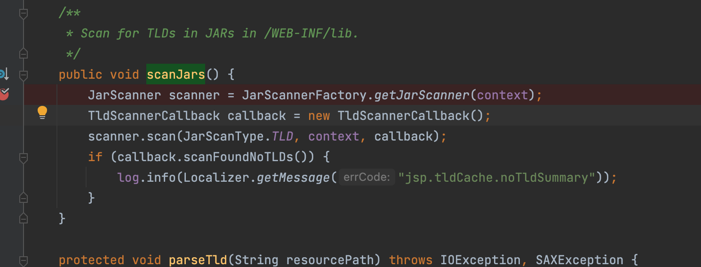

# DesperateCat

## 题目环境

JDK8u311

Tomcat9.0.56

## 分析

首先拿到这个源码我们看什么

```xml
  <servlet>
        <servlet-name>ExportServlet</servlet-name>
        <servlet-class>org.rwctf.servlets.ExportServlet</servlet-class>
  </servlet>
  <servlet-mapping>
        <servlet-name>ExportServlet</servlet-name>
        <url-pattern>/export</url-pattern>
  </servlet-mapping>
```

看web.xml，从这里我们发现只有一个类，简简单单几秒看完这个函数

不想贴代码了，占地方，总结说来提供了一个POST方法，这里能让我们去上传任意文件，配合部分的任意内容，为什么是部分呢，请看下面

```jsp
String data = "DIRTY DATA AT THE BEGINNING " + content + " DIRTY DATA AT THE END";
            this.writeBytesToFile(saveFile, data.getBytes(StandardCharsets.UTF_8));
```

脏数据达咩，并且这里也规定了编码格式UTF-8，所以也别想什么编码的trick了，那接下来我们很容易想到是不是可以通过标签去搞事情呢，很遗憾不行


这里是单字符替换，写的也没毛病，所以咋也别想太多绕过jsp啥的，这里很明显就是让我们用el表达式了，但是，又来了新的问题，el表达式要想执行方法怎么办！！我们知道执行函数方法是需要`()`，而这里也被过滤了

## 两个重要的Trick

这个后面回用到，当然我不想去分析为什么el表达式这样可以，有兴趣自己跟下源码

a["classes"]等价于a.getclasses()它会去去调用get开头的函数

同理我们也可以赋值

a["classes"] = "wsnd";他会去通过set赋值

还有炒冷饭学起来：[Spring framework（cve-2010-1622）漏洞利用指南 | 空虚浪子心的灵魂 (inbreak.net)](https://www.inbreak.net/archives/377)

虽然不是靠这篇文章就能解决，但是我们也知道了利用 el api 3.0 的赋值操作覆盖某些属性的值可能导致rce，接下来我们就来看看如何能让他rce呢

## 探索开始

这里我们需要用到applicationScope，首先我们看看这里都有一些什么重要的属性,`${applicationScope}`直接通过el是自带out.write的方便我们查看


这里我们暂时只需要关注`org.apache.jasper.compiler.StringInterpreter`，那么这是什么呢

## 如何利用org.apache.jasper.compiler.StringInterpreter

首先我们需要知道这个org.apache.jasper.compiler.StringInterpreter到底是什么，它是一个接口，那这个接口是干什么的呢，可以看到它的描述

Defines the interface for the String interpreter. This allows users to provide custom String interpreter implementations that can optimise String processing for an application by performing code generation for a sub-set of Strings.

翻译过来就是定义了字符串解释器的接口。这允许用户提供自定义的字符串解释器实现，通过对字符串的子集进行代码生成，可以为应用程序优化字符串处理。很通俗易懂是吧，好的我们继续

另外，在jsp的编译过程中，在`org/apache/jasper/compiler/Generator.java`中他会执行`getStringInterpreter`


继续跟入看看


这里从ApplicationContext上下文获取，之后看到上面那张图


`createInstance`对这个获取到的类进行实例化

```java
private static StringInterpreter createInstance(ServletContext context,
                                                String className) throws Exception {
  return (StringInterpreter) context.getClassLoader().loadClass(
    className).getConstructor().newInstance();
}
```

这是部分调用栈

```java
getStringInterpreter:54, StringInterpreterFactory (org.apache.jasper.compiler)
<init>:3544, Generator (org.apache.jasper.compiler)
generate:3593, Generator (org.apache.jasper.compiler)
generateJava:257, Compiler (org.apache.jasper.compiler)
compile:391, Compiler (org.apache.jasper.compiler)
compile:367, Compiler (org.apache.jasper.compiler)
compile:351, Compiler (org.apache.jasper.compiler)
compile:605, JspCompilationContext (org.apache.jasper)
```

那么如何让让jsp执行上面的编译呢，很简单，有两种方式：

1.初次启动tomcat的时候访问

2.若tomcat启动后，我们只需要再往里面写一个jsp访问即可

因此我们便很容易能想到接下来的操作，通过第二种方式啦，接下来我们只需要让org.apache.jasper.compiler.StringInterpreter为我们的恶意类，如何赋值也很简单，通过`param.a`去去的get请求中的参数a的值，简简单单绕过双引号即可，或者cookie也行姿势太多

```jsp
${applicationScope[param.a]=param.b}
```

此时我们只需要传入

```
a=org.apache.jasper.compiler.StringInterpreter&b=com.test.YYDS（这玩意儿是我写的恶意类）
```

好了这个问题解决了，接下来解决下一个问题，如何将恶意类加载进去呢，很简单

## 加载恶意类到JVM

我们只需要往we b.xml中写入一点不影响本身逻辑运行的东西即可，比如简简单单插入注释，之后就会把`/WEB-INF/lib`下的jar包加载进来,看看关键逻辑，其他细节自己看

org.apache.jasper.servlet.TldScanner#scanJars


## 梳理利用思路

1.写一个恶意类并编译成jar

2.将这个jar文件上传到`/WEB-INF/lib`下

3.往web.xml当中随便插入点注释，使这个jar包加载到jvm

4.上传一个jsp文件内容为`${applicationScope[param.a]=param.b}`,并用小手访问这个jsp文件传入`a=org.apache.jasper.compiler.StringInterpreter&b=com.test.YYDS`后面为恶意类

5.再上传一个啥内容都行的jsp，目的是执行compile到关键地方，通过`StringInterpreterFactory.getStringInterpreter`，实例化恶意类


到了这里是不是更疑惑了，你不是有脏数据吗，怎么做jar呢，很好我也不知道，就卡在这里了，但思路没错，看看利用结果了

## 结果

通过这个思路，确实计算器弹出来

