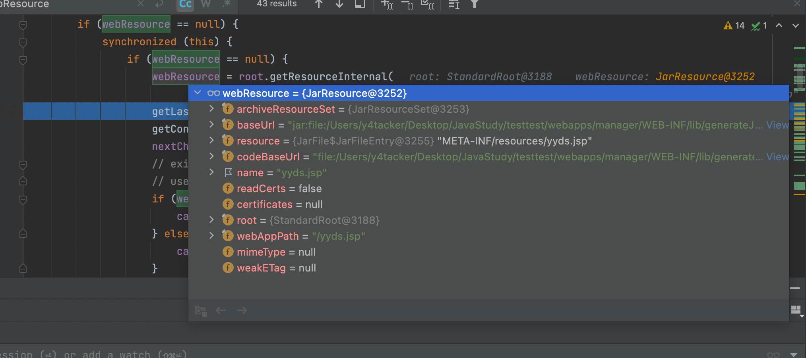
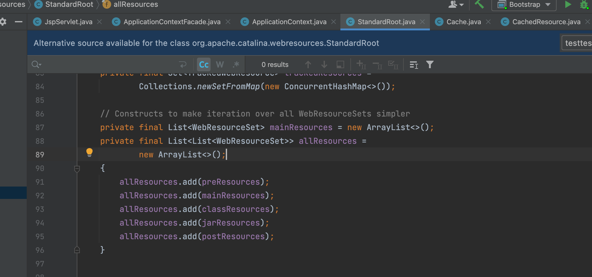

# 两个好玩的问题

<center>@Y4tacker</center>


## 1.为什么往 `/WEB-INF/tomcat-web.xml/`文件夹下写东西可以触发重加载 

### 问题来源


问题的一切来源于一句话：

Trigger a reload of the web app by writing any file to `/WEB-INF/tomcat-web.xml/` ，文件夹什么鬼！

当然多提一嘴不是每个版本这个tomcat-web.xml都生效的具体看配置，详细的往下看

### 解决

首先既然能够在tomcat运行后继续加载新的jar到jvm，如果是你会怎么实现呢，答案很显然，多线程，定时让一个子进程去监控文件的变化，tomcat也是如此，具体的就不多说了，也不是本篇的重点，这里只是简单提一嘴


关于本篇要探索的问题，我本来也确实不清楚，但是昨天看到一句话

```xml
Trigger a reload of the web app by writing any file to `/WEB-INF/tomcat-web.xml/` 
```

嗯？看到这个我愣了一下，因为在我第一认知里面都是网上说的web.xml，这个加了个前缀tomcat又是什么，并且为什么创建目录也能被识别到内容变化呢(今天一位师傅与我讨论)

首先谈谈我的第一想法，我一开始猜测是扫描到这个`/WEB-INF/tomcat-web.xml/`,发现是目录，是不是就去通过遍历目录下的文件内容看是否有变化呢

但是答案是No，我跟了下源码，这里我们节约时间从关键的说起`org.apache.catalina.startup.HostConfig#checkResources`,

我们来看看checkResources是干嘛的，会去检查哪些资源这里也很清楚了


我们这里研究的是`/WEB-INF/tomcat-web.xml/`，继续往下看

往下看，关注下

```java
long lastModified = app.reloadResources.get(s).longValue();
```

光看lastModified我就大概猜到了是靠什么机制了，没错时间戳！当前文件夹下的文件变动了自然也会影响文件夹的时间戳变化，不过都来了当然还是进去看看嘛


确实如此，后面通过reload也就重新将`/WEB-INF/lib`下的jar加载进去了，昨天提过这里不再多讲

好了到了这里又是一个问题，刚才我们的资源路径是怎么取得的？

`app.reloadResources`这值是怎么来的呢，其实是在tomca首次运行时就设置了，在`org.apache.catalina.core.StandardContext#addWatchedResource`中便引入了，那值是哪来的，在`项目路径/conf/context.xml`

```xml
<Context>
<WatchedResource>WEB-INF/web.xml</WatchedResource>
<WatchedResource>WEB-INF/tomcat-web.xml</WatchedResource>
<WatchedResource>${catalina.base}/conf/web.xml</WatchedResource>
</Context>
```

哦一切也就解决了，通过配置WatchedResource来监视，这也是默认名称

## 2.Tomcat下/WEB-INF/lib中被加载的jar，如果在其/META-INF/resources/下直接写jsp可以直接访问执行

### 问题来源


很骚的东西，第一次看到，马上吃饭了，简单看了下

首先大概说一下浏览器敲下`htttp://xxx/xx.jsp时候`，它会检查jsp文件是否存在来避免创建垃圾文件夹和文件，也就是在

`org.apache.jasper.servlet.JspServlet#serviceJspFile`下的

```java
if (null == context.getResource(jspUri)) {
```

往里一直跟，最终一个关键的点在`org.apache.catalina.webresources.CachedResource#validateResource`下



这个JarResource里面有映射关系，我们简简单单看看webResource咋来的



这里只是初始化其他地方也没有

后面找了下在`org.apache.jasper.servlet.JspCServletContext#scanForResourceJARs`找到了答案


拿下！！！


