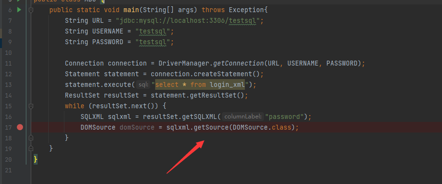
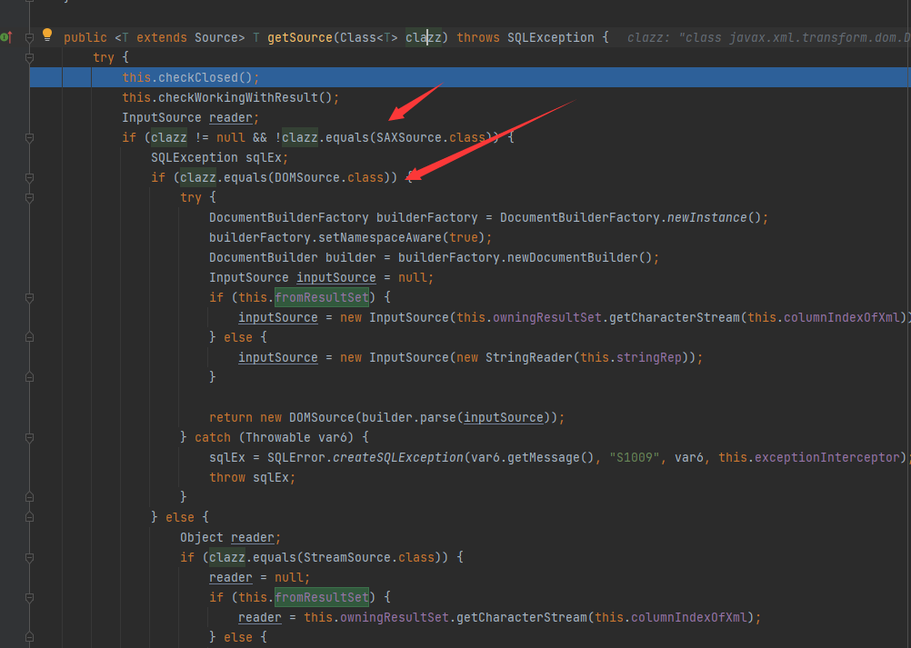

# CVE-2021-2471 JDBC-XXE漏洞分析

很简单的一个漏洞

## 漏洞介绍

JDBC存在XXE漏洞,造成漏洞的原因主要是因为getSource方法未对传入的XML格式数据进行检验。导致攻击者可构造恶意的XML数据引入外部实体。造成XXE攻击。

## 影响版本

< MySQL JDBC 8.0.27

## 环境依赖

```xml
<dependency>
    <groupId>mysql</groupId>
    <artifactId>mysql-connector-java</artifactId>
    <version>8.0.26</version>
</dependency>
```

## 漏洞代码Demo

```java
import javax.swing.text.Document;
import javax.xml.transform.dom.DOMSource;
import java.sql.*;

public class ABC {
    public static void main(String[] args) throws Exception{
        String URL = "jdbc:mysql://localhost:3306/testsql";
        String USERNAME = "testsql";
        String PASSWORD = "testsql";

        Connection connection = DriverManager.getConnection(URL, USERNAME, PASSWORD);
        Statement statement = connection.createStatement();
        statement.execute("select * from login_xml");
        ResultSet resultSet = statement.getResultSet();
        while (resultSet.next()) {
            SQLXML sqlxml = resultSet.getSQLXML("password");
            DOMSource domSource = sqlxml.getSource(DOMSource.class);
        }
    }
}
```

## 漏洞分析

漏洞在`getSource`中



根据传入Class的类型来进入不同分支

可以看到这里直接用`DocumentBuilder`来解析xml，并且没有设置防御，造成漏洞产生

## 防御方法--setFeature


```Java
DocumentBuilderFactory dbf = DocumentBuilderFactory.newInstance();
dbf.setFeature("http://apache.org/xml/features/disallow-doctype-decl", true);
DocumentBuilder db = dbf.newDocumentBuilder(); 
Document document = db.parse(in);
```

