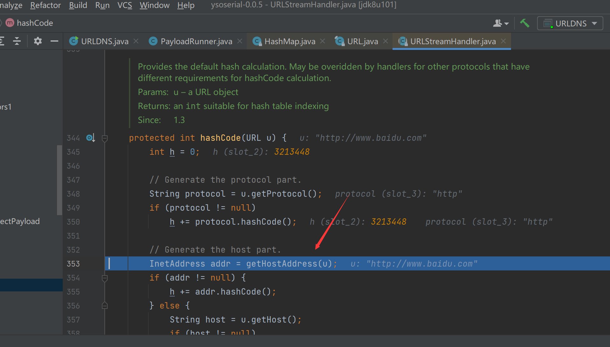
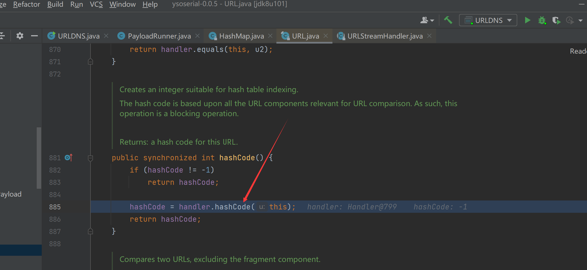
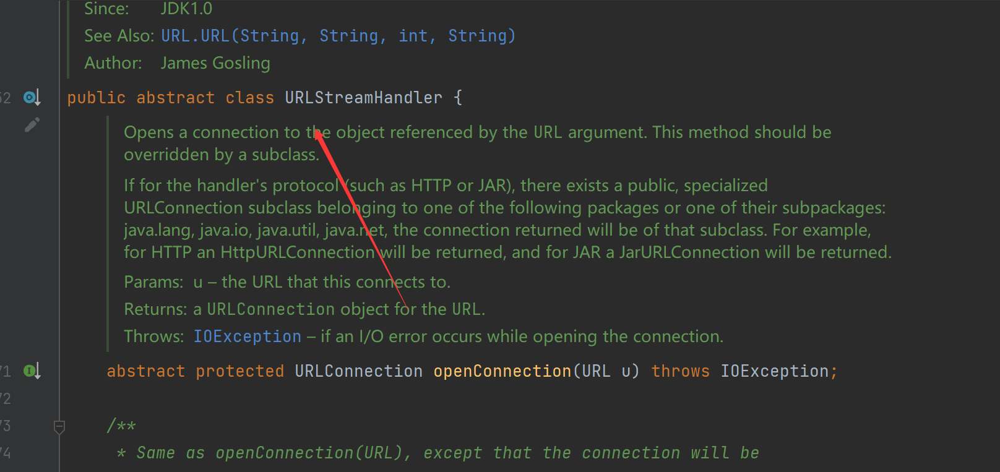
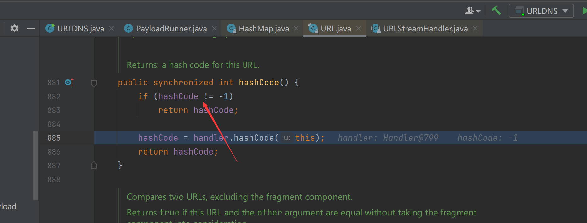
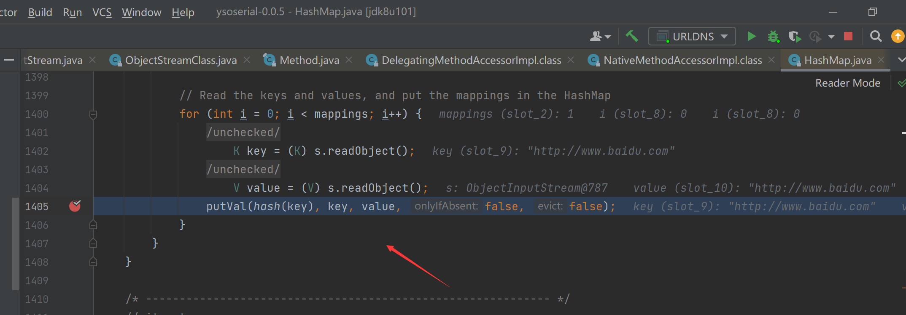
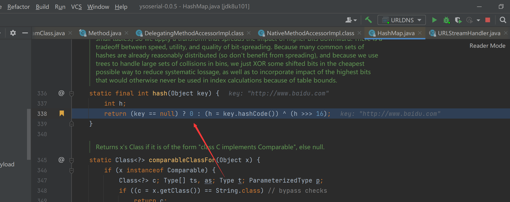
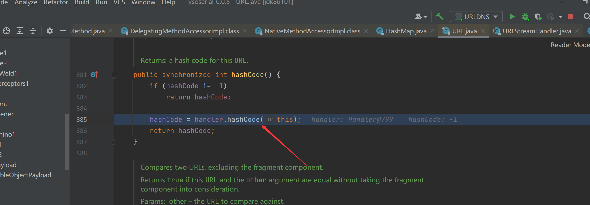
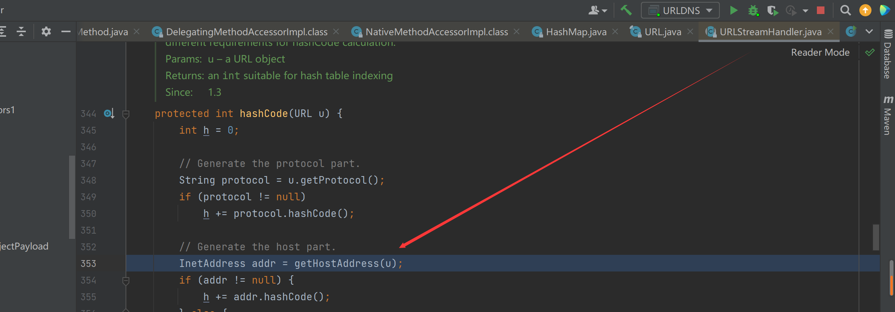

# Java反序列化之URLDNS

## payload

看看Ysoserial的payload，很简单的

```java
URLStreamHandler handler = new SilentURLStreamHandler();
HashMap ht = new HashMap();
URL u = new URL(null, url, handler); 
ht.put(u, url); 
Reflections.setFieldValue(u, "hashCode", -1); 
```

## 分析

采用回溯法去分析，是getHostAddress， 解析了域名，而调用这个的函数为URLStreamHandler下的hashCode

再往上发现hashMap的 hash方法，可以调用其他类的hashCode函数

hashCode

因此整个调用链就出来了， 需要生成一个URLStreamHandler的对象，将其作为hashMap的key值，反序列化
但是这个是一个抽象类不能直接实例化，需要实现这个类，只能用该类的子类



当然还有个值得注意的地方就是，这里需要改为-1



## 利用流程

反序列化调用HashMAp的readObject方法

key不为null所以进入hashcode方法

之前设置了hashcode为-1，进入了URLStreamHandler的hashcode方法

最后在URLStreamHandler中，调用了 getHostAddress， 解析了域名

