# GoogleCTF2022-Log4j

<center>@Y4tacker</center>

## 写在前面

唯一一个Java题了，挺有意思的一道题学到很多

题目附件：https://github.com/google/google-ctf/tree/master/2022/web-log4j


## 非预期分析

题目给了一个公网环境(题目似乎没有重启，能猜到不可能是RCE)以及附件压缩包，里面同时有python以及java的环境，先简单看看python的，这里运行了web服务，将输入作为分割传入chat函数后通过subprocess调用命令执行并返回结果，这里不存在命令注入

```python
app = Flask(__name__)

@app.route("/", methods=['GET', 'POST'])
def start():
    if request.method == 'POST':
        text = request.form['text'].split(' ')
        cmd = ''
        if len(text) < 1:
            return ('invalid message', 400)
        elif len(text) < 2:
            cmd = text[0]
            text = ''
        else:
            cmd, text = text[0], ' '.join(text[1:])
        result = chat(cmd, text)
        return result
    return render_template('index.html')

def chat(cmd, text):
    # run java jar with a 10 second timeout
    res = subprocess.run(['java', '-jar', '-Dcmd=' + cmd, 'chatbot/target/app-1.0-SNAPSHOT.jar', '--', text], capture_output=True, timeout=10)
    print(res.stderr.decode('utf8'))
    return res.stdout.decode('utf-8')

if __name__ == '__main__':
    port = os.environ['PORT'] if 'port' in os.environ else 1337
    app.run(host='0.0.0.0', port=port)
```

因此重点就是分析这个java的文件，很简单的代码(同时可以看到这里有LOG4J2)

```java
import org.apache.logging.log4j.LogManager;
import org.apache.logging.log4j.Logger;
import java.lang.System;
import java.time.format.DateTimeFormatter;
import java.time.LocalDateTime;

public class App {
  public static Logger LOGGER = LogManager.getLogger(App.class);
  public static void main(String[]args) {
    //获取环境变量当中的flag,同时这里可以知道我们需要获取到环境变量
    String flag = System.getenv("FLAG");
    if (flag == null || !flag.startsWith("CTF")) {
        LOGGER.error("{}", "Contact admin");
    }
		//日志输出命令行参数
    LOGGER.info("msg: {}", args);
    // TODO: implement bot commands
    String cmd = System.getProperty("cmd");
    if (cmd.equals("help")) {
      doHelp();
      return;
    }
    if (!cmd.startsWith("/")) {
      System.out.println("The command should start with a /.");
      return;
    }
    //根据命令行参数执行doCommand，简单可以看出这里没什么利用
    doCommand(cmd.substring(1), args);
  }

  private static void doCommand(String cmd, String[] args) {
    switch(cmd) {
      case "help":
        doHelp();
        break;
      case "repeat":
        System.out.println(args[1]);
        break;
      case "time":
        DateTimeFormatter dtf = DateTimeFormatter.ofPattern("yyyy/M/d H:m:s");
        System.out.println(dtf.format(LocalDateTime.now()));
        break;
      case "wc":
        if (args[1].isEmpty()) {
          System.out.println(0);
        } else {
          System.out.println(args[1].split(" ").length);
        }
        break;
      default:
        System.out.println("Sorry, you must be a premium member in order to run this command.");
    }
  }
  private static void doHelp() {
    System.out.println("Try some of our free commands below! \nwc\ntime\nrepeat");
  }
}
```

同时发现这里有个`log4j2.xml`的配置文件

```xml
<?xml version="1.0" encoding="UTF-8"?>
<Configuration status="INFO">
    <Appenders>
        <Console name="Console" target="SYSTEM_ERR">
            <PatternLayout pattern="%d{HH:mm:ss.SSS} %-5level %logger{36} executing ${sys:cmd} - %msg %n">
            </PatternLayout>
        </Console>
    </Appenders>
    <Loggers>
        <Root level="debug">
            <AppenderRef ref="Console"/>
        </Root>
    </Loggers>
</Configuration>
```

可以看见这里的Root的level设置为debug，`这代表如果没有单独指定Logger`， 那么就会使用该Root日志输出输出，因此就算我们能解析到`${env:FLAG}`也不可能拿到结果(因为这是在日志而不是标准输出当中)，因此我们有没有办法讲结果输出到标准输出呢，当然答案是有的也造成了这次非预期，如果我们单独设置了Logger的话，如果那个日志策略会输出到标准输出那么就可以解决这个问题

这里说一下其中一个就可以，也就是这个`org.apache.logging.log4j.core.lookup.ResourceBundleLookup`，要执行`LOGGER.warn`只需要满足下面两个条件之一即可，这里简单测试一下`${bundle:2333}`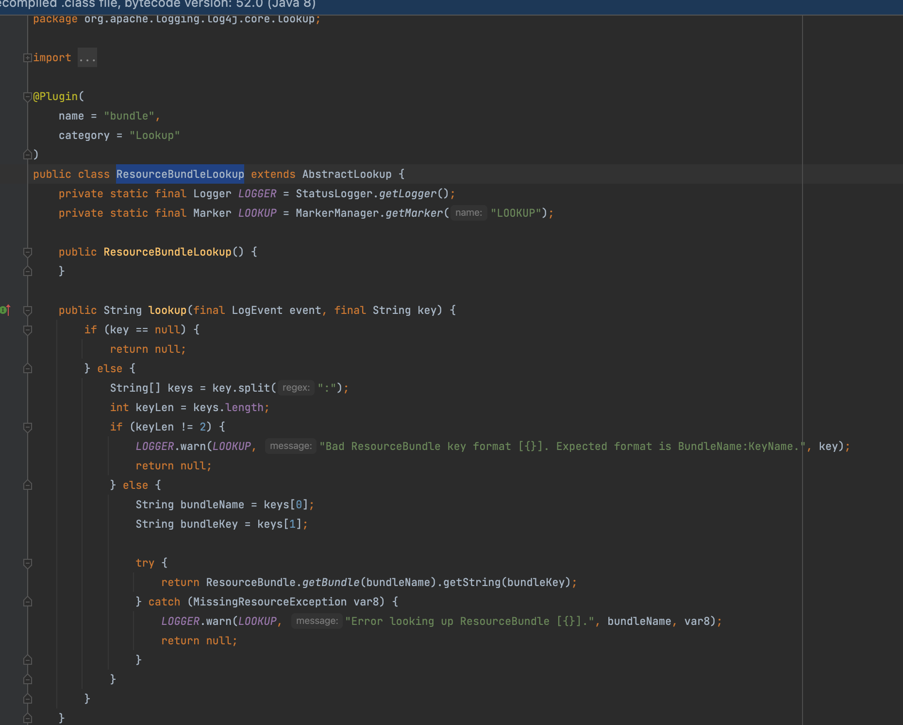

发现这个LOGGER确实能将关键信息带到标准输出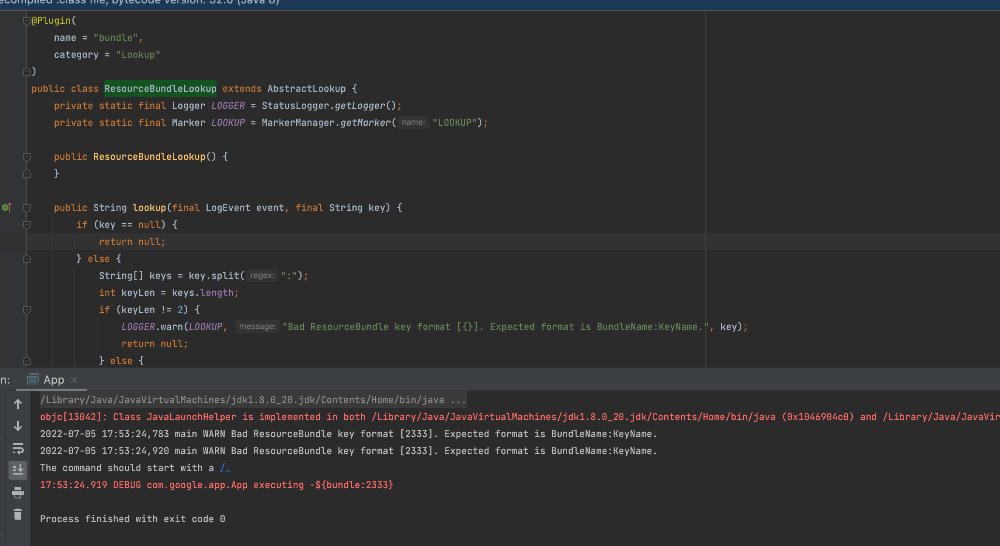

因此我们只需要输入`${bundle:${env:FLAG}}`即可


```
${${a:-b}undle:${env:FLAG}}
```

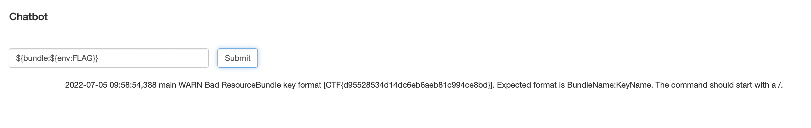

## 预期分析-redos

猜测可能是非预期了所以搞了个新的题，将同样的payload输入后页面只是显示`Sensitive information detected in output. Censored for security reasons.`

这里会检测内容，根据猜测能够知道肯定是把那个ResourceBundleLookup下的`LOGGER.warn`的输出特征给过滤掉了，这里简单fuzz下证实了我的猜测，毕竟这里是有doCommand功能

```java
  private static void doCommand(String cmd, String[] args) {
    switch(cmd) {
      case "help":
        doHelp();
        break;
      case "repeat":
        System.out.println(args[1]);
        break;
      case "time":
        DateTimeFormatter dtf = DateTimeFormatter.ofPattern("yyyy/M/d H:m:s");
        System.out.println(dtf.format(LocalDateTime.now()));
        break;
      case "wc":
        if (args[1].isEmpty()) {
          System.out.println(0);
        } else {
          System.out.println(args[1].split(" ").length);
        }
        break;
      default:
        System.out.println("Sorry, you must be a premium member in order to run this command.");
    }
  }
```

只需要通过repeat功能即可，成功验证了猜想，因此不需要考虑payload的问题了

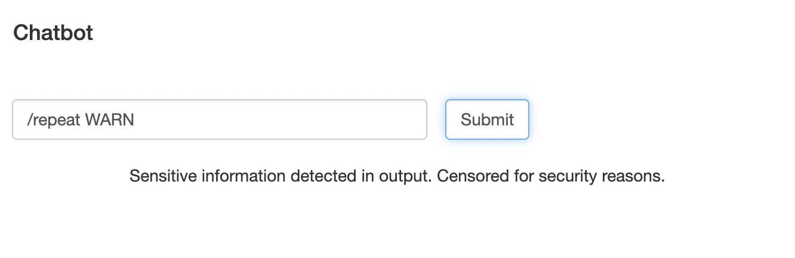


那怎么半呢其实这里还有一个小细节，对于log4j2的日志的实现来说其实是先将`${xx}`当中的内容做替换再按我们规定的输出格式输出(如果是你去实现这样的功能相信这是目前为止的最优解)，具体代码这里就不展开了，接着说明

其实log4j2对日志输出中的`%d/%p`等其实是有自己的实现的，它有个注解比如下面这个是`%d`的他们都是有个注解`ConverterKeys`，因此我们可以看看这个有没有一些神奇的东西可以配合我们完成

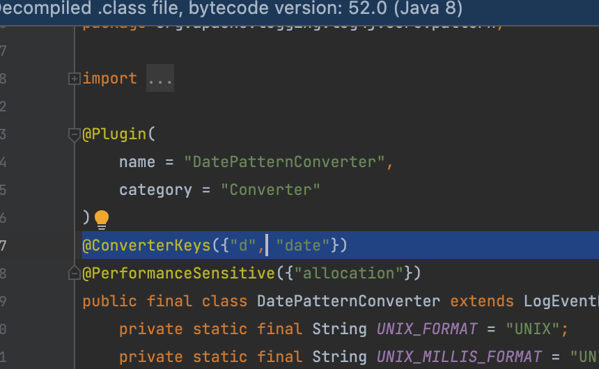

### 如何扫描并获取包下被指定注解的类

为了方便我这里直接用了reflections 框架（此框架依赖com.google.guava）

```xml
<dependency>
  <groupId>org.reflections</groupId>
  <artifactId>reflections</artifactId>
  <version>0.9.11</version>
</dependency>

<dependency>
  <groupId>com.google.guava</groupId>
  <artifactId>guava</artifactId>
  <version>21.0</version>
</dependency>
```

因此我们可以扫描指定包下的

```java
Reflections f = new Reflections("org.apache.logging.log4j.core");
Set<Class<?>> set = f.getTypesAnnotatedWith(ConverterKeys.class);
for (Class<?> tmp:set){
  if (tmp.isInterface()){
    System.out.println("interface:"+tmp.getName());
  }else {
    System.out.println("class:"+tmp.getName());

  }
}
```

得到如下结果

```java
class:org.apache.logging.log4j.core.pattern.VariablesNotEmptyReplacementConverter
class:org.apache.logging.log4j.core.pattern.UuidPatternConverter
class:org.apache.logging.log4j.core.pattern.LineLocationPatternConverter
class:org.apache.logging.log4j.core.pattern.HighlightConverter
class:org.apache.logging.log4j.core.pattern.LevelPatternConverter$SimpleLevelPatternConverter
class:org.apache.logging.log4j.core.pattern.ThreadIdPatternConverter
class:org.apache.logging.log4j.core.pattern.IntegerPatternConverter
class:org.apache.logging.log4j.core.pattern.ClassNamePatternConverter
class:org.apache.logging.log4j.core.pattern.ProcessIdPatternConverter
class:org.apache.logging.log4j.core.pattern.MaxLengthConverter
class:org.apache.logging.log4j.core.pattern.LineSeparatorPatternConverter
class:org.apache.logging.log4j.core.pattern.AbstractStyleNameConverter$Yellow
class:org.apache.logging.log4j.core.pattern.AbstractStyleNameConverter$Green
class:org.apache.logging.log4j.core.pattern.RootThrowablePatternConverter
class:org.apache.logging.log4j.core.pattern.MethodLocationPatternConverter
class:org.apache.logging.log4j.core.pattern.MessagePatternConverter
class:org.apache.logging.log4j.core.pattern.DatePatternConverter
class:org.apache.logging.log4j.core.pattern.AbstractStyleNameConverter$White
class:org.apache.logging.log4j.core.pattern.EqualsIgnoreCaseReplacementConverter
class:org.apache.logging.log4j.core.pattern.NdcPatternConverter
class:org.apache.logging.log4j.core.pattern.SequenceNumberPatternConverter
class:org.apache.logging.log4j.core.pattern.RepeatPatternConverter
class:org.apache.logging.log4j.core.pattern.EncodingPatternConverter
class:org.apache.logging.log4j.core.pattern.MdcPatternConverter
class:org.apache.logging.log4j.core.pattern.AbstractStyleNameConverter$Magenta
class:org.apache.logging.log4j.core.pattern.MessagePatternConverter$SimpleMessagePatternConverter
class:org.apache.logging.log4j.core.pattern.RegexReplacementConverter
class:org.apache.logging.log4j.core.pattern.AbstractStyleNameConverter$Black
class:org.apache.logging.log4j.core.pattern.ThreadNamePatternConverter
class:org.apache.logging.log4j.core.pattern.NanoTimePatternConverter
class:org.apache.logging.log4j.core.pattern.RelativeTimePatternConverter
class:org.apache.logging.log4j.core.pattern.FileLocationPatternConverter
class:org.apache.logging.log4j.core.pattern.MessagePatternConverter$RenderingPatternConverter
class:org.apache.logging.log4j.core.pattern.LevelPatternConverter
class:org.apache.logging.log4j.core.pattern.FileDatePatternConverter
class:org.apache.logging.log4j.core.pattern.AbstractStyleNameConverter$Cyan
class:org.apache.logging.log4j.core.pattern.EqualsReplacementConverter
class:org.apache.logging.log4j.core.pattern.ThrowablePatternConverter
class:org.apache.logging.log4j.core.pattern.LoggerFqcnPatternConverter
class:org.apache.logging.log4j.core.pattern.ExtendedThrowablePatternConverter
class:org.apache.logging.log4j.core.pattern.ThreadPriorityPatternConverter
class:org.apache.logging.log4j.core.pattern.MessagePatternConverter$FormattedMessagePatternConverter
class:org.apache.logging.log4j.core.pattern.MarkerSimpleNamePatternConverter
class:org.apache.logging.log4j.core.pattern.EndOfBatchPatternConverter
class:org.apache.logging.log4j.core.pattern.FullLocationPatternConverter
class:org.apache.logging.log4j.core.pattern.MapPatternConverter
class:org.apache.logging.log4j.core.pattern.AbstractStyleNameConverter$Red
class:org.apache.logging.log4j.core.pattern.MarkerPatternConverter
class:org.apache.logging.log4j.core.pattern.LoggerPatternConverter
class:org.apache.logging.log4j.core.pattern.LevelPatternConverter$LevelMapLevelPatternConverter
class:org.apache.logging.log4j.core.pattern.StyleConverter
class:org.apache.logging.log4j.core.pattern.AbstractStyleNameConverter$Blue
```

### 选择合适的类完成challenge

这里引起我注意的有两个类，一个是和正则相关，一个是和重复相关的英文吸引了我

```java
class:org.apache.logging.log4j.core.pattern.RegexReplacementConverter
class:org.apache.logging.log4j.core.pattern.RepeatPatternConverter
```

对应使用为

`%replace{abc}{a}{d}`=>`adc`

`%repeat{a}{3}`=>`aaa`

分别看看RegexReplacementConverter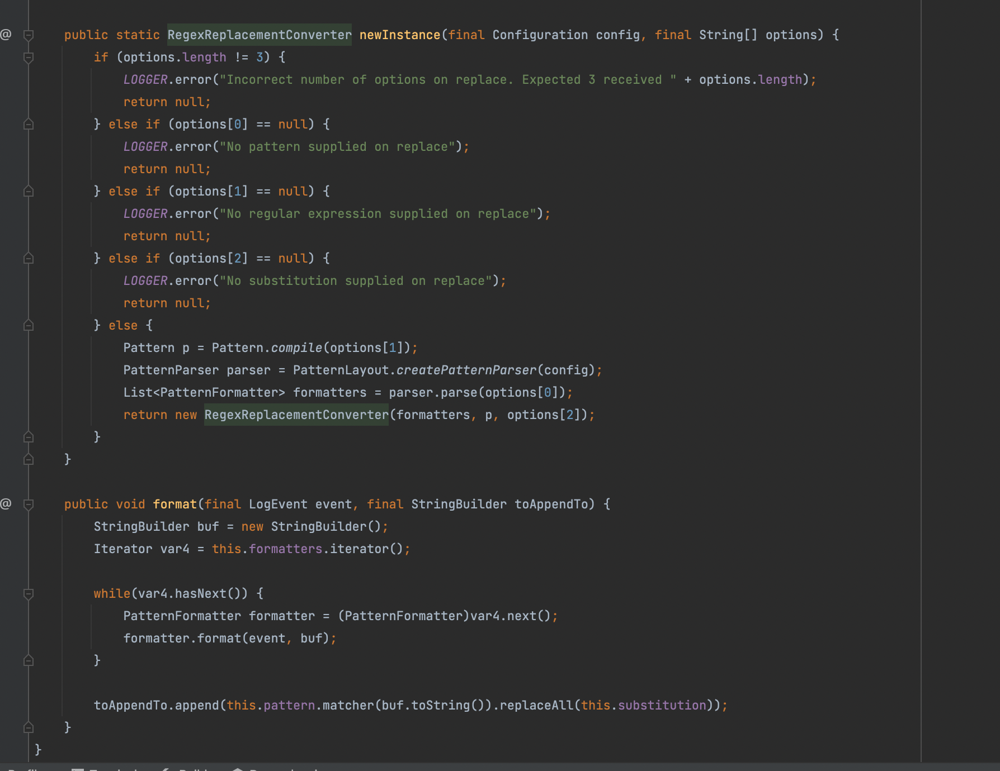

RepeatPatternConverter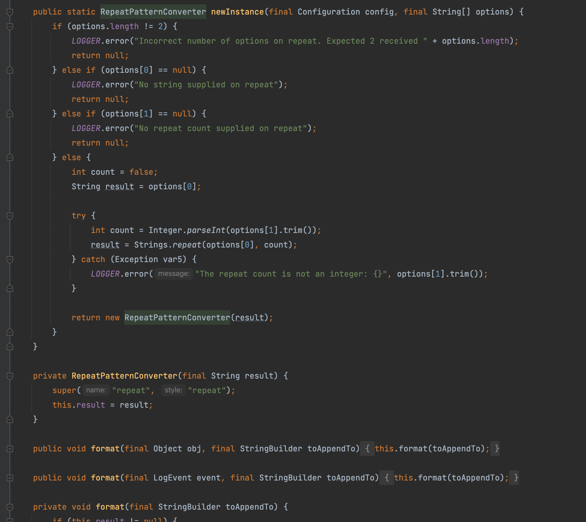

结合这两个功能就能大胆猜想能否通过repeat构造超长字符串来消耗正则引擎的性能呢？答案是否？其实代码里很清楚了，只有`RegexReplacementConverter`有个`List<PatternFormatter> formatters = parser.parse(options[0]);`这个parse的操作并且这个0决定只能在第一位，第一位是什么就是要替换的类，而repeat里面显然没有，因此这两个也不能嵌套去完成这个题目了

那么还有什么方式呢？那就是redos，我们只需要构造一个包含具有自我重复的重复性分组的正则表达式即可，比如在[Cookia师傅的博文](http://cookia.cc/2017/09/13/redos/)当中找到的(毕竟我懒)

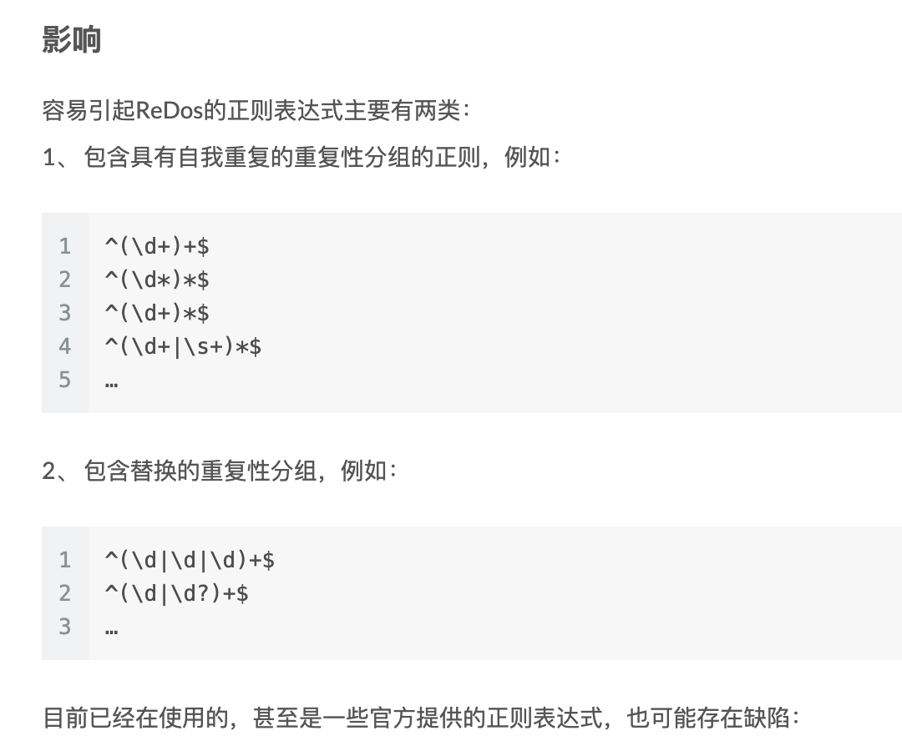

因此我们可以构造正则`^.{x}(.).*$`，其中x为数字，分别获取第一....n位对其进行重复之后再在后面加上任意字符`x`，其实就是构造出`aaaaaaaax`的形式

但我发现在jdk8上能成功的redos却在打的时候没用？那个给的docker我也没法构建，后面发现高版本jdk9+以后和jdk8上的有区别

可以看到[RSPEC-2631](https://rules.sonarsource.com/java/RSPEC-2631)中发现ReDoS 问题已在 Java 9 及更高版本中处理，但是功夫不负有心人，又在stackoverflow的主题[is-java-redos-vulnerable](https://stackoverflow.com/questions/53048859/is-java-redos-vulnerable)当中发现，明显可以看到这句话通过增加`()`来增加复杂度，但是这次我在本地9-11版本(当然每个大版本我只有一个小版本的jre可能不全面)都测试通过成功redos

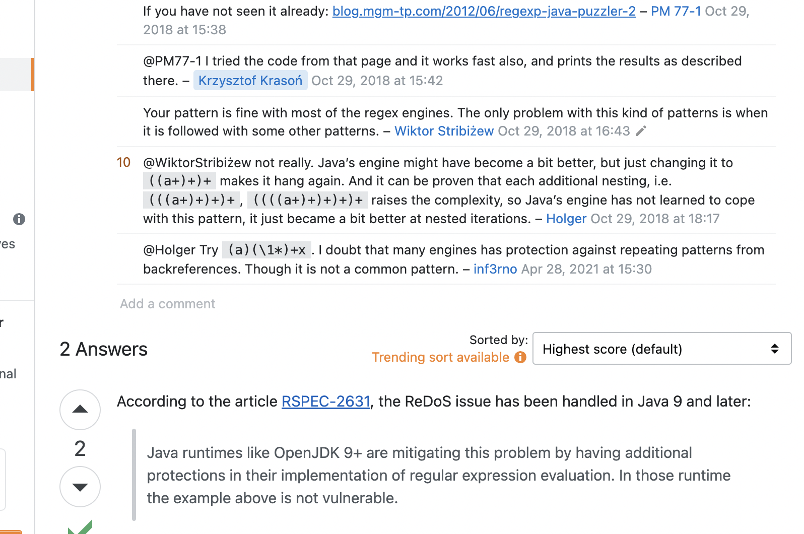

但是在题目环境仍然是完成解析告诉我`Sensitive information detected in output. Censored for security reasons.`

最后我决定再为它加点复杂度也就是在最后加一个`$`，也就是`((C+)+)+$`

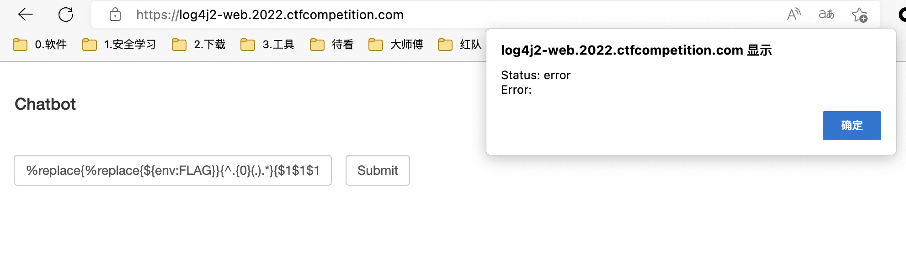

接下来就是写个脚本慢慢跑的问题，也是看心态和代理给不给力的问题

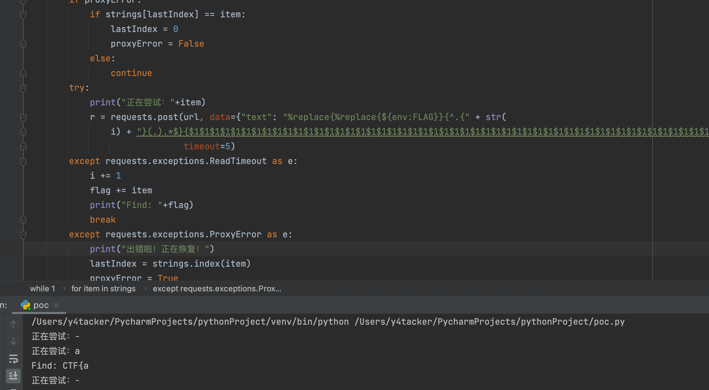

## 参考文章

https://blog.csdn.net/Q176782/article/details/78288734

http://cookia.cc/2017/09/13/redos/

https://www.cnblogs.com/ggband/p/11668879.html

https://rules.sonarsource.com/java/RSPEC-2631

https://stackoverflow.com/questions/53048859/is-java-redos-vulnerable
